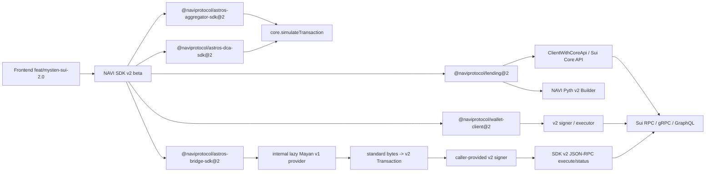
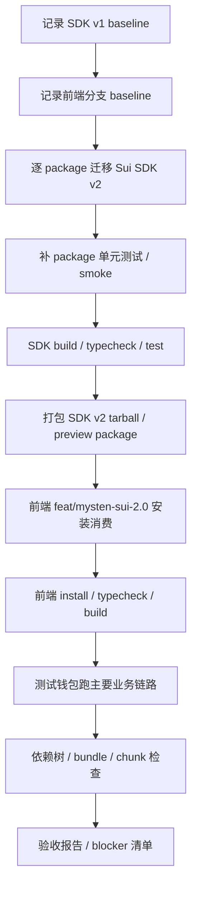
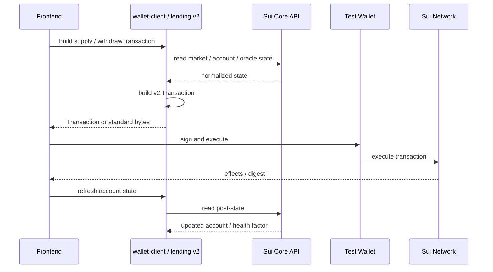
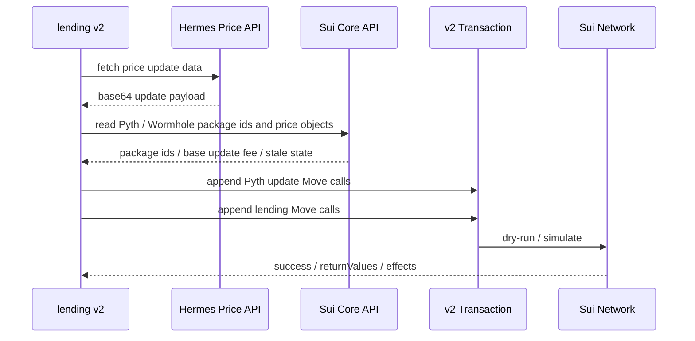
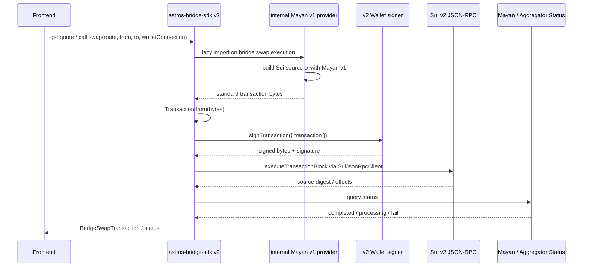

# Sui SDK 2.0 SDK 独立技术方案

日期：2026-06-03  
来源：拆分自 `SUI_SDK_2_UPGRADE_TECHNICAL_PLAN.md`，并继承其中已完成的调研结论和验证结论。  
目标仓库：`naviprotocol-monorepo`  
目标交付：Sui SDK v2 beta

## 0. 结论

本方案只定义 SDK 仓库的改造、测试和交付标准。SDK v2 beta 的完成标准不是“代码能 build”，而是：

1. SDK package 自身在 Node 22.x 下完成 Sui SDK v2 迁移、build、typecheck 和测试。
2. SDK public API 不再暴露旧 Sui v1 public type，不把旧 `SuiClient` / `TransactionBlock` / raw response 作为稳定 contract。
3. 关键业务路径有迁移前 baseline、迁移后对照、以及新增回归测试。
4. 前端 `feat/mysten-sui-2.0` 分支可以真实消费 SDK v2 package，且主要业务链路通过测试钱包验收。
5. Bridge 纳入 SDK v2 beta 首批交付，按 internal lazy Mayan provider 方案执行并通过 bundle / chunk / 多 route smoke。

本文后续可作为 Codex goal 的交付标准。执行时以本文的 package 拆分、测试矩阵和验收清单作为 stop condition。

## 1. 文档来源和已确认前提

本文来源于完整设计文档 `SUI_SDK_2_UPGRADE_TECHNICAL_PLAN.md` 的 SDK 部分，并只抽取 SDK 相关结论。完整设计文档中的调研结论仍是本文依据：

1. `@mysten/sui@2.x` 当前 npm `engines.node` 要求 Node `>=22`，SDK package 必须在 Node 22.x 下验证。
2. SDK v2 按官方迁移指南完整改造：ESM-only、network 必填、Core API、GraphQL / JSON-RPC 边界、BCS schema、executor response 变化。
3. SDK public read/view 方法优先接受 `ClientWithCoreApi`，避免继续绑定旧 `SuiClient`。
4. JSON-RPC 只能作为明确 adapter 存在，不能继续散落在 public surface。
5. Pyth 不再作为 `@naviprotocol/lending@2` 主依赖；正式采用 NAVI 自维护最小 v2 builder。
6. Mayan v1 仍可作为 `@naviprotocol/astros-bridge-sdk@2` 的 internal lazy provider，因为已验证 v1 build 标准 bytes 可以被 v2 parse / sign / execute/status。
7. SDK v1 和 SDK v2 需要并行维护一段时间；v2 用 beta / next 路线发布，不能强制破坏仍使用 v1 的业务。

## 2. 目标和非目标

### 2.1 目标

1. 发布 Sui SDK v2 beta package：`@naviprotocol/lending@2`、`@naviprotocol/wallet-client@2`、`@naviprotocol/astros-aggregator-sdk@2`、`@naviprotocol/astros-bridge-sdk@2`、`@naviprotocol/astros-dca-sdk@2`。
2. 移除 SDK v2 主路径里的旧 Sui v1 public type。
3. 保持业务逻辑语义不回归：读取结果、交易构建、simulate、签名执行链路按业务不变量对齐 baseline。
4. 补齐测试薄弱 package 的最小回归用例，避免只依赖现有测试。
5. 用前端 `feat/mysten-sui-2.0` 作为真实消费者做最终消费验收。

### 2.2 非目标

1. 不在本文定义前端 UI 改造方案。
2. 不在本文定义后端接口迁移方案。
3. 不强制所有旧业务立即切到 SDK v2；v1 保持 legacy line。
4. 不把第三方 Sui v1 SDK 作为 SDK v2 public dependency 暴露给使用方。
5. 不以真实大额交易作为验收要求；真实 execute 只允许使用授权测试钱包和小额测试金额。

## 3. 总体架构

核心边界：

1. SDK v2 public API 只暴露 v2 类型或 NAVI 自定义 DTO。
2. 第三方 v1 SDK 只能存在于 internal provider / adapter 或 legacy line，不能进入 root entry 或 public type。
3. Bridge 的 Mayan v1 provider 只允许 lazy load；root import、普通 lending/swap 页面不能加载 Mayan / Sui v1 chunk。
4. SDK 自测必须和前端消费验收一起通过，才算 SDK goal 完成。

## 4. 交互流程

## 5. 关键时序

### 5.1 Lending supply / withdraw 类链路

### 5.2 Pyth update + lending PTB

### 5.3 Bridge internal Mayan provider

## 6. Package 拆分方案

| Package | 优先级 | 改造重点 | 主要验证 |
| --- | --- | --- | --- |
| `@naviprotocol/lending@2` | P0 | v2 client、Core API、simulate parser、BCS、Pyth v2 builder、reward/account/oracle/emode | BCS golden tests、simulate returnValues、Pyth dry-run / execute、account/reward regression |
| `@naviprotocol/wallet-client@2` | P0 | v2 client factory、signer/executor、lending/swap/volo/haedal wrappers、Suilend pin | sign/simulate/execute wrapper tests、module snapshot、Suilend smoke |
| `@naviprotocol/astros-bridge-sdk@2` | P0 | Mayan v1 internal lazy provider、v2 public API、standard bytes | root entry check、lazy chunk、build bytes -> v2 parse -> dry-run -> sign -> execute -> status |
| `@naviprotocol/astros-aggregator-sdk@2` | P1 | swap PTB、route dry-run、execute response、expiration metadata | route build、PTB smoke、simulate parser、frontend swap smoke |
| `@naviprotocol/astros-dca-sdk@2` | P1 | create/cancel PTB、coin utils、simulate parser | create/cancel PTB、coin utils、dry-run smoke |
| docs / examples | P1 | migration guide、ESM import、Node 22.x、client 初始化、response 类型变化 | 示例与 v2 public API 一致，关键示例可 typecheck |

### 6.1 `@naviprotocol/lending@2`

改造重点：

1. `@mysten/sui@2`、`@mysten/bcs@2` 或 `@mysten/sui/bcs`。
2. read path 参数改为 `ClientWithCoreApi`。
3. `getObject` / `multiGetObjects` / `getOwnedObjects` 等迁到 `client.core.*`。
4. `devInspect` / `dryRun` 迁到 `core.simulateTransaction`，并统一解析 `commandResults.returnValues`。
5. 区分 object `content` 和 `objectBcs`，避免把对象 BCS 当 Move struct 内容解析。
6. 移除主依赖里的 `@pythnetwork/pyth-sui-js`。
7. Pyth Hermes data、stale check、update PTB 分别实现 v2 路径。

测试重点：

1. market / pool / account / reward / oracle / emode baseline 对照。
2. BCS golden tests。
3. simulate returnValues parser 覆盖 success、empty、error。
4. Pyth update builder 覆盖 dry-run、真实小额 execute、链上查询、multi-feed、与 lending Move call 串联。

### 6.2 `@naviprotocol/wallet-client@2`

改造重点：

1. constructor 和 client factory 改为 v2 client。
2. signer / executor 适配 v2 `Transaction` 和 executor union response。
3. 返回 NAVI 自定义结果类型，不穿透旧 raw response。
4. lending / swap / volo / haedal module 保持业务语义。
5. Suilend 显式 pin 已确认版本，不跟 npm latest；claim 前先解决 runtime import / version pin。

测试重点：

1. balance / lending / swap / volo / haedal wrapper snapshot。
2. sign / simulate / execute wrapper tests。
3. effects BCS parser。
4. Suilend read smoke；如启用 Suilend claim，用授权测试钱包做 build / v2 parse / simulate / sign / execute。

### 6.3 `@naviprotocol/astros-aggregator-sdk@2`

改造重点：

1. 替换 Sui client import 和 tx import。
2. route dry-run 迁到 v2 simulate。
3. execute response 不再作为旧 raw response 暴露。
4. 保留 transaction expiration / route metadata。
5. 不以 v2 发布强制覆盖仍在使用 v1 的外部业务。

测试重点：

1. quote / route build。
2. swap PTB build。
3. dry-run / simulate parser。
4. 前端 swap 主要链路 smoke。

### 6.4 `@naviprotocol/astros-bridge-sdk@2`

改造重点：

1. Bridge 纳入 SDK v2 beta 首批交付。
2. public API 使用 Sui v2 类型和 plain DTO。
3. Mayan v1 只放 internal provider，并通过 dynamic import lazy load。
4. adapter 内部输出标准 transaction bytes；SDK 将 bytes 转为 v2 `Transaction`，调用前端/外部传入的 v2 `signTransaction` 签名，并由 SDK 使用 v2 client 执行源链交易。
5. `astros-bridge-sdk@1.x` 保留 legacy line。

业务一致性要求：

1. Sui-source Bridge 业务路径必须和 `main` / `astros-bridge-sdk@1.x` 保持一致：Mayan quote -> Mayan Sui route builder -> wallet sign -> source-chain execute -> status 查询。
2. v2 迁移只改变 SDK 边界：内部把 Mayan builder 产物转为 v2 `Transaction`，并使用调用方传入的 v2 wallet signer / v2 client 完成签名和执行。
3. 前端和外部接入方不需要安装 Mayan 或 Sui v1，也不需要接收 v1 transaction bytes 自行解析；Mayan / Sui v1 只能作为 SDK lazy provider 内部实现细节。
4. 允许修复升级前已存在但会影响验收真实性的错误处理缺口，例如 Sui source execute failure 不得返回 `processing`，EVM gasless Mayan order hash 不得当作链上 tx hash 等待，ERC20 allowance 优先使用 Mayan base-unit amount。
5. 不允许借 v2 升级改变 quote、route selection、chain id mapping、amount semantic、status DTO 或 wallet ownership。

测试重点：

1. root entry 不加载 Mayan / Sui v1。
2. 非 Bridge 页面 chunk 不包含 Mayan / Sui v1。
3. 执行 Bridge 时才加载 internal provider chunk。
4. quote -> internal build bytes -> v2 parse -> dry-run -> wallet sign -> SDK execute -> status。
5. 多 route / 多 chain smoke，不只覆盖已验证的 1 SUI -> Arbitrum USDC route。
6. 单测必须覆盖 `main` 旧逻辑等价路径：Sui legacy bytes + v2 sign/execute、Solana source chainId 0、EVM non-gasless waitForTransaction，以及上述错误处理硬化。

### 6.5 `@naviprotocol/astros-dca-sdk@2`

改造重点：

1. client import 替换。
2. coin pagination / owned object 读取改为 v2 Core API。
3. create / cancel PTB 保持业务语义。
4. simulate parser 适配。

测试重点：

1. create PTB smoke。
2. cancel PTB smoke。
3. coin utils snapshot。
4. dry-run / simulate parser。

## 7. 测试策略

### 7.1 Baseline 先行

开发前必须先记录 baseline。Baseline 不是为了证明旧代码全绿，而是为了区分“历史已有问题”和“SDK v2 引入的 regression”。

SDK baseline：

1. 当前 package build / typecheck / test 结果。
2. 当前现有测试失败项和原因。
3. 关键 public API shape：函数入口、返回结构、导出入口。
4. 关键业务路径：lending read、reward read、PTB build、simulate、bridge quote/build/status。
5. 依赖树：`@mysten/sui`、`@mysten/sui.js`、`@pythnetwork/pyth-sui-js`、Mayan。

前端 baseline：

1. 前端 `feat/mysten-sui-2.0` 当前 install / typecheck / build 结果。
2. 前端当前 SDK 相关依赖树。
3. 前端主要业务链路当前状态：lending、swap、bridge、reward claim。
4. 已知失败必须记录，不作为 SDK v2 regression。

Baseline 记录原则：

1. 链上动态值不做固定 snapshot。
2. 固定业务不变量：成功/失败状态、返回结构、position/reward 非空、Move call 数量、coin type、package id、simulate success、digest/status。
3. 对真实 execute，只使用授权测试钱包和小额测试金额。

### 7.2 测试分层

| 层级 | 目的 | 示例 |
| --- | --- | --- |
| Unit | 验证纯函数、parser、DTO、BCS | BCS decoder、effects parser、coin utils |
| Contract | 验证 public API shape 不误变 | exports、函数参数、返回 DTO snapshot |
| Mainnet read smoke | 验证读链路业务语义 | market/account/reward/route/quote |
| Simulate smoke | 验证交易构建可被 v2 simulate | supply/withdraw/borrow/repay/swap/dca |
| Funded E2E | 验证真实签名执行 | Pyth update、Bridge 小额 route、必要 lending 小额 tx |
| Frontend consumer | 验证真实使用方可消费 | install/build/typecheck、业务页面测试 |

### 7.3 需要补齐的测试缺口

| Package | 当前测试状态 | 必补内容 |
| --- | --- | --- |
| lending | 测试基础较完整 | BCS golden、simulate returnValues、Pyth v2 builder、v2 object content parser |
| wallet-client | 有 lending/balance/swap/volo/haedal 测试 | v2 signer/executor、effects parser、Suilend pin smoke |
| astros-aggregator-sdk | 测试偏弱 | route build、swap PTB、simulate parser、frontend swap smoke |
| astros-bridge-sdk | 当前主要是 quote test | build bytes、v2 parse、dry-run、sign、execute、status、bundle/chunk |
| astros-dca-sdk | 测试缺口最大 | create/cancel PTB、coin utils、simulate smoke |

## 8. 前端消费验收

SDK v2 最终服务前端，因此 SDK goal 必须包含前端消费验收。验收目标分支为前端 `feat/mysten-sui-2.0`。

### 8.1 接入方式

建议分两步：

1. 开发期可以用 workspace link 或本地 build 产物快速联调。
2. 最终验收必须使用 tarball / preview package / beta package 方式安装，不能只用源码 link。

最终验收必须覆盖 package metadata 问题：

1. `exports` 正确。
2. ESM import 正确。
3. type declarations 正确。
4. peer dependencies 正确。
5. browser bundle 不拉入 Node-only 模块。
6. 前端 lockfile 不出现不可接受的 Sui v1/v2 多版本冲突。

### 8.2 依赖冲突验收

前端安装 SDK v2 后必须检查：

1. 主应用可接受的 `@mysten/sui` 版本只走 v2。
2. SDK v2 root entry 不依赖 `@mysten/sui.js`。
3. `@pythnetwork/pyth-sui-js` 不进入 `@naviprotocol/lending@2` 主依赖树。
4. Bridge 的 Mayan / Sui v1 只能出现在 internal lazy chunk，不允许出现在 SDK root entry 或非 Bridge 页面 chunk。
5. 没有因为 Sui v1/v2 双版本导致 dApp Kit、wallet、Transaction parse、sign/execute 失败。

### 8.3 前端业务链路验收

使用授权测试钱包和小额测试金额。私钥只允许通过本地环境或安全测试配置注入，不写入仓库、不打印日志、不进入浏览器源码。

| 业务域 | 必测链路 | 验收标准 |
| --- | --- | --- |
| Lending | market/account read、supply、withdraw、borrow、repay、NAVI rewards claim | 页面可构建交易，wallet 可签名，simulate / execute 成功，post-state 可刷新 |
| Swap / Aggregator | quote、route、build PTB、simulate、小额 execute | route 返回有效，PTB 可 simulate，必要小额 execute 成功 |
| Bridge | quote、build bytes、v2 parse、sign/execute、status | Bridge route 可完成，status 可查询；lazy chunk 证据通过 |
| DCA | create、cancel、dry-run | PTB 构建和 simulate 成功 |
| Wallet wrappers | balance、volo、haedal、lending wrappers | 页面状态与 baseline 业务语义一致 |

## 9. 风险和处理

| 风险 | 影响 | 处理 |
| --- | --- | --- |
| Sui v1/v2 多版本冲突 | 前端钱包签名、Transaction parse、bundle 失败 | peer dependency 固定为 v2；v1 只能 internal lazy；前端依赖树和 bundle 检查作为验收门槛 |
| Pyth 官方包仍非 v2 主依赖可用 | lending oracle / update PTB 风险 | 使用 NAVI 自维护 Pyth v2 builder；不把 `pyth-sui-js` 放入 lending v2 主依赖 |
| Mayan 仍依赖 Sui v1 | Bridge 产品风险 | internal lazy provider 输出标准 bytes；SDK 转 v2 `Transaction`，调用前端/外部 signer 签名，并用 v2 `SuiJsonRpcClient` execute；做 chunk 和多 route smoke |
| v2 改造偏离升级前业务逻辑 | Bridge / 前端回归风险 | 逐项对比 `main` / v1 provider：保留 quote、route、chain id、amount、wallet ownership 和 status DTO；只允许边界错误处理硬化，并用单测固定等价路径 |
| 测试薄弱包隐藏 regression | aggregator / bridge / dca 风险 | 迁移前补 baseline，迁移后补最小 smoke |
| 链上数据动态变化 | snapshot 不稳定 | 只断言业务不变量和结构，不固定动态金额 |
| 真实 execute 有资金和安全风险 | 测试风险 | 只用授权测试钱包、小额金额；不打印 secret；需要真实签名时明确记录证据 |

## 10. 实施计划

| 阶段 | 内容 | 产出 |
| --- | --- | --- |
| A. Baseline | 记录 SDK 和前端 baseline、依赖树、现有失败 | baseline 报告 |
| B. 基础迁移 | Node 22.x、ESM-only、`@mysten/sui@2`、client factory、public API 边界 | SDK v2 基础可 build |
| C. Package 改造 | lending / wallet-client / aggregator / bridge / dca 逐包迁移 | package v2 beta |
| D. 测试补齐 | 补 parser、BCS、simulate、PTB、Bridge chunk、DCA smoke | package 回归测试 |
| E. 前端消费 | 前端安装 SDK v2 tarball / preview package | 前端 build/typecheck |
| F. 业务验收 | 测试钱包跑 lending / swap / bridge / dca 主链路 | 验收报告和 blocker 清单 |
| G. 文档和发布 | migration guide、examples、changeset | beta release ready |

## 11. Codex Goal Acceptance Checklist

SDK v2 goal 只有同时满足以下条件，才可以标记完成：

- [ ] SDK baseline 已记录，历史失败项已标注。
- [ ] 前端 `feat/mysten-sui-2.0` baseline 已记录，历史失败项已标注。
- [ ] 所有 SDK v2 package 在 Node 22.x 下 build 通过。
- [ ] 所有 SDK v2 package typecheck 通过。
- [ ] package 测试通过；baseline 已有失败不得混入 v2 regression。
- [ ] `@mysten/sui.js` 不存在于 SDK v2 主路径。
- [ ] SDK public API 不暴露旧 `SuiClient` / `TransactionBlock` / raw v1 response。
- [ ] SDK public read/view 方法接受 `ClientWithCoreApi` 或等价 v2 client contract。
- [ ] JSON-RPC 只存在于明确 adapter 或明确记录的兼容路径。
- [ ] `@naviprotocol/lending@2` 主依赖树不包含 `@pythnetwork/pyth-sui-js`。
- [ ] Pyth v2 builder 覆盖 Hermes update data、dynamic package id、base update fee、dry-run、真实小额 execute、链上查询。
- [ ] Bridge internal Mayan provider 覆盖 build bytes、v2 parse、dry-run、sign、execute、status。
- [ ] Bridge root entry 不加载 Mayan / Sui v1。
- [ ] Bridge lazy chunk 和前端 bundle 检查通过。
- [ ] aggregator 和 dca 的最小 PTB / simulate smoke 已补齐。
- [ ] docs / examples / migration guide 已更新。
- [ ] 前端 `feat/mysten-sui-2.0` 可以安装 SDK v2 tarball / preview package。
- [ ] 前端 install / typecheck / build 通过，或已有 baseline failure 已明确排除。
- [ ] 前端依赖树没有不可接受的 Sui v1/v2 冲突。
- [ ] 授权测试钱包完成主要业务链路验收：lending、swap、bridge、dca、wallet wrappers。
- [ ] 未完成项均有 blocker 记录、影响范围、降级方案或后续 owner。
