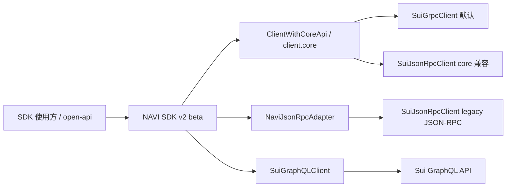
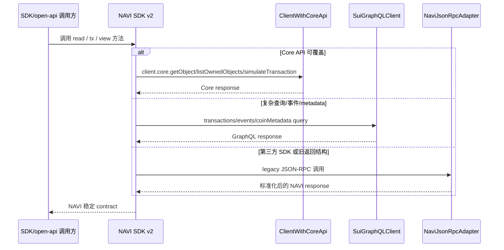
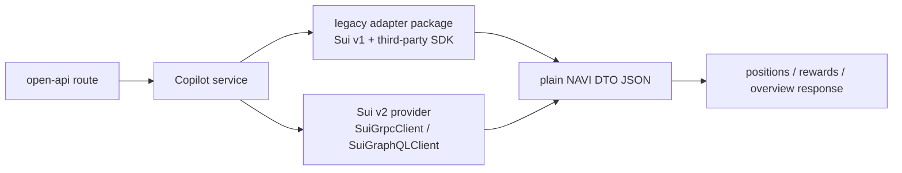

# Sui SDK 2.0 升级技术方案

日期：2026-06-01  
关联需求：ENG-3654 `mysten sui sdk 2.0 升级`  
npm 依赖快照时间：2026-06-01

## 0. 结论

本次目标是做 **Sui SDK v2 beta 完整迁移版本**，不是做一个半套兼容版本。SDK v1 和 v2 会并行维护一段时间，后续再根据业务迁移情况决定 v1 的收口方式。

本次我们负责：

| 范围 | 本次是否负责 | 说明 |
| --- | --- | --- |
| SDK 仓库 `naviprotocol-monorepo` | 是 | 核心改造范围，目标是发布 Sui SDK 2.0 兼容 v2 beta。 |
| `navi-open-api` | 是 | 核心后端改造范围，负责接入 SDK v2、清理旧 Sui SDK、承接 Copilot 数据接口。 |
| Copilot 数据迁 open-api | 是 | 单独章节梳理；目标是和前端现有 11 个协议全量 parity。 |
| 前端 | 否 | 由其他同学处理；本文只写前后端边界和联调要求。 |
| `dex-aggregator-backend` | 否 | 有对应后端同学后续处理；本文只列影响点，并判断是否阻塞我们。 |
| 其他后端 | 否，除 open-api 外 | 如果受 SDK v2 影响，只列出影响点，后续交给对应 owner。 |

核心判断：

1. **SDK v2 应按官方迁移指南完整改造**：移除 v1 `SuiClient` / `@mysten/sui.js`，升级到 `@mysten/sui@2`，同步 ESM-only、Node 22、network 必填、BCS schema、Core API、GraphQL / gRPC / JSON-RPC 传输策略、transaction executor 返回结构。
2. **Node 22 对我们是落地必要条件**：官方文档正文强调 ESM-only，但 `@mysten/sui@2.x` npm package `engines.node` 是 `>=22`。SDK monorepo 当前 root 是 `node >=20`，open-api 没有显式 engines；v2 beta 需要把 SDK/open-api build/test/runtime 统一到 Node 22。
3. **ClientWithCoreApi 不是“另一个阶段”**，它是官方为了让 SDK 同时支持 JSON-RPC / gRPC / GraphQL client 的通用接口。我们的 v2 beta 应按官方建议抽象 client：能走 Core API 的 public 方法接受 `ClientWithCoreApi`；不能走 Core API 的旧 JSON-RPC 能力进入 `NaviJsonRpcAdapter`，不把旧 `SuiClient` 类型继续暴露给使用方。
4. **当前最大阻塞不是我们不做完整迁移，而是第三方依赖是否已经支持 Sui 2.0**。Mayan、Pyth、Scallop、Magma、MMT 仍有 Sui 1.x 依赖，需要逐个判断是否阻塞对应 package。
5. **open-api Copilot API 目前主要是内部使用**，包括 NAVI 前端、defi CLI / MCP / AI 工具。是否对外公开暂不作为本方案前提，但内部使用也需要稳定 contract，否则前端和 MCP 会各自处理错误和兼容。

## 1. ClientWithCoreApi 是什么

一句话：`ClientWithCoreApi` 是 Mysten SDK v2 里“只要求 client 有 `core` API 能力”的类型抽象。这样 SDK 不需要绑定死 `SuiJsonRpcClient`，也可以接受 `SuiGrpcClient` 或 `SuiGraphQLClient`。

为什么会出现在方案里：

1. 官方建议 SDK maintainers 不要继续把 public API 写死成旧的 `SuiClient`，而是接受 `ClientWithCoreApi`。
2. `SuiGrpcClient`、`SuiGraphQLClient`、`SuiJsonRpcClient` 都可以实现 Core API，所以 Core API 读路径可以使用同一套 SDK 方法。
3. 但是我们当前 SDK/open-api 里有大量 `devInspectTransactionBlock`、`dryRunTransactionBlock`、`executeTransactionBlock`、`queryEvents`、`queryTransactionBlocks` 这类 JSON-RPC 风格调用。不是所有调用都能无脑替换成 `client.core.*`。

所以本方案的处理方式是：

| 场景 | v2 处理 |
| --- | --- |
| 默认 client factory | 优先创建 `SuiGrpcClient`；需要复杂查询时配套 `SuiGraphQLClient`。 |
| 读取对象、coin、package、基础链上数据 | 优先 `client.core.*`，SDK public 方法参数使用 `ClientWithCoreApi`。 |
| query transaction / event / total supply / historical data | 优先 `SuiGraphQLClient`，避免继续堆 JSON-RPC 查询逻辑。 |
| dryRun / devInspect | 优先 `client.core.simulateTransaction`；`devInspect` 等价语义使用 `checksEnabled: false`。 |
| execute / signer | 优先 `signer.signAndExecuteTransaction({ transaction, client })` 或 v2 transaction executor；统一处理 `Transaction` / `FailedTransaction` union 返回。 |
| 第三方 SDK 或旧返回结构无法迁移 | 隔离到 `NaviJsonRpcAdapter`，只允许 adapter 内使用 `SuiJsonRpcClient`。 |
| SDK public API | 不再暴露旧 `SuiClient` / `SuiTransactionBlockResponse` / `DryRunTransactionBlockResponse` 作为稳定 contract。 |

这不是“分期不做完整迁移”，而是完整迁移时需要区分：**官方推荐的 client 抽象**、**推荐传输 gRPC / GraphQL** 和 **兼容迁移用 JSON-RPC adapter**。

## 2. 官方变化摘要和我们的改造思路

官方文档来源：

- [Migrate to 2.0](https://sdk.mystenlabs.com/sui/migrations/sui-2.0)
- [@mysten/sui](https://sdk.mystenlabs.com/sui/migrations/sui-2.0/sui)
- [Migrating from JSON-RPC](https://sdk.mystenlabs.com/sui/migrations/sui-2.0/json-rpc-migration)
- [SDK Maintainers](https://sdk.mystenlabs.com/sui/migrations/sui-2.0/sdk-maintainers)
- [Core API](https://sdk.mystenlabs.com/sui/clients/core)
- [BCS](https://sdk.mystenlabs.com/sui/bcs)
- [Wallet Builders](https://sdk.mystenlabs.com/sui/migrations/sui-2.0/wallet-builders)
- [Building SDKs](https://sdk.mystenlabs.com/sui/sdk-building)
- [dApp Kit](https://sdk.mystenlabs.com/sui/migrations/sui-2.0/dapp-kit)

| 官方变化 | 对应改造思路 | 涉及范围 |
| --- | --- | --- |
| `@mysten/*` ESM-only，`@mysten/sui@2.x` package engines `node >=22` | SDK v2 改 ESM-only；SDK/open-api build/test/runtime 统一 Node 22；TypeScript moduleResolution 改 `NodeNext` / `Bundler` | SDK、open-api |
| 移除 `@mysten/sui/client` 下的 `SuiClient`、`getFullnodeUrl`、JSON-RPC types | 旧 `SuiClient` 全部移除；JSON-RPC 兼容代码使用 `@mysten/sui/jsonRpc` 的 `SuiJsonRpcClient`、`getJsonRpcFullnodeUrl`；优先走 gRPC/Core | SDK 全包、open-api |
| client 构造必须传 `network` | 所有 client singleton / test / demo 明确 network | SDK、open-api |
| JSON-RPC 被标记为 deprecated，推荐迁 gRPC / GraphQL | 默认 `SuiGrpcClient`；复杂查询/事件/metadata 用 `SuiGraphQLClient`；`SuiJsonRpcClient` 只作为 `NaviJsonRpcAdapter` 兼容层 | SDK、open-api |
| SDK maintainer 建议接受 `ClientWithCoreApi` | public API 不继续绑定旧 `SuiClient`；能走 Core API 的 read path 使用 `ClientWithCoreApi` 和 `client.core.*` | SDK |
| Core API 替换对象/coin/dynamic field/dryRun/devInspect | `getObject` -> `core.getObject`，`multiGetObjects` -> `core.getObjects`，`getOwnedObjects` -> `core.listOwnedObjects`，`dryRun/devInspect` -> `core.simulateTransaction` | SDK lending/wallet/aggregator/dca、open-api |
| `queryEvents`、`queryTransactionBlocks`、`getTotalSupply` 等历史/索引类查询建议迁 GraphQL；`getCoinMetadata` 可走 Core API | open-api stats/Copilot 查询路径引入 GraphQL client；metadata 走 Core 或 GraphQL；SDK 内部只在必要时提供轻量 wrapper | open-api、SDK docs |
| BCS schema、ExecutionStatus、object schema 调整 | BCS parser 和 simulate returnValues 补 golden tests；解析对象内容使用 `include: { content: true }`，不要把 `objectBcs` 当 Move struct 内容解析 | SDK lending、open-api navi/veNavx |
| Experimental API 稳定化，`Experimental_` 前缀移除 | 替换 `wallet-client/src/signer.ts` 相关类型 | SDK wallet-client |
| `Commands` 改名 `TransactionCommands` | 扫描并替换 `Commands` import；当前仓库暂未发现直接使用，但作为检查项保留 | SDK、open-api |
| GraphQL schema consolidated | 如使用 `@mysten/sui/graphql/schemas/latest` 等旧路径，改 `@mysten/sui/graphql/schema`；当前扫描未发现直接使用 | open-api |
| `namedPackagesPlugin` 和全局 plugin registry 移除 | 如后续使用 MVR，要通过 client 构造的 `mvr` 配置；当前扫描未发现直接使用 | SDK |
| Transaction executor 接受 `ClientWithCoreApi`，返回结构变化 | wrapper / signer / execute response 不再穿透旧 raw response | SDK wallet-client、aggregator |
| transaction 默认 expiration | 后续 build unsigned tx bytes 必须返回有效期 metadata；前端过期后重新 build | open-api 交易构建类接口 |
| zkLogin legacy address 参数 | 当前 SDK/open-api 未发现直接 zkLogin import；如果后续接入 wallet/auth，要明确 `legacyAddress` 行为并做回归 | 后续 wallet/auth |
| wallet standard `reportTransactionEffects` 移除、新 effects BCS 结构 | 我们不是钱包 extension，但 wallet-client/sign 执行路径需要按 v2 `signer.signAndExecuteTransaction` 和 union response 处理 raw effects | SDK wallet-client |
| 官方 SDK 建议 client extension、`tx` / `call` / `view` 分层、transaction thunks | v2 beta 不强制重构所有包为 extension，但新增/改造 SDK public surface 应按 `ClientWithCoreApi`、`tx/call/view` 分层和 thunk 思路组织，降低后续维护成本 | SDK |
| dApp Kit 重写 | 前端另行处理；本方案只避免 Copilot 数据继续依赖前端多套协议 SDK | 前端边界 |

### 2.1 SDK-specific guides 递归查漏

| 官方 guide / 递归链接 | 本地是否直接使用 | 对本方案的补充 |
| --- | --- | --- |
| `@mysten/sui` | 是，SDK/open-api 大量使用 | 新增检查项：`TransactionCommands`、GraphQL schema 路径、`namedPackagesPlugin` 移除、executor union 返回、默认 expiration、zkLogin legacy 参数。 |
| `Migrating from JSON-RPC` | 是，当前主要是 JSON-RPC 风格调用 | 明确 gRPC/Core/GraphQL 分工：对象/coin/dynamic field/metadata/simulate 走 Core；事件/交易查询/totalSupply 走 GraphQL；JSON-RPC 只放 adapter。 |
| `SDK Maintainers` / `Core API` / `Building SDKs` | 是，我们是 SDK 发布方 | public 方法接受 `ClientWithCoreApi`；`@mysten/*` 放 peer + dev；新增 public surface 按 `tx` / `call` / `view` 分层；读对象内容使用 `content` BCS。 |
| `BCS` | 是，lending/open-api 有 BCS parser | 补充 `content` 和 `objectBcs` 的区别；effects 解析按 `bcs.TransactionEffects` V1/V2 union 做 golden tests。 |
| `Wallet Builders` | 间接受影响，wallet-client 有 sign/execute wrapper | 不做 wallet extension，但必须适配 `signAndExecuteTransaction` 新返回结构：`Transaction` / `FailedTransaction` union、`tx.effects.bcs`。 |
| `@mysten/dapp-kit` | 前端范围，本次不直接改 | 只记录前端后续需要处理；open-api/Copilot 迁后端可降低前端同时维护协议 SDK 的压力。 |
| `@mysten/kiosk` / `@mysten/zksend` / `@mysten/suins` / `@mysten/deepbook-v3` / `@mysten/walrus` / `@mysten/seal` | 当前 SDK/open-api 没有直接 import | 不作为本次直接迁移项；这些 guide 的共同模式是 client extension + 支持 gRPC/GraphQL/JSON-RPC，作为我们 SDK 后续演进方向。 |

### 2.2 目标架构





## 3. 阻塞依赖总览

本节回答：哪些依赖会阻塞我们完成 v2，哪些可以通过兼容方案消除阻塞。

### 3.1 结论

按目前讨论的边界，**SDK v2 主链路可以不被第三方 Sui v1 SDK 阻塞**，前提是：

1. `@naviprotocol/astros-bridge-sdk` 不声明 Sui v2 ready，保留为 Mayan legacy bridge 维护线。
2. open-api Copilot 的 AlphaFi / MMT / Scallop / Magma 等 read-only 协议允许先用 legacy adapter 输出 NAVI DTO。
3. `navi-sdk` 从 open-api 中移除，按已存在的迁移指南替换到拆分后的 `@naviprotocol/*` 包，不作为 legacy 兼容对象。
4. 涉及交易构建的能力不能用 v1 SDK 混入 v2 主链路；要么自建 v2 builder，要么等上游。

如果要求 **bridge 也必须在本次 v2 beta 中 Sui v2 ready**，则 Mayan 仍是硬阻塞。

### 3.2 阻塞等级

| 等级 | 含义 | 处理原则 |
| --- | --- | --- |
| P0 | 不处理会阻塞 SDK/open-api v2 主链路 | 移除、替代、或降级为不纳入 v2 ready。 |
| P1 | 阻塞某个 package / 协议 parity，但不阻塞 v2 主链路 | legacy adapter / direct adapter / worker 过渡。 |
| P2 | 可升级或只需适配 | 正常升级回归。 |
| Not blocker | 内部历史依赖或已拆包迁移 | 顺手清理，不作为上游阻塞。 |

### 3.3 依赖分级和兼容方案

| 依赖 | 当前状态 | 影响范围 | 等级 | 最佳实践兼容方案 | 是否只能等上游 |
| --- | --- | --- | --- | --- | --- |
| `navi-sdk` | 旧聚合包仍依赖 `@mysten/sui` v1 / `@mysten/sui.js` / Mayan / Pyth；但已有拆包迁移文档：`navi-sdk` -> `@naviprotocol/lending`、`@naviprotocol/astros-aggregator-sdk`、`@naviprotocol/astros-bridge-sdk` | open-api 仍有直接 import | Not blocker | open-api 移除 `navi-sdk`，按迁移指南替换到拆分 SDK v2 或本地 service；不要做 legacy adapter | 否 |
| `@mayanfinance/swap-sdk@14.2.0` | 最新版仍 dependencies `@mysten/sui ^1.34.0`；Mayan Sui 源链 tx build 依赖 SDK 本地拼 Move calls | `astros-bridge-sdk` | P0，如果 bridge 必须 v2 ready；否则 P1 legacy | Bridge 不进入 Sui v2 ready 主链路；维护 `astros-bridge-sdk@1.x` legacy line，内部 pin Sui v1 + Mayan，仅输出 plain result；如必须 v2 ready，单独做 Mayan v2 tx builder spike | bridge 必须 v2 ready 时，基本只能等上游或自建 builder |
| `@pythnetwork/pyth-sui-js@3.0.0` | 仍 dependencies `@mysten/sui ^1.3.0` | lending oracle、Suilend/Scallop/Firefly 间接依赖 | P1 | 自研 lending 不再依赖 `pyth-sui-js`：Hermes 数据用 `@pythnetwork/hermes-client`，链上 stale check 走 Core API，Pyth update PTB 用 v2 `Transaction` 直接实现或单独 spike；三方 SDK 的 Pyth 依赖只留在 legacy adapter 内 | 否，但 Pyth update tx builder 需要 spike |
| `@alphafi/alphalend-sdk@1.1.27/2.0.2` | peer `@mysten/sui 1.45.0`，依赖 Pyth | open-api Copilot AlphaFi | P1 | Copilot read-only 先用 legacy adapter package，内部 pin Sui v1，输出 `CopilotPosition` DTO；长期改 v2 direct adapter / 协议 API | 否 |
| `@mmt-finance/clmm-sdk@1.3.25` | peer `@mysten/sui ^1.28.2` | open-api Momentum/MMT provider | P1 | read-only legacy adapter package；只输出 positions/rewards DTO；如果 Next build 冲突再升级为独立 HTTP worker | 否 |
| `@scallop-io/sui-scallop-sdk@2.4.5` | dependencies + peer `@mysten/sui 1.45.2`，依赖 Pyth | Copilot Scallop parity | P1 | 先尝试 read-only legacy adapter；失败则列为协议 parity blocker，不影响 SDK v2 主链路 | 不一定 |
| `@magmaprotocol/magma-clmm-sdk@0.6.2` | peer `@mysten/sui ^1.35.0`、`@mysten/bcs ^1.7.0` | Copilot Magma parity | P1 | 先尝试 read-only direct adapter 或 legacy adapter；不把 SDK 类型外泄 | 不一定 |
| `@suilend/sdk@3.0.3` / `@suilend/sui-fe@3.0.2` | peer `@mysten/sui 2.15.0`，但 Suilend SDK peer Pyth 2.2.0 | wallet-client、open-api Suilend | P2 | 升级到 v3；验证 Pyth 依赖不外泄到 public API；必要时把 Pyth 相关路径隔离 | 否 |
| Cetus CLMM / DLMM / Vaults | 新版支持或内置 Sui2 | open-api Cetus | P2 | 升级新版并回归 positions/rewards | 否 |
| `@firefly-exchange/library-sui` | open-api 当前 2.x 是 Sui1；最新 4.x 依赖 Sui2，但仍带 Pyth | open-api Bluefin/Firefly | P2 | 升级 4.x 后验证；如果 Pyth 路径不参与 read-only 可继续主链路 | 否 |
| `shio-sdk@1.0.9` | 不直接依赖 Mysten SDK | aggregator/dca/wallet-client | P2 | 正常回归 | 否 |

### 3.4 Legacy adapter 兼容方式

open-api 可以短期同时存在 Sui v1 / v2 依赖，但必须隔离：



推荐优先级：

| 方案 | 适用场景 | 优点 | 风险 / 限制 |
| --- | --- | --- | --- |
| v2 direct adapter | 能用 Core / GraphQL / 协议 HTTP API 直接读的数据 | 最干净，长期方案 | 初期实现成本高 |
| workspace legacy adapter package | Copilot read-only 协议，如 AlphaFi / MMT / Scallop / Magma | 成本低，可快速达成 parity | Next build 可能依赖解析冲突，需要验证 |
| 独立 HTTP worker | legacy package 在 Next build/runtime 冲突 | 隔离最彻底 | 部署和运维成本更高 |
| 等上游 / 自建 v2 tx builder | bridge / swap / claim 等交易构建 | 最安全 | 进度或成本高 |

legacy adapter 的硬规则：

1. adapter 内部可以依赖 Sui v1 SDK 和三方 v1 SDK。
2. adapter 对外只能返回 plain JSON / NAVI DTO。
3. 不能返回或暴露 `SuiClient`、`Transaction`、`SuiObjectResponse`、`SuiTransactionBlockResponse`。
4. 不能把 v1 `Transaction` 交给 v2 wallet / dApp Kit / `SuiGrpcClient` 签名执行。
5. read-only 可以 adapter 过渡；tx builder 不建议 adapter 混用。

### 3.5 Bridge legacy 方案

Mayan 是交易构建问题，不适合用普通 read-only adapter 类比。推荐口径：

| 包 | v2 状态 |
| --- | --- |
| `@naviprotocol/lending@2 beta` | Sui v2 ready |
| `@naviprotocol/wallet-client@2 beta` | Sui v2 ready |
| `@naviprotocol/astros-aggregator-sdk@2 beta` | Sui v2 ready |
| `@naviprotocol/astros-dca-sdk@2 beta` | Sui v2 ready |
| `@naviprotocol/astros-bridge-sdk@1.x` | legacy bridge line，不声明 Sui v2 ready |

`astros-bridge-sdk@1.x` legacy line 需要做小改造：

```json
{
  "dependencies": {
    "@mysten/sui": "1.45.2",
    "@mayanfinance/swap-sdk": "14.2.0"
  }
}
```

至少不能继续让 peer 范围误吃 Sui v2：

```json
{
  "peerDependencies": {
    "@mysten/sui": ">=1.25.0 <2"
  }
}
```

更推荐内部 pin Sui v1，因为它可能被 Sui v2 前端 app lazy import。bridge legacy 可用性不能靠构建判断，必须用 6 步 smoke 验证：

1. build bridge tx。
2. 钱包能弹签。
3. 签名后的 bytes 能 execute。
4. 返回 digest。
5. Mayan status 能查到。
6. 源链 tx / 目标链 tx 都完成。

### 3.6 对“v2 是否还有阻塞”的判断

按上述方案，**SDK v2 主链路没有必须等待三方上游的阻塞**：

1. `navi-sdk`：不是阻塞，按迁移指南移除。
2. Mayan：不纳入 v2 ready，legacy bridge 隔离。
3. AlphaFi / MMT / Scallop / Magma：Copilot read-only 用 legacy adapter 或 direct adapter。
4. Pyth：自研 lending 路径替换为 Hermes + v2 transaction builder；第三方依赖留在 adapter。

仍需确认的不是“能不能做”，而是产品口径：

1. 是否接受 `astros-bridge-sdk@1.x` 作为 legacy，不纳入 v2 ready。
2. 是否接受 open-api Copilot read-only 先用 legacy adapter 达成 parity。
3. 是否接受 tx builder 能力不通过 legacy adapter 混用，必要时单独 spike。

## 4. SDK 仓库 package 级方案

仓库：`/Users/Tmac/Desktop/work/navi/naviprotocol-monorepo`

### 4.1 `@naviprotocol/lending`

| 项 | 内容 |
| --- | --- |
| 现状 | peer `@mysten/sui >=1.25.0`，dev `1.38.0`，依赖 `@mysten/bcs 1.6.3`、`@pythnetwork/pyth-sui-js ^2.0.0`。 |
| 影响点 | `SuiClient`、`getFullnodeUrl`、Coin 类型、devInspect、BCS parser、oracle/reward/account/emode。 |
| 核心改造 | 迁到 `@mysten/sui@2`、`@mysten/bcs@2` 或 `@mysten/sui/bcs`；read path 参数改 `ClientWithCoreApi`；`getObject/multiGetObjects` 改 `client.core.*`；`devInspect` 改 `core.simulateTransaction({ checksEnabled: false })`；解析 `commandResults.returnValues`；区分 `content` 和 `objectBcs`。 |
| 阻塞依赖 | Pyth 仍依赖 Sui 1.x，oracle 路径需评估隔离或替代。 |
| 验证 | BCS golden tests、reward/account/oracle/emode simulate returnValues、object content parser、build/typecheck。 |

### 4.2 `@naviprotocol/wallet-client`

| 项 | 内容 |
| --- | --- |
| 现状 | peer `@mysten/sui >=1.25.0`，依赖旧 `@suilend/sdk 1.1.75`、`@suilend/sui-fe 0.3.x`。 |
| 影响点 | constructor `SuiClientOptions`、public `client: SuiClient`、signer、balance/lending/swap/volo/haedal module return types。 |
| 核心改造 | 改成 v2 client factory，默认 `SuiGrpcClient`；移除 `Experimental_SuiClientTypes`；signer/execute 改按 v2 `signer.signAndExecuteTransaction` 或 executor 处理 `Transaction` / `FailedTransaction` union；返回 NAVI 自定义结果类型，避免穿透旧 `SuiTransactionBlockResponse`。 |
| 阻塞依赖 | Suilend 可升级到 v3，但 Pyth 2.2.0 仍依赖 Sui 1.x，需要验证依赖树能否共存。 |
| 验证 | sign / simulate / execute wrapper tests；effects BCS 解析；各 module 返回类型 snapshot；Suilend smoke test。 |

### 4.3 `@naviprotocol/astros-aggregator-sdk`

| 项 | 内容 |
| --- | --- |
| 现状 | peer `@mysten/sui >=1.25.0`，依赖 `shio-sdk`，没有直接第三方 Sui SDK blocker。 |
| 影响点 | swap PTB、route dryrun、execute response、client 参数。 |
| 核心改造 | client import 替换；route/dryRun 改 `core.simulateTransaction`；execute response 处理 union；交易构建路径保留有效期 metadata；新增代码按 `tx` / `call` / `view` 分层，不把旧 raw response 作为 public contract。 |
| 阻塞依赖 | 暂未发现硬阻塞；但 dex backend 仍用 v1，v2 发布不能强制覆盖 v1。 |
| 验证 | route build、swap PTB、dryRun parser、open-api `/api/astros/ptb` 联动 smoke。 |

### 4.4 `@naviprotocol/astros-bridge-sdk`

| 项 | 内容 |
| --- | --- |
| 现状 | 依赖 `@mayanfinance/swap-sdk 13.3.0`；npm 最新 Mayan 14.2.0 仍依赖 `@mysten/sui ^1.34.0`。 |
| 影响点 | Mayan/Sui tx build、execute response、Sui client 类型。 |
| 核心改造 | 先验证 Mayan 是否能在 Sui2 项目中隔离运行；若不能，需要 bridge v2 标注 blocker 或替代方案。禁止把 Mayan 的 Sui1 类型泄露到 SDK v2 public API。 |
| 阻塞依赖 | Mayan 是当前硬风险。 |
| 验证 | bridge quote/build tx smoke；依赖树检查；打包检查。 |

### 4.5 `@naviprotocol/astros-dca-sdk`

| 项 | 内容 |
| --- | --- |
| 现状 | peer `@mysten/sui >=1.25.0`，依赖 `shio-sdk`。 |
| 影响点 | DCA create/cancel、coin utils、client 参数类型。 |
| 核心改造 | client import 替换；coin pagination 改 `client.core.listCoins` / `listOwnedObjects` 对应结构；simulate/parser 适配；交易构建路径保留 expiration 影响说明。 |
| 阻塞依赖 | 暂未发现硬阻塞。 |
| 验证 | create/cancel PTB、coin utils、dryRun smoke。 |

### 4.6 docs / examples

| 项 | 内容 |
| --- | --- |
| 现状 | docs 和 README 仍有 `SuiClient` 示例。 |
| 核心改造 | 更新 v2 migration guide、ESM import 示例、Node 22、`SuiGrpcClient` 默认示例、GraphQL 查询示例、`NaviJsonRpcAdapter` 边界、client 初始化、response 类型变化。 |
| 验证 | docs 示例能 typecheck 或至少和新 API 一致。 |

## 5. open-api 仓库方案

仓库：`/Users/Tmac/Desktop/work/navi/navi-open-api`

### 5.1 现状

当前依赖：

```text
@mysten/sui 1.25.0
@mysten/sui.js ^0.54.1
@mysten/bcs 1.5.0
@naviprotocol/lending ^1.4.0
@naviprotocol/astros-aggregator-sdk ^1.14.0
@naviprotocol/astros-bridge-sdk ^1.2.0
@naviprotocol/astros-dca-sdk ^1.0.0
navi-sdk 1.6.15-dev.1
```

粗略扫描：

| 区域 | `@mysten/sui/client` import | `@mysten/sui.js` | `SuiClient` | `devInspect` |
| --- | ---: | ---: | ---: | ---: |
| open-api src | 18 | 2 | 28 | 29 |

### 5.2 影响点和核心改造

| 模块/API | 影响点 | 升级方案 | 阻塞 |
| --- | --- | --- | --- |
| 项目运行环境 | 当前未显式 `engines`，`@types/node` 是 20 | 增加 Node 22 约束；确认 Next 16/open-api 部署环境支持 Node 22；TS moduleResolution 保持 `bundler` 可解析 ESM subpath exports | 部署环境需确认 |
| `src/services/copilot/sui-client.ts` | 直接 new `SuiClient` | 改成 v2 client factory：默认 `SuiGrpcClient`，补 `SuiGraphQLClient`，必要时暴露 `NaviJsonRpcAdapter` | 无 |
| `/api/copilot/positions` | 当前 JSON 路径可能 double-send；协议失败不返回给调用方 | 修 response wrapper，补 `partialFailures`、`unsupportedProtocols` | 无，必须先修 |
| `/api/copilot/rewards` | 错误语义和 partial failure 不统一 | 和 positions 共用 contract | 无 |
| `/api/copilot/overview` | 文件存在，但当前 handler 直接 `throw new Error('Service temporarily unavailable')` | 恢复为正式接口；因为你要求 Copilot parity，这里应纳入 open-api 改造 | 无 |
| `src/services/rewards.ts` | 使用旧 `@mysten/sui.js/client` | 移除 `@mysten/sui.js`；对象读取走 Core API，必要旧结构走 adapter | 无 |
| `src/services/suiSDK.ts` | 使用旧 `@mysten/sui.js/transactions` / `TransactionBlock` | 改为 v2 `Transaction`；`devInspect` 改 simulate；旧 `TransactionBlock` 类型全部消除 | 无 |
| `src/services/navi/*`、`veNavx/*` | 多处 devInspect parser | 抽公共 simulate parser，覆盖 `commandResults.returnValues` / error / empty；BCS parser 使用 v2 schema | 无 |
| `/api/astros/ptb` | tx build / transaction response shape / 默认 expiration | 先适配 SDK v2；交易 bytes API 返回 expiration 相关 metadata；不混入 Copilot read-only 迁移 | 取决于 SDK aggregator |
| `/api/afsui/stats`、`haedal/stats`、`volo/stats` | queryEvents / EventId 类型 | 优先迁 GraphQL `events` query；如果字段不等价再隔离 adapter | 无 |
| metadata / token price 补全 | `getCoinMetadata` / `getTotalSupply` JSON-RPC 风格 | `getCoinMetadata` 优先 Core API；`getTotalSupply` 或历史聚合优先 GraphQL；统一 cache 和 failure 语义 | 无 |

### 5.3 open-api API 使用范围

当前理解：**主要是 NAVI 内部使用**，包括：

1. NAVI 前端后续调用。
2. defi CLI / MCP / AI tools 调用。
3. open-api 内部服务复用。

这和“是否对外公开”的关系：

| 使用范围 | 影响 |
| --- | --- |
| 内部 only | 不需要公开 SLA / API key 体系，但仍需要稳定 response contract，否则前端和 MCP 都会重复兼容错误。 |
| NAVI 前端 + MCP/CLI | 需要版本化或至少保持 additive contract；需要 requestId、限流、cache 策略。 |
| 外部公开 | 还需要 API key、CORS 白名单、文档、兼容承诺、deprecation policy。 |

本方案按“内部 + NAVI 前端 + MCP/CLI”设计，不按完全公开外部 API 设计。

## 6. Copilot 数据迁 open-api

### 6.1 目标

根据讨论，Copilot 各协议数据迁移到 open-api。当前 open-api Copilot 接口主要用于 navi defi CLI / MCP，没有对产品前端正式发布。本次目标是让 open-api 成为 Copilot read-only 数据源，并与前端现有 11 个协议全量 parity。

### 6.2 协议 parity

| 协议 | 前端当前支持 | open-api 当前支持 | 改造判断 |
| --- | --- | --- | --- |
| `navi` | 是 | 是 | 必须保留。 |
| `suilend` | 是 | 是 | 必须升级依赖并回归。 |
| `wallet` | 是 | 是 | 必须保留。 |
| `volo` | 是 | 是 | 必须保留。 |
| `momentum` | 是 | 是 | 必须保留。 |
| `cetus` | 是 | 是 | 必须保留，Cetus 新版支持 Sui2。 |
| `alphafi` | 是 | 是 | 必须保留。 |
| `bluefin` | 是 | 是 | 必须保留。 |
| `magma` | 是 | 否 | 需要新增；Magma SDK peer Sui 1.x，是阻塞风险。 |
| `scallop` | 是 | 否 | 需要新增；Scallop SDK 锁 Sui 1.45.2，是高风险阻塞。 |
| `ember` | 是 | 否 | 需要新增；需从前端现有实现迁到 open-api。 |

### 6.3 API contract

建议保持当前 `/api/copilot/*` 路径，内部使用即可；如果后续要对外公开，再加 `/api/v1` 和公开文档。

成功响应建议：

```json
{
  "data": {
    "address": "0x...",
    "requestedProtocols": ["navi", "scallop"],
    "servedProtocols": ["navi"],
    "unsupportedProtocols": [],
    "partialFailures": [
      {
        "protocol": "scallop",
        "code": "protocol_failed",
        "message": "scallop provider failed"
      }
    ],
    "protocols": {}
  },
  "code": 0,
  "requestId": "req_xxx"
}
```

必须修正：

1. `/api/copilot/positions` JSON 路径潜在 double-send。
2. `parseProtocols` 不能静默过滤未知协议。
3. provider 失败不能只打 log，必须返回 `partialFailures`。
4. `/api/copilot/overview` 当前代码存在但不可用，需要恢复正式返回。
5. Copilot 接口需覆盖 JSON / CSV、rate limit、cache、requestId。

### 6.4 边界

| 能力 | 是否迁 open-api |
| --- | --- |
| positions / rewards / overview | 是 |
| protocol SDK 调用、价格补全、position normalize | 是 |
| 钱包连接、签名、执行交易 | 否，仍在前端 |
| claim/reward tx bytes build | 不属于 Copilot read-only 首要目标；如后续做，需要单独安全和 wallet E2E 验证 |

## 7. dex / 其他后端影响

`dex-aggregator-backend` 不在本次改造范围，后续由对应后端同学处理。本方案只判断是否阻塞 SDK/open-api。

| 模块 | 受影响点 | 是否阻塞我们 |
| --- | --- | --- |
| dex route dryrun / find-routes | `dryRunTransactionBlock` response parser | 否。v1 SDK 继续维护即可。 |
| DEX providers | Cetus / DeepBook / Bluefin / Magma / Momentum 等 provider 依赖 Sui SDK / 第三方 SDK | 否。后续独立迁移。 |
| DCA event worker | Event shape / cursor | 否。后续独立迁移。 |
| xBTC campaign | 旧 `@mysten/sui.js` + 服务端签名/执行 | 否。交易执行路径需单独安全评审。 |
| dex 消费 `@naviprotocol/astros-aggregator-sdk` v1 | v2 发布可能影响它 | 不应阻塞。SDK v2 用 beta/next，v1 继续维护。 |

## 8. 总体计划和 工时预估

说明：粗估，默认有现有代码上下文、自动化搜索、AI 协助改造和测试补全；不包含前端 dApp Kit 改造和 dex backend 改造。

| 阶段 | 内容 | 产出 |工时 |
| --- | --- | --- | --- |
| A. 依赖和方案冻结 | 确认 SDK package 阻塞依赖、Copilot 11 协议 parity、open-api 内部使用 contract | 最终 go/no-go 表 | - |
| B. SDK 基础迁移 | ESM-only、Node 22、`@mysten/sui@2`、import/type 替换、`SuiGrpcClient` 默认 factory、`SuiGraphQLClient`、`NaviJsonRpcAdapter`、`ClientWithCoreApi` public surface | SDK v2 基础可 build | - |
| C. SDK package 改造 | lending / wallet-client / aggregator / dca / bridge 逐包改造；bridge/Mayan 如阻塞则形成替代方案或 blocker 说明 | SDK v2 beta | - |
| D. SDK 测试和文档 | BCS golden tests、dryRun/devInspect parser tests、migration guide、examples | SDK v2 beta 可交付 | - |
| E. open-api Sui2 改造 | 升级 SDK、移除 `@mysten/sui.js`、Node 22、gRPC/GraphQL client factory、JSON-RPC adapter、navi/veNavx simulate parser | open-api Sui2 build/typecheck | - |
| F. Copilot 迁后端 | positions/rewards/overview contract、11 协议 parity、Magma/Scallop/Ember 新增或 blocker 处理 | Copilot 后端数据源 | - |
| G. 联调和验收 | golden wallet parity、MCP/CLI smoke、前端数据源联调支持 | 验收报告 | - |

总计：

| 范围 | 工时 |
| --- | ---: |
| SDK v2 beta 完整迁移 | - |
| open-api + Copilot 迁移 | - |
| 联调验收 | - |
| 合计 | - |

主要不确定项：

1. Mayan 是否有可用 Sui2 方案。
2. Pyth 是否能隔离 Sui1 依赖，不污染 SDK v2 使用方。
3. Scallop/Magma 是否能在 open-api Sui2 依赖树里稳定运行。
4. Copilot 11 协议 parity 的 golden wallet 数据差异。

## 9. 验收标准

### SDK

- [ ] 所有 v2 package 在 Node 22 下 build/typecheck 通过。
- [ ] v2 package ESM-only，v1 保持原发布方式。
- [ ] 不再对外暴露旧 `SuiClient` 作为 public contract。
- [ ] SDK public read/view 方法能走 `ClientWithCoreApi`，默认 client factory 使用 `SuiGrpcClient`。
- [ ] JSON-RPC 调用只存在于 `NaviJsonRpcAdapter` 或明确标记的第三方兼容路径中。
- [ ] `queryEvents` / `queryTransactionBlocks` / `getTotalSupply` 有 GraphQL 迁移或明确 adapter 说明；`getCoinMetadata` 走 Core API 或明确说明。
- [ ] `Experimental_SuiClientTypes` 移除。
- [ ] `TransactionCommands`、MVR plugin、GraphQL schema、default expiration、zkLogin legacyAddress 均完成扫描并记录“已改 / 不涉及”结果。
- [ ] `SuiTransactionBlockResponse` / `DryRunTransactionBlockResponse` 不作为 NAVI v2 稳定返回类型。
- [ ] lending BCS / oracle / reward / account / emode simulate golden tests 通过。
- [ ] bridge/Mayan 如果无法完成 Sui2，必须有明确 blocker 说明和对 v2 beta 的影响范围。
- [ ] migration guide 和 docs examples 更新。

### open-api

- [ ] 移除本次路径里的 `@mysten/sui.js` 使用。
- [ ] `SuiClient` import 替换为 v2 client，Node 22 runtime/deploy 环境确认完成。
- [ ] open-api 有统一 `SuiGrpcClient` / `SuiGraphQLClient` / `NaviJsonRpcAdapter` 工厂。
- [ ] stats / event / totalSupply 路径优先走 GraphQL；metadata 走 Core API；无法迁移的路径有 adapter 说明。
- [ ] navi / veNavx / rewards 的 devInspect 路径改 simulate parser，并覆盖 empty/error/returnValues。
- [ ] `/api/copilot/positions` JSON / CSV smoke test 通过，无 double-send。
- [ ] `/api/copilot/rewards` 和 `/api/copilot/overview` 有统一 contract。
- [ ] invalid address、unsupported protocol、rate limit、partial failure、all failed 均有明确响应。
- [ ] MCP/CLI 调用不被破坏。

### Copilot

- [ ] open-api 达到前端现有 11 协议 parity，或对无法迁移协议给出 blocker 和降级方案。
- [ ] 固定 5-10 个 golden wallet，对比 position count、valueUSD、reward、healthFactor。
- [ ] 单协议失败不影响其他协议返回。
- [ ] 前端切数据源时仍由前端负责钱包连接、签名和执行。

## 10. 下一步

建议先做两件事：

1. **SDK 阻塞依赖确认**：Mayan、Pyth、Scallop、Magma、MMT 是否可在 Sui2 依赖树下稳定工作。
2. **Copilot 11 协议 parity 确认**：把前端每个协议实现迁移到 open-api 的 owner、阻塞依赖和 golden wallet 验证样本列出来。
