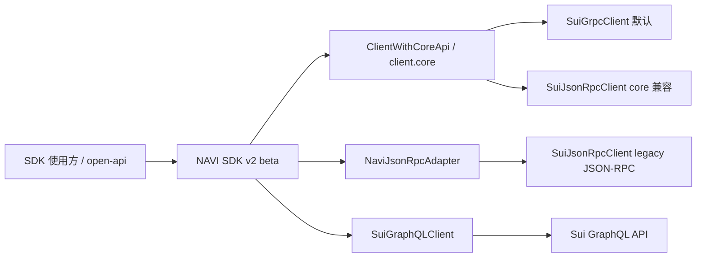
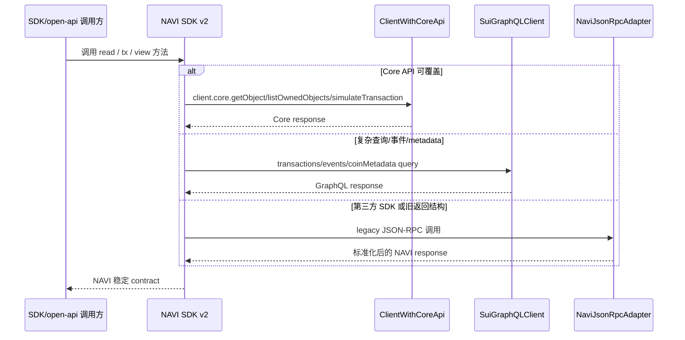
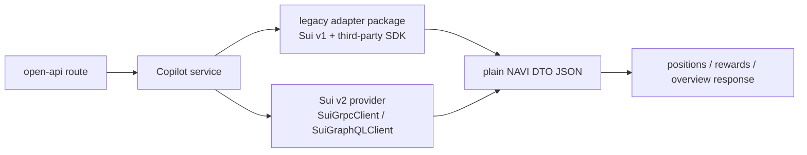
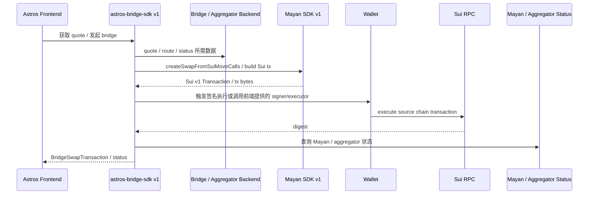
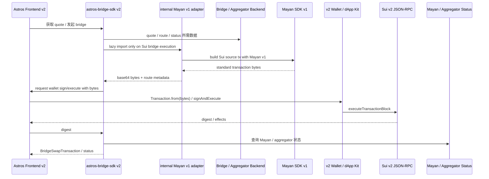

# Sui SDK 2.0 升级技术方案

日期：2026-06-01  
关联需求：ENG-3654 `mysten sui sdk 2.0 升级`  
npm 依赖快照时间：2026-06-01

## 0. 结论

本次目标是做 **Sui SDK v2 beta 完整迁移版本**，不是做一个半套兼容版本。SDK v1 和 v2 会并行维护一段时间，后续再根据业务迁移情况决定 v1 的收口方式。

本次我们负责：

| 范围 | 本次是否负责 | 说明 |
| --- | --- | --- |
| SDK 仓库 `naviprotocol-monorepo` | 是 | 核心改造范围，目标是发布 Sui SDK 2.0 兼容 v2 beta。 |
| `navi-open-api` | 是 | 核心后端改造范围，负责接入 SDK v2、清理旧 Sui SDK、承接 Copilot 数据和 action 构建接口。 |
| Copilot 能力迁 open-api | 是 | 单独章节梳理；交付标准以前端现有 Copilot 能力为准：11 个协议展示 parity，8 个协议 claim/collect action parity。 |
| 前端 | 否 | 由其他同学处理；本文只写前后端边界和联调要求。 |
| `dex-aggregator-backend` | 否 | 有对应后端同学后续处理；本文只列影响点，并判断是否阻塞我们。 |
| 其他后端 | 否，除 open-api 外 | 如果受 SDK v2 影响，只列出影响点，后续交给对应 owner。 |

核心判断：

1. **SDK v2 应按官方迁移指南完整改造**：移除 v1 `SuiClient` / `@mysten/sui.js`，升级到 `@mysten/sui@2`，同步 ESM-only、Node 22+、network 必填、BCS schema、Core API、GraphQL / gRPC / JSON-RPC 传输策略、transaction executor 返回结构。
2. **Node 22+ 是 Sui SDK v2 的最低落地条件；SDK 与 open-api 的目标运行时不同**：官方文档正文强调 ESM-only，`@mysten/sui@2.x` npm package `engines.node` 是 `>=22`。前端 Vercel 项目当前 Node.js Version 是 `22.x`，所以 SDK v2 必须在 Node 22.x 下 build/typecheck/test 通过，不能只按 Node 24.x 验证。Vercel `navi-open-api` 项目当前 Node.js Version 是 `24.x`，因此 open-api build/test/runtime、CI 和本地开发应统一到 Node 24.x。
3. **ClientWithCoreApi 不是“另一个阶段”**，它是官方为了让 SDK 同时支持 JSON-RPC / gRPC / GraphQL client 的通用接口。我们的 v2 beta 应按官方建议抽象 client：能走 Core API 的 public 方法接受 `ClientWithCoreApi`；不能走 Core API 的旧 JSON-RPC 能力进入 `NaviJsonRpcAdapter`，不把旧 `SuiClient` 类型继续暴露给使用方。
4. **当前最大风险不是我们不做完整迁移，而是第三方依赖是否已经支持 Sui 2.0，以及交易能力是否能以标准 bytes 方式隔离**。Mayan、Pyth、Scallop、Magma、MMT 仍有 Sui 1.x 依赖，需要逐个判断：read-only 用 DTO adapter；Copilot 前端现有 claim/collect 也要迁到 open-api 支持，但 action/tx 必须有 v2 builder 或已实测可行的标准 transaction bytes；不能只因为 read-only 可兼容就默认开放交易按钮。
5. **open-api Copilot API 目前主要是内部使用**，包括 NAVI 前端、defi CLI / MCP / AI 工具。是否对外公开暂不作为本方案前提，但内部使用也需要稳定 contract，否则前端和 MCP 会各自处理错误和兼容。

已实测更新：

1. v1 SDK 构建出的标准 Sui transaction bytes 可以被 v2 `Transaction.from(bytes)` 解析、v2 JSON-RPC dry-run、v2 keypair 签名，并已用测试钱包执行 1 MIST 自转账成功。
2. Mayan v1 SDK 构建出的 bridge transaction bytes 可以被 v2 解析、v2 JSON-RPC dry-run、v2 keypair 签名并执行成功。测试交易 `HRLeV1vA38xrtyiXxQT31o9NEBPGUjN6fJzLcuxU7Gc2` 已被 Mayan Explorer 标记 `COMPLETED`，open-aggregator 标记 `completed`。Bridge 最终方案是 `@naviprotocol/astros-bridge-sdk@2` 内部 lazy bundle Mayan v1 adapter，不把 Bridge 迁到 open-api。
3. Pyth `updatePriceFeeds` 已验证 NAVI 自维护最小 v2 builder 可用：Hermes update data -> v2 `Transaction` -> dry-run -> mainnet sign/execute -> 链上查询全部成功。`pyth-sui-js@3.0.0` 不是 Sui SDK v2 包，仍依赖 `@mysten/sui ^1.3.0`，且要求 Node 24，不进入 `@naviprotocol/lending@2` 主依赖树。
4. 前端 Copilot 当前注册 11 个协议，且前端 `useClaimRwards` 对 8 个协议有 claim/collect builder：NAVI、Suilend、Momentum、Cetus、AlphaFi、Bluefin、Magma、Scallop。open-api 当前只同步 8 个 read/reward provider：NAVI、Suilend、Wallet、Volo、Momentum、Cetus、AlphaFi、Bluefin，缺 Magma、Scallop、Ember。
5. 使用钱包 `0x3be8db6ca4adf33387f16c86c443737e78fd14db85a4e1c68cc8f256ac68549c` 调 production open-api，已确认 NAVI / AlphaFi / Cetus / Bluefin 有 position/reward 样本，Suilend / Momentum rewards 为 0；`/api/copilot/overview` 当前返回 `Service temporarily unavailable`。
6. open-api 当前 Copilot provider contract 是 read-only：`getPositions`、`getRewards`、可选 `getHealthFactor`；没有正式 claim/action endpoint，也没有统一的 action capability contract。已确认本次 Copilot 交付标准以前端现有能力为准：11 个协议的 positions / rewards / overview 展示能力，以及前端已有的 8 个协议 claim/collect 构建能力，都需要迁到 open-api 支持。未完成协议级证据链前可以返回 `supported: false` + reason，但不能视为该协议 action parity 已交付。
7. 前端截图已确认 `0x3be8db6ca4adf33387f16c86c443737e78fd14db85a4e1c68cc8f256ac68549c` 和 `0x439f285f559997df4b4ad42c282581b1ca991631ab020a29c8031a0849b7e30f` 两个钱包可以覆盖 8 个 claim/collect 协议的前端奖励样本：NAVI、Suilend、Momentum、Cetus、AlphaFi、Bluefin、Magma、Scallop。截图是前端功能基准和 golden wallet 选择依据，不等同于后端 provider/action 已实现。
8. Bridge 已确认纳入 SDK v2 beta 首批交付，按 `@naviprotocol/astros-bridge-sdk@2` internal lazy Mayan adapter 方案执行；验收必须包含 root entry 不加载 Mayan/Sui v1、lazy chunk、前端 build chunk 和多 route smoke。

## 1. ClientWithCoreApi 是什么

一句话：`ClientWithCoreApi` 是 Mysten SDK v2 里“只要求 client 有 `core` API 能力”的类型抽象。这样 SDK 不需要绑定死 `SuiJsonRpcClient`，也可以接受 `SuiGrpcClient` 或 `SuiGraphQLClient`。

为什么会出现在方案里：

1. 官方建议 SDK maintainers 不要继续把 public API 写死成旧的 `SuiClient`，而是接受 `ClientWithCoreApi`。
2. `SuiGrpcClient`、`SuiGraphQLClient`、`SuiJsonRpcClient` 都可以实现 Core API，所以 Core API 读路径可以使用同一套 SDK 方法。
3. 但是我们当前 SDK/open-api 里有大量 `devInspectTransactionBlock`、`dryRunTransactionBlock`、`executeTransactionBlock`、`queryEvents`、`queryTransactionBlocks` 这类 JSON-RPC 风格调用。不是所有调用都能无脑替换成 `client.core.*`。

所以本方案的处理方式是：

| 场景 | v2 处理 |
| --- | --- |
| 默认 client factory | 优先创建 `SuiGrpcClient`；需要复杂查询时配套 `SuiGraphQLClient`。 |
| 读取对象、coin、package、基础链上数据 | 优先 `client.core.*`，SDK public 方法参数使用 `ClientWithCoreApi`。 |
| query transaction / event / total supply / historical data | 优先 `SuiGraphQLClient`，避免继续堆 JSON-RPC 查询逻辑。 |
| dryRun / devInspect | 优先 `client.core.simulateTransaction`；`devInspect` 等价语义使用 `checksEnabled: false`。 |
| execute / signer | 优先 `signer.signAndExecuteTransaction({ transaction, client })` 或 v2 transaction executor；统一处理 `Transaction` / `FailedTransaction` union 返回。 |
| 第三方 SDK 或旧返回结构无法迁移 | 隔离到 `NaviJsonRpcAdapter`，只允许 adapter 内使用 `SuiJsonRpcClient`。 |
| SDK public API | 不再暴露旧 `SuiClient` / `SuiTransactionBlockResponse` / `DryRunTransactionBlockResponse` 作为稳定 contract。 |

这不是“分期不做完整迁移”，而是完整迁移时需要区分：**官方推荐的 client 抽象**、**推荐传输 gRPC / GraphQL** 和 **兼容迁移用 JSON-RPC adapter**。

## 2. 官方变化摘要和我们的改造思路

官方文档来源：

- [Migrate to 2.0](https://sdk.mystenlabs.com/sui/migrations/sui-2.0)
- [@mysten/sui](https://sdk.mystenlabs.com/sui/migrations/sui-2.0/sui)
- [Migrating from JSON-RPC](https://sdk.mystenlabs.com/sui/migrations/sui-2.0/json-rpc-migration)
- [SDK Maintainers](https://sdk.mystenlabs.com/sui/migrations/sui-2.0/sdk-maintainers)
- [Core API](https://sdk.mystenlabs.com/sui/clients/core)
- [BCS](https://sdk.mystenlabs.com/sui/bcs)
- [Wallet Builders](https://sdk.mystenlabs.com/sui/migrations/sui-2.0/wallet-builders)
- [Building SDKs](https://sdk.mystenlabs.com/sui/sdk-building)
- [dApp Kit](https://sdk.mystenlabs.com/sui/migrations/sui-2.0/dapp-kit)

| 官方变化 | 对应改造思路 | 涉及范围 |
| --- | --- | --- |
| `@mysten/*` ESM-only，`@mysten/sui@2.x` package engines `node >=22` | SDK v2 改 ESM-only；SDK package 必须按前端 Vercel Node 22.x 验证；open-api 按当前 Vercel Node 24.x 统一 build/test/runtime/CI/local；TypeScript moduleResolution 改 `NodeNext` / `Bundler` | SDK、open-api |
| 移除 `@mysten/sui/client` 下的 `SuiClient`、`getFullnodeUrl`、JSON-RPC types | 旧 `SuiClient` 全部移除；JSON-RPC 兼容代码使用 `@mysten/sui/jsonRpc` 的 `SuiJsonRpcClient`、`getJsonRpcFullnodeUrl`；优先走 gRPC/Core | SDK 全包、open-api |
| client 构造必须传 `network` | 所有 client singleton / test / demo 明确 network | SDK、open-api |
| JSON-RPC 被标记为 deprecated，推荐迁 gRPC / GraphQL | 默认 `SuiGrpcClient`；复杂查询/事件/metadata 用 `SuiGraphQLClient`；`SuiJsonRpcClient` 只作为 `NaviJsonRpcAdapter` 兼容层 | SDK、open-api |
| SDK maintainer 建议接受 `ClientWithCoreApi` | public API 不继续绑定旧 `SuiClient`；能走 Core API 的 read path 使用 `ClientWithCoreApi` 和 `client.core.*` | SDK |
| Core API 替换对象/coin/dynamic field/dryRun/devInspect | `getObject` -> `core.getObject`，`multiGetObjects` -> `core.getObjects`，`getOwnedObjects` -> `core.listOwnedObjects`，`dryRun/devInspect` -> `core.simulateTransaction` | SDK lending/wallet/aggregator/dca、open-api |
| `queryEvents`、`queryTransactionBlocks`、`getTotalSupply` 等历史/索引类查询建议迁 GraphQL；`getCoinMetadata` 可走 Core API | open-api stats/Copilot 查询路径引入 GraphQL client；metadata 走 Core 或 GraphQL；SDK 内部只在必要时提供轻量 wrapper | open-api、SDK docs |
| BCS schema、ExecutionStatus、object schema 调整 | BCS parser 和 simulate returnValues 补 golden tests；解析对象内容使用 `include: { content: true }`，不要把 `objectBcs` 当 Move struct 内容解析 | SDK lending、open-api navi/veNavx |
| Experimental API 稳定化，`Experimental_` 前缀移除 | 替换 `wallet-client/src/signer.ts` 相关类型 | SDK wallet-client |
| `Commands` 改名 `TransactionCommands` | 扫描并替换 `Commands` import；当前仓库暂未发现直接使用，但作为检查项保留 | SDK、open-api |
| GraphQL schema consolidated | 如使用 `@mysten/sui/graphql/schemas/latest` 等旧路径，改 `@mysten/sui/graphql/schema`；当前扫描未发现直接使用 | open-api |
| `namedPackagesPlugin` 和全局 plugin registry 移除 | 如后续使用 MVR，要通过 client 构造的 `mvr` 配置；当前扫描未发现直接使用 | SDK |
| Transaction executor 接受 `ClientWithCoreApi`，返回结构变化 | wrapper / signer / execute response 不再穿透旧 raw response | SDK wallet-client、aggregator |
| transaction 默认 expiration | 后续 build unsigned tx bytes 必须返回有效期 metadata；前端过期后重新 build | open-api 交易构建类接口 |
| zkLogin legacy address 参数 | 当前 SDK/open-api 未发现直接 zkLogin import；如果后续接入 wallet/auth，要明确 `legacyAddress` 行为并做回归 | 后续 wallet/auth |
| wallet standard `reportTransactionEffects` 移除、新 effects BCS 结构 | 我们不是钱包 extension，但 wallet-client/sign 执行路径需要按 v2 `signer.signAndExecuteTransaction` 和 union response 处理 raw effects | SDK wallet-client |
| 官方 SDK 建议 client extension、`tx` / `call` / `view` 分层、transaction thunks | v2 beta 不强制重构所有包为 extension，但新增/改造 SDK public surface 应按 `ClientWithCoreApi`、`tx/call/view` 分层和 thunk 思路组织，降低后续维护成本 | SDK |
| dApp Kit 重写 | 前端另行处理；本方案只避免 Copilot 数据继续依赖前端多套协议 SDK | 前端边界 |

### 2.1 SDK-specific guides 递归查漏

| 官方 guide / 递归链接 | 本地是否直接使用 | 对本方案的补充 |
| --- | --- | --- |
| `@mysten/sui` | 是，SDK/open-api 大量使用 | 新增检查项：`TransactionCommands`、GraphQL schema 路径、`namedPackagesPlugin` 移除、executor union 返回、默认 expiration、zkLogin legacy 参数。 |
| `Migrating from JSON-RPC` | 是，当前主要是 JSON-RPC 风格调用 | 明确 gRPC/Core/GraphQL 分工：对象/coin/dynamic field/metadata/simulate 走 Core；事件/交易查询/totalSupply 走 GraphQL；JSON-RPC 只放 adapter。 |
| `SDK Maintainers` / `Core API` / `Building SDKs` | 是，我们是 SDK 发布方 | public 方法接受 `ClientWithCoreApi`；`@mysten/*` 放 peer + dev；新增 public surface 按 `tx` / `call` / `view` 分层；读对象内容使用 `content` BCS。 |
| `BCS` | 是，lending/open-api 有 BCS parser | 补充 `content` 和 `objectBcs` 的区别；effects 解析按 `bcs.TransactionEffects` V1/V2 union 做 golden tests。 |
| `Wallet Builders` | 间接受影响，wallet-client 有 sign/execute wrapper | 不做 wallet extension，但必须适配 `signAndExecuteTransaction` 新返回结构：`Transaction` / `FailedTransaction` union、`tx.effects.bcs`。 |
| `@mysten/dapp-kit` | 前端范围，本次不直接改 | 只记录前端后续需要处理；open-api/Copilot 迁后端可降低前端同时维护协议 SDK 的压力。 |
| `@mysten/kiosk` / `@mysten/zksend` / `@mysten/suins` / `@mysten/deepbook-v3` / `@mysten/walrus` / `@mysten/seal` | 当前 SDK/open-api 没有直接 import | 不作为本次直接迁移项；这些 guide 的共同模式是 client extension + 支持 gRPC/GraphQL/JSON-RPC，作为我们 SDK 后续演进方向。 |

### 2.2 目标架构





## 3. 阻塞依赖总览

本节回答：哪些依赖会阻塞我们完成 v2，哪些可以通过兼容方案消除阻塞。

### 3.1 结论

按目前讨论和实测结果，**SDK/open-api v2 主链路可以不被第三方 Sui v1 SDK 阻塞**，前提是：

1. `@naviprotocol/astros-bridge-sdk@2` public surface 声明 Sui v2 ready，但 Mayan v1 只作为 SDK 内部 lazy adapter 存在；root entry 不同步加载 Mayan / Sui v1 依赖，不把 v1 类型暴露给前端。
2. open-api Copilot 的 AlphaFi / MMT / Scallop / Magma 等 read-only 协议允许先用 workspace legacy adapter 输出 NAVI DTO。
3. `navi-sdk` 从 open-api 中移除，按已存在的迁移指南替换到拆分后的 `@naviprotocol/*` 包，不作为 legacy 兼容对象。
4. 涉及交易构建的能力不能用 v1 SDK 对象混入 v2 主链路；要么自建 v2 builder，要么由后端构建标准 transaction bytes，要么等上游。
5. Copilot 的 `positions/rewards/overview` 和 `claimRewards/bridge/migration` 必须分开处理：前者是读数据，可以兼容共存；后者是交易构建，不能通过 legacy adapter 混用 v1/v2 `Transaction`。

Mayan 仍依赖 Sui v1，但已实测“v1 build 标准 bytes -> v2 parse / sign / execute”可行，因此不再作为 Bridge 产品功能或 bridge SDK v2 public package 的硬阻塞；风险收敛到 internal adapter 打包隔离、lazy load、以及更多 route / chain 的回归覆盖。

### 3.2 阻塞等级

| 等级 | 含义 | 处理原则 |
| --- | --- | --- |
| P0 | 不处理会阻塞 SDK/open-api v2 主链路 | 移除、替代、或降级为不纳入 v2 ready。 |
| P1 | 阻塞某个 package / 协议 parity，但不阻塞 v2 主链路 | legacy adapter / direct adapter / worker 过渡。 |
| P2 | 可升级或只需适配 | 正常升级回归。 |
| Not blocker | 内部历史依赖或已拆包迁移 | 顺手清理，不作为上游阻塞。 |

### 3.3 依赖分级和兼容方案

| 依赖 | 当前状态 | 影响范围 | 等级 | 最佳实践兼容方案 | 是否只能等上游 |
| --- | --- | --- | --- | --- | --- |
| `navi-sdk` | 旧聚合包仍依赖 `@mysten/sui` v1 / `@mysten/sui.js` / Mayan / Pyth；但已有拆包迁移文档：`navi-sdk` -> `@naviprotocol/lending`、`@naviprotocol/astros-aggregator-sdk`、`@naviprotocol/astros-bridge-sdk` | open-api 仍有直接 import | Not blocker | open-api 移除 `navi-sdk`，按迁移指南替换到拆分 SDK v2 或本地 service；不要做 legacy adapter | 否 |
| `@mayanfinance/swap-sdk@14.2.0` | 最新版仍 dependencies `@mysten/sui ^1.34.0`；Mayan Sui 源链 tx build 依赖 SDK 本地拼 Move calls | `astros-bridge-sdk`、产品 Bridge action | P1 | `astros-bridge-sdk@2` public API 使用 Sui v2 类型；Mayan v1 放 SDK 内部 lazy bundle adapter，adapter build 标准 bytes 后由 v2 前端钱包签名执行；`astros-bridge-sdk@1.x` legacy line 继续给旧前端维护 | 否；不等 Mayan v2，但要做 lazy bundle / 依赖树 / 多 route smoke |
| `@pythnetwork/pyth-sui-js@3.0.0` | 最新 npm 包仍 dependencies `@mysten/sui ^1.3.0`，且要求 Node `^24.0.0`；不是 Sui SDK v2 兼容包 | lending oracle、Suilend/Scallop/Firefly 间接依赖 | P1 | lending v2 主包移除该依赖；Hermes 数据走 HTTP / 受控 Hermes client；链上 stale check 走 v2 object reader；Pyth update PTB 采用 NAVI 自维护最小 v2 builder，已完成 mainnet 真实执行验证 | 否 |
| `@alphafi/alphalend-sdk@1.1.27/2.0.2` | peer `@mysten/sui 1.45.0`，依赖 Pyth / 7K / NAVI lending v1；v1 SDK 有 `claimRewards` builder | open-api Copilot AlphaFi | P1 | Copilot 展示数据先用 legacy adapter package，内部 pin Sui v1，输出 `CopilotPosition` DTO；claim/action 不纳入 legacy read adapter，除非用 AlphaFi 仓位钱包验证 backend-built bytes 全链路 | 否 |
| `@7kprotocol/sdk-ts@4.0.0` | peer `@mysten/sui ^1.44.0`、`@pythnetwork/pyth-sui-js ^2.2.0` | AlphaFi 间接依赖、可能影响聚合交易构建 | P1 | 只允许作为 legacy read adapter 或 v1 交易链路内部依赖；SDK v2 主包不要直接依赖；交易构建能力需等上游 v2 或替换 provider | 交易构建依赖上游或替代实现 |
| `@mmt-finance/clmm-sdk@1.3.25` | peer `@mysten/sui ^1.28.2`；v1 SDK 有 `collectReward` / `collectFee` builder | open-api Momentum/MMT provider | P1 | read-only legacy adapter package；只输出 positions/rewards DTO；action 需要 MMT 仓位钱包验证 backend-built bytes | 否 |
| `@scallop-io/sui-scallop-sdk@2.4.5` | npm latest dependencies + peer `@mysten/sui 1.45.2`，依赖 Pyth；GitHub 已合入 Sui v2 迁移 PR，但 npm 版本尚未体现；v1 SDK 有 claim builder | Copilot Scallop parity | P1 | 先尝试 read-only legacy adapter；如上游发布 v2 npm 版本再切 v2 direct adapter；claim 需要 v2 npm 或 Scallop 仓位钱包验证 backend-built bytes | 不一定，需要确认发布版本 |
| `@magmaprotocol/magma-clmm-sdk@0.6.2` | peer `@mysten/sui ^1.35.0`、`@mysten/bcs ^1.7.0`；v1 SDK 有 collect fee payload builder | Copilot Magma parity | P1 | 先尝试 read-only direct adapter 或 legacy adapter；不把 SDK 类型外泄；action 需要 Magma 仓位钱包验证 backend-built bytes | 不一定 |
| `@suilend/sdk@3.0.3` / `@suilend/sui-fe@3.0.3` | 不跟 npm latest，显式 pin；peer 精确锁 `@mysten/sui 2.15.0`；d.ts 有 v2 claim builder，但 root import 在纯 Node ESM 下失败 | wallet-client、open-api Suilend | P1 for action / P2 for read-only | read-only 可先隔离回归；claim/action 先解决 runtime import 和 version pin，再用截图钱包 smoke | 否，但不能直接视为可用 |
| Cetus CLMM / DLMM / Vaults | 新版支持或内置 Sui2，包 import 已验证 | open-api Cetus | P2 | 升级新版并回归 positions/rewards；claim/fee action 仍需具体 builder 和仓位钱包 smoke | 否 |
| `@firefly-exchange/library-sui` | open-api 当前 2.x 是 Sui1；最新 4.x 依赖 Sui2，但当前 import 因 `@noble/curves` exports 失败，Bluefin7K 还有 Node >=24 约束 | open-api Bluefin/Firefly | P1 for action / P2 for read-only | open-api 目标 Node 24.x 后，Node >=24 本身不再是环境 blocker；但 root import / dependency runtime 仍不能直接视为可用 action 依赖。read-only 先走现有 provider/API 或隔离 adapter | 否，但 action 需要修复 |
| `shio-sdk@1.0.9` | 不直接依赖 Mysten SDK | aggregator/dca/wallet-client | P2 | 正常回归 | 否 |

### 3.4 Pyth 兼容边界

Pyth 不应按 AlphaFi / MMT / Scallop 这类普通 read-only 三方 SDK 处理。它在 `@naviprotocol/lending` 中参与 oracle 和 PTB 构建，必须按能力拆分。

官方 npm 状态：截至 2026-06-02，`@pythnetwork/pyth-sui-js` 最新发布版是 `3.0.0`，但这个 “3.0.0” 不是 Sui SDK v2 兼容版本。它仍依赖 `@mysten/sui ^1.3.0`，并且 `engines.node` 是 `^24.0.0`。Pyth 官方仓库已有 Sui v2 相关 issue / PR 讨论，但本方案以 npm 可安装版本为准，不能把 Pyth 官方 v2 release 作为交付前置条件。

实测结论：**正式采用 NAVI 自维护最小 Pyth v2 builder**。`pyth-sui-js` 只作为 fallback / 对照参考，不进入 `@naviprotocol/lending@2` 主依赖树。

| 能力 | 当前典型用法 | v2 策略 | 是否阻塞 SDK v2 主链路 |
| --- | --- | --- | --- |
| Hermes price data | `SuiPriceServiceConnection` 拉取 price update data | 用 Hermes HTTP `fetch` 获取 `/v2/updates/price/latest?encoding=base64&parsed=false`；不依赖 `@pythnetwork/pyth-sui-js`。如要 SDK 封装，最多考虑 `@pythnetwork/hermes-client@2.1.0`，但仍需 Node `>=22.14.0` | 否 |
| 链上 stale check / price object 读取 | 读取 Pyth price info object 后判断 freshness | 用 Sui v2 client 读取 `pythPriceInfoObject`，解析 Move object content；保留现有 `getPythStalePriceFeedIdV2` 思路，改成 v2 reader | 否 |
| Pyth update tx builder | `SuiPythClient.updatePriceFeeds` 追加 update calls | 自维护 `NaviPythV2Builder`：动态读取 Pyth / Wormhole latest packageId、读取 base update fee、解析 accumulator message / VAA、追加 `vaa::parse_and_verify`、`pyth::create_authenticated_price_infos_using_accumulator`、`pyth::update_single_price_feed`、`hot_potato_vector::destroy` | 否 |
| 三方 SDK 间接 Pyth 依赖 | Suilend / Scallop / Firefly 等三方包内部依赖 Pyth | 只允许留在 open-api read-only legacy adapter 内；不得进入 `@naviprotocol/lending@2` 主依赖树 | 否，只要不外泄 |

因此，`@naviprotocol/lending@2` 的原则是：

1. 主包不直接依赖 `@pythnetwork/pyth-sui-js`，避免把 Sui v1 依赖树和 Node 24 engine 约束带给 SDK v2 使用方。
2. `SuiPriceServiceConnection` 替换为 Hermes HTTP fetch，或受控使用 `@pythnetwork/hermes-client@2.1.0`。
3. `SuiPythClient.updatePriceFeeds` 替换为 NAVI 自维护最小 v2 `Transaction` builder。
4. Pyth 作为三方 SDK 的间接依赖可以留在 open-api read-only legacy adapter 内，但不能作为 lending v2 主包的兼容方式。
5. `pyth-sui-js@2.4.0` internal adapter 只作为 fallback / 对照测试；`pyth-sui-js@3.0.0` 不作为 fallback，因为它要求 Node 24 且仍依赖 Sui v1。

实测结果：

| 探针 | 结果 | 结论 |
| --- | --- | --- |
| `pyth-sui-js@3.0.0` 直接作为主依赖 | `npm install --engine-strict` 失败，要求 Node `^24.0.0`；且依赖 `@mysten/sui ^1.3.0` | 淘汰，不进入 lending v2 主依赖 |
| `pyth-sui-js@2.4.0` adapter 隔离 | engine-strict 可安装；依赖树隔离成功：root/app 为 `@mysten/sui@2.17.0`，adapter 内为 `@mysten/sui@1.45.2` | 可作为 fallback，但不是正式方案 |
| NAVI 自维护最小 v2 builder dry-run | 只依赖 `@mysten/sui@2.17.0`；Hermes update bytes `1311`；tx bytes `2995`；commands `5`；mainnet dry-run `success` | 正式方案可行 |
| NAVI 自维护最小 v2 builder 真实执行 | 用 E2E 测试钱包执行 mainnet SUI/USD Pyth update 成功；digest `GN5xkTD9q5dn216szgxt1Xcr2moH1MuhPYiXn1mDgHus`；链上 `getTransactionBlock` status `success`，events `1` | 证明不是只停留在 build / dry-run，真实签名执行链路可用 |

自维护 builder 的实现结构：

```text
packages/lending/src/oracle/
  hermes.ts              # Hermes HTTP update data
  pyth-object-reader.ts  # v2 client 读取 pyth state / dynamic field / price info
  pyth-v2-builder.ts     # 自维护 Pyth update Move calls
```

`pyth-v2-builder.ts` 必须保留 Pyth 官方要求的动态 package 逻辑：不能硬编码 Pyth / Wormhole packageId，要从 state object 的 `upgrade_cap.fields.package` 读取最新 packageId，再拼 update Move calls。

### 3.5 Legacy adapter 兼容方式

open-api 可以短期同时存在 Sui v1 / v2 依赖，但必须隔离：



推荐优先级：

| 方案 | 适用场景 | 优点 | 风险 / 限制 |
| --- | --- | --- | --- |
| v2 direct adapter | 能用 Core / GraphQL / 协议 HTTP API 直接读的数据 | 最干净，长期方案 | 初期实现成本高 |
| workspace legacy adapter package | Copilot 展示数据协议，如 AlphaFi / MMT / Scallop / Magma | 成本低，可快速达成 parity | Next build 可能依赖解析冲突，需要验证 |
| 独立 HTTP worker | legacy package 在 Next build/runtime 冲突 | 隔离最彻底 | 部署和运维成本更高 |
| backend-built tx bytes action adapter | 协议 SDK 只有 v1，但后端能构建标准 Sui transaction bytes | 前端不引入 v1 SDK，仍可由 v2 钱包签名执行 | 必须逐协议实测；只看到 builder 存在不够，gas、sender、expiration、wallet 解析和执行都要过 |
| 等上游 / 自建 v2 tx builder | bridge / swap / claim 等交易构建 | 最安全 | 进度或成本高 |

legacy adapter 的硬规则：

1. adapter 内部可以依赖 Sui v1 SDK 和三方 v1 SDK。
2. adapter 对外只能返回 plain JSON / NAVI DTO。
3. 不能返回或暴露 `SuiClient`、`Transaction`、`SuiObjectResponse`、`SuiTransactionBlockResponse`。
4. 不能把 v1 `Transaction` / `TransactionBlock` JS 对象交给 v2 wallet / dApp Kit / `SuiGrpcClient` 签名执行。
5. read-only 可以 adapter 过渡；tx builder 不能复用 read-only adapter。
6. 如果必须支持 v1-only 协议的交易能力，只允许做 action adapter：后端把交易完全构建成标准 BCS transaction bytes，前端用 v2 `Transaction.from(bytes)` 或 wallet 支持的 bytes 签名执行。
7. backend-built bytes 必须逐协议通过：后端 build、前端 v2 parse、v2 simulate、钱包签名、execute、链上结果确认；未通过前不得默认开放。
8. Pyth 间接依赖只能作为三方 read-only adapter 内部实现细节；`@naviprotocol/lending@2` 主包不能通过 legacy adapter 保留 `@pythnetwork/pyth-sui-js`。
9. claim/action 的默认值是 `supported: false`；只有完成上述证据链，才允许改为 `supported: true`。不能用“后端能 read”替代“交易链路已验证”。

### 3.5.1 依赖隔离落地选择

本次最终采用两个不同方案，因为 open-api 和 bridge-sdk 的发布形态不同：

| 位置 | 最终方案 | 原因 |
| --- | --- | --- |
| open-api Copilot legacy adapter | **npm workspaces 放在 open-api 仓库内** | open-api 当前是 npm 单项目，不是 workspace；普通 folder `file:` adapter 无法稳定隔离依赖。改成 npm workspaces 后，root open-api 可使用 `@mysten/sui@2`，`packages/copilot-*-v1-adapter` 内部 pin `@mysten/sui@1` 和三方 v1 SDK。adapter 只返回 plain DTO，不影响 API contract。 |
| `@naviprotocol/astros-bridge-sdk@2` Mayan v1 adapter | **SDK 内部 lazy bundle adapter** | 前端只需要安装 `@naviprotocol/astros-bridge-sdk@2`，不应该额外感知 Mayan v1 adapter 包。Mayan / Sui v1 只在执行 Sui bridge 时动态加载，root entry 保持轻量，后续 Mayan 升 v2 时只替换内部实现。 |

不采用的方案：

| 方案 | 为什么不作为默认 |
| --- | --- |
| private npm package | 隔离清晰，但需要 registry 权限、CI token、发布版本和跨仓库版本管理。adapter 当前主要是迁移期内部实现，先发私有包收益不够。后续如果多个仓库长期复用，再升级为 private package。 |
| packed tarball | POC 可行，但每次改 adapter 都要重新 `npm pack`，CI 和版本追踪容易变成手工产物。只适合作为依赖隔离 POC，不作为正式方案。 |
| open-api 直接 folder `file:` adapter | POC 运行失败：folder `file:` 不会自然安装 adapter 自己的 `@mysten/sui@1` 依赖树，runtime 会找不到 v1 依赖。 |
| bridge-sdk root entry 同步 bundle Mayan v1 | POC 可行但包体不合适。当前前端有静态 import bridge-sdk config/types 的路径，如果 root entry 带入 Mayan，会让非 Bridge 页面也加载大包。 |

对应结构：

```text
navi-open-api/
  package.json              # private true, workspaces: ["packages/*"], @mysten/sui@2
  src/
  packages/
    copilot-alphafi-v1-adapter/
      package.json          # @mysten/sui@1 + AlphaFi SDK
    copilot-mmt-v1-adapter/
      package.json          # @mysten/sui@1 + MMT SDK
```

```text
naviprotocol-monorepo/packages/astros-bridge-sdk/
  src/index.ts              # v2 public API, light exports only
  src/sui-bridge.ts         # Sui bridge public action, lazy imports internal adapter
  src/internal/mayan-v1-adapter.ts
```

Bridge SDK import 规则：

```ts
// root 保持轻量，不能同步 import Mayan / Sui v1
export { config } from './config';
export type { BridgeSwapTransaction } from './types';

// 只有执行 Sui bridge 时加载内部 adapter
const adapter = await import('./internal/mayan-v1-adapter');
```

验证口径：

| 验证项 | open-api workspace adapter | bridge-sdk internal lazy bundle |
| --- | --- | --- |
| 依赖树 | root `@mysten/sui@2`，adapter package 内部 `@mysten/sui@1` | SDK public peer 只有 `@mysten/sui@2`；Mayan / Sui v1 只允许作为 internal adapter 的 build/runtime 实现，不出现在 public API |
| build | open-api build/typecheck 不因双版本冲突失败 | SDK build 和前端 app build 通过；root entry 和非 Bridge 页面 chunk 不包含 Mayan v1 |
| runtime | provider 返回 DTO，不返回 v1 SDK object | quote/build/parse/sign/execute/status smoke 通过 |
| 后续替换 | 上游协议 v2 ready 后移除对应 adapter package | Mayan v2 ready 后替换 internal adapter，不改 public API |

### 3.6 Copilot read/action 迁移边界

Copilot 交付标准以前端现有功能为准。前端当前展示 11 个协议，并对 8 个协议提供 claim/collect builder；这两类能力都要迁到 open-api。迁移时仍需按能力分层，不能用“read 可以共存”推导出“claim / bridge / migration 也可以共存”。

| 能力 | 当前性质 | v2 处理方式 | 是否可用 legacy adapter |
| --- | --- | --- | --- |
| `positions` / `overview` | 只读数据聚合 | open-api 统一输出 NAVI DTO，允许协议 provider 内部用 v1 legacy adapter | 是 |
| `rewards` 查询 | 只读奖励数据 | 和 positions 同策略；返回 `claimableRewards` 和 `actions.claimRewards.supported` | 是 |
| NAVI `claimRewards` | 构建领取奖励交易 | 用 `@naviprotocol/lending@2` 原生 v2 `Transaction` builder；不依赖 Pyth oracle refresh | 否 |
| 三方协议 `claimRewards` / `collectFees` | 构建第三方领取交易 | 属于 Copilot 前端能力迁后端范围。必须新增 action endpoint；只有协议级验证通过才返回可签名 bytes，否则返回 `supported: false` + reason，或 deep link 到协议站点 | 条件性，只能走 v2 direct builder 或 action adapter |
| NAVI migration / supply / borrow / repay / withdraw | 构建 lending 交易，并可能需要 oracle refresh | 用 lending v2 原生 builder；涉及 Pyth update 时走 NAVI 自维护最小 Pyth v2 builder | 否 |
| Bridge / Mayan swap | 构建跨链交易和链上 source tx | 不属于 Copilot，也不走 open-api。`astros-bridge-sdk@2` public API 走 v2，内部 lazy bundle Mayan v1 adapter build 标准 bytes，前端 v2 钱包签名执行 | 条件性，只能走 Bridge SDK internal adapter 或 Mayan v2 |

当前代码事实：

1. open-api Copilot provider contract 当前只有 `getPositions`、`getRewards`、可选 `getHealthFactor`；没有 claim/action endpoint，也没有可直接迁移的第三方 claim contract。
2. monorepo SDK 当前有 NAVI lending reward query 和 `claimLendingRewardsPTB` builder；wallet-client 包装了 NAVI `claimAllRewards`。
3. monorepo 当前没有集成 AlphaFi / Scallop / MMT / Magma 的第三方 claim builder；这些 action 只是在上游协议 SDK 里存在，需要单独设计 open-api action endpoint。

建议 open-api Copilot response 增加 action capability，而不是让前端猜：

```json
{
  "protocol": "scallop",
  "claimableRewards": [],
  "actions": {
    "claimRewards": {
      "supported": false,
      "reason": "protocol_sdk_v2_not_ready"
    }
  }
}
```

判断原则：

1. `read-only legacy adapter` 只解决 positions / rewards / overview parity，不能覆盖 claim/collect 交付。
2. 所有会生成、修改、签名、模拟或执行 `Transaction` 的能力都必须是 v2 原生，或后端返回标准 transaction bytes；不能从 v1 adapter 穿透 SDK 对象。
3. 前端当前已有 claim/collect 按钮或能力的协议，按钮背后必须是 v2 builder、backend-built transaction bytes、或 deep link；不能让前端调用 v1 `TransactionBlock`。
4. claim/action 级别要按协议返回 capability，避免一个协议读数据成功但交易按钮不可用时误导前端。
5. `supported: false` 是迁移期或 blocker 状态，不是最终交付完成状态；最终 Copilot parity 需要逐协议把前端现有 action 能力迁到 open-api，或给出明确 blocker / 降级方案。

### 3.6.1 Claim / action 可用性确认矩阵

这里按“当前可以证明到哪一步”判断，不按“理论上 SDK 有方法”判断。SDK v2 主包不被三方 claim/action 阻塞；但 Copilot 前端能力迁后端会被尚未验证的 action 阻塞。前端现有 claim/collect 能力必须逐协议补全实测证据。

前后端代码事实：

1. 前端 `packages/copilot-store/src/protocols/index.ts` 注册 11 个协议：`navi`、`suilend`、`wallet`、`volo`、`momentum`、`cetus`、`alphafi`、`bluefin`、`magma`、`scallop`、`ember`。
2. 前端 `packages/copilot-store/src/hooks/copilot.ts` 的 `useClaimRwards` 只把 8 个协议纳入 claim：`navi`、`suilend`、`momentum`、`cetus`、`alphafi`、`bluefin`、`magma`、`scallop`；`wallet`、`volo`、`ember` 不进入 claim。
3. open-api `src/services/copilot/index.ts` 当前只注册 8 个 provider：`navi`、`suilend`、`wallet`、`volo`、`momentum`、`cetus`、`alphafi`、`bluefin`。`magma`、`scallop`、`ember` 尚未同步到后端。
4. open-api `src/pages/api/copilot/overview.ts` 当前直接抛 `Service temporarily unavailable`，不是正式可用接口。

生产钱包验证结果和前端截图样本：

| 协议 | production positions | production rewards | 结论 |
| --- | ---: | ---: | --- |
| NAVI | 36 | 12 | read/reward 样本充足；NAVI claim 属于 SDK v2 自有 builder 改造范围。 |
| AlphaFi | 4 | 1 | read/reward 样本已确认；可作为 AlphaFi action adapter 的 golden wallet，但 open-api 当前没有 claim endpoint，尚不能证明交易可执行。 |
| Cetus | 1 | 3 | read/reward 样本已确认；可作为 Cetus fee/reward collect 的 golden wallet，但仍需 v2 builder / backend-built bytes dry-run。 |
| Bluefin | 1 | 1 | read/reward 样本已确认；可作为 Bluefin collect fee 的 golden wallet，但 Firefly/Bluefin action 依赖链仍需单独处理。 |
| Volo | 3 | 0 | read 样本已确认；前端不做 claim。 |
| Wallet | 64 | 0 | read 样本已确认；不涉及 claim。 |
| Suilend | 0 | 0 | production open-api 当前 rewards=0，但前端截图显示 `0x3be8...549c` 有 Suilend reward，可作为前端 action parity 样本。 |
| Momentum | 0 | 0 | production open-api 当前 rewards=0，但前端截图显示 `0x439f...e30f` 有 Momentum reward，可作为前端 action parity 样本。 |
| Magma | open-api 未支持 | open-api 未支持 | 前端截图显示 `0x3be8...549c` 有 Magma reward；后端 provider 缺失，需要补 read/reward provider 和 action adapter。 |
| Scallop | open-api 未支持 | open-api 未支持 | 前端截图显示 `0x3be8...549c` 和 `0x439f...e30f` 有 Scallop reward；后端 provider 缺失，需要补 read/reward provider 和 action adapter。 |
| Ember | open-api 未支持 | open-api 未支持 | 前端支持 read-only，claim no-op；后端需要补 provider 或明确降级。 |

| 协议 / 能力 | 当前证据 | v2 处理结论 | 是否阻塞 Copilot 交付 |
| --- | --- | --- | --- |
| NAVI `claimRewards` | NAVI SDK 自有 builder，属于本次 `@naviprotocol/lending@2` 改造范围 | 做 v2 原生 `Transaction` builder，并用 funded wallet 回归 | 是，NAVI action parity 必须交付 |
| Pyth `updatePriceFeeds` | NAVI 自维护最小 v2 builder 已完成 mainnet dry-run、sign、execute、链上查询；digest `GN5xkTD9q5dn216szgxt1Xcr2moH1MuhPYiXn1mDgHus` | 正式采用自维护 v2 builder；`pyth-sui-js@2.4.0` adapter 只作为 fallback / 对照测试 | 否，不是 Copilot 独立协议 action |
| Mayan Bridge | v1 Mayan build bytes -> v2 parse / dry-run / sign / execute / status 已完成 1 SUI -> Arbitrum USDC smoke | `astros-bridge-sdk@2` 内部 lazy bundle Mayan v1 adapter；public API 不暴露 v1 类型；前端仍通过 bridge SDK 发起 Bridge | 否，不属于 Copilot |
| Cetus rewards / fees | production 钱包有 1 个 Cetus position、3 条 rewards/fees；新版 Cetus CLMM / DLMM / farms / vaults 包在 Sui v2 依赖树下可 import | 优先 v2 direct builder；用该钱包补 backend/action dry-run。未完成前 `supported: false` | 是，未完成前不能算 Cetus action parity 交付 |
| Suilend claim | `@suilend/sdk@3.0.3` d.ts 有 v2 `Transaction` claim builder；但 root import 在纯 Node ESM 下失败，且 peer 锁定 `@mysten/sui 2.15.0`；前端截图钱包 `0x3be8...549c` 有 Suilend reward | 显式 pin `@suilend/sdk@3.0.3` / `@suilend/sui-fe@3.0.3`，不跟 npm latest；claim/action 需要先解决 runtime import / 版本 pin，再用截图钱包验证 | 是，runtime 和 action 证据未完成前不能算 Suilend action parity |
| AlphaFi claim | production 钱包有 4 个 AlphaFi positions、1 条 STSUI reward；前端当前是自写 Move call builder，不是直接调用 AlphaFi SDK claim | 可以作为 action adapter golden wallet。推荐把前端自写 builder 迁到 open-api v2 action builder，或后端返回 bytes；通过 build -> v2 parse -> simulate 后再开放 | 是，未完成前不能算 AlphaFi action parity 交付 |
| Scallop claim | 前端有 provider 和 claim builder，但 open-api 未同步 provider；npm latest 仍 Sui 1.45.2，v2 PR 未发布；前端截图钱包 `0x3be8...549c` / `0x439f...e30f` 有 Scallop reward | 先补 open-api read/reward provider；再等 v2 npm 或验证 backend-built bytes | 是，provider 和 action 都是 Copilot parity 缺口 |
| MMT / Momentum collect rewards / fees | 前端有 Momentum collect fee/reward builder；production open-api 对原钱包 positions/rewards=0；前端截图钱包 `0x439f...e30f` 有 Momentum reward | read-only 保留；claim/action 用 `0x439f...e30f` 验证 backend-built bytes | 是，action 证据未完成前不能算 Momentum action parity |
| Magma collect fees | 前端有 Magma provider 和 collect builder；open-api 未同步 provider；SDK peer 仍 Sui 1.x；前端截图钱包 `0x3be8...549c` 有 Magma reward | 先补 open-api read/reward provider；再用 `0x3be8...549c` 验证 backend-built bytes | 是，provider 和 action 都是 Copilot parity 缺口 |
| Firefly / Bluefin action | Firefly v4 root import 因 `@noble/curves` exports 失败；Bluefin 7K 新版有 Node >=24 约束 | open-api 目标 Node 24.x 可满足 Node 约束，但 import/runtime 未修复前仍不作为 open-api v2 direct action 依赖；read-only 先走现有 provider / API | 是，未完成前不能算 Bluefin action parity 交付 |

两个截图钱包已经足够覆盖前端当前 8 个 claim/collect 协议的奖励样本，也足够作为 Copilot action parity 的 golden wallet 候选。但还不能证明真实执行成功，因为 open-api 没有 action endpoint，且真实 execute 需要钱包签名确认。Magma / Scallop 仍缺 open-api provider parity；Suilend / Momentum 仍需后端 runtime 和 action 证据。以上缺口对 SDK v2 主包不是 blocker，但对 Copilot 前端能力 parity 是交付 blocker，除非产品确认降级。

### 3.7 Bridge SDK v2 + Mayan v1 internal adapter 方案

Bridge 不属于 Copilot，也不经过 open-api。当前产品 Bridge 的依赖链仍是：

```text
前端 Astros / swap package
  -> @naviprotocol/astros-bridge-sdk
  -> bridge backend / aggregator quote / status API
  -> @mayanfinance/swap-sdk
  -> Sui / EVM / Solana 交易链路
```

因此本次不把 Bridge 迁到 open-api。open-api 的 adapter 用于 Copilot 协议展示数据和 action 构建隔离；Bridge 的兼容逻辑留在 `@naviprotocol/astros-bridge-sdk@2` 内部。

#### 当前 v1 流程



v1 的关键问题不是业务时序，而是依赖边界：SDK 依赖 Mayan，Mayan 依赖 `@mysten/sui@1`。如果前端整体升级 `@mysten/sui@2`，不能让 v1 `Transaction` 类型或 v1 `SuiClient` 穿透到前端主依赖树。

#### v2 后流程



v2 的原则：

1. `@naviprotocol/astros-bridge-sdk@2` 对外只暴露 v2 兼容 API、plain DTO、bytes、metadata 和 status，不暴露 Mayan / Sui v1 类型。
2. Mayan v1 adapter 是 SDK 内部实现，不单独要求前端安装。
3. root entry 不同步 import Mayan；只有 Sui bridge execution path 动态 import internal adapter。
4. 当前 bridge backend / aggregator backend 不升级也可以继续工作，因为它们仍只提供 quote / route / status 数据；Sui source tx build 仍在 SDK 内完成。
5. 后续 Mayan 发布 v2 后，只替换 internal adapter，保持 SDK public API 不变。

实测结论：`@mayanfinance/swap-sdk@14.2.0` 虽然依赖 Sui v1，但它构建出来的是标准 Sui transaction bytes；v2 SDK 可以 `Transaction.from(bytes)` 解析，v2 JSON-RPC dry-run、v2 keypair 签名和 `executeTransactionBlock` 均可以接收。已用测试钱包完成 1 SUI -> Arbitrum USDC smoke：

| 验证项 | 结果 |
| --- | --- |
| v1 Mayan build bytes | success，bytes length 3680 |
| v2 `Transaction.from(bytes)` | success |
| v2 JSON-RPC dry-run | success |
| v2 sign + execute | success |
| source digest | `HRLeV1vA38xrtyiXxQT31o9NEBPGUjN6fJzLcuxU7Gc2` |
| Mayan Explorer | `clientStatus=COMPLETED`，`status=REDEEMED_ON_EVM_WITH_FEE` |
| open-aggregator | `status=completed` |

这个 smoke 证明“内部 Mayan v1 builder -> 标准 bytes -> 前端 v2 签名执行”对 Mayan Sui 源链交易可行。它不覆盖所有 route / chain / quote type；正式改造仍需要把同样验证固化到 bridge SDK 集成测试。

推荐口径：

| 包 | v2 状态 |
| --- | --- |
| `@naviprotocol/lending@2 beta` | Sui v2 ready |
| `@naviprotocol/wallet-client@2 beta` | Sui v2 ready |
| `@naviprotocol/astros-aggregator-sdk@2 beta` | Sui v2 ready |
| `@naviprotocol/astros-dca-sdk@2 beta` | Sui v2 ready |
| `@naviprotocol/astros-bridge-sdk@2 beta` | Sui v2 public API ready；内部 lazy bundle Mayan v1 adapter |
| `@naviprotocol/astros-bridge-sdk@1.x` | legacy bridge line，继续给旧前端维护 |

`astros-bridge-sdk@1.x` legacy line 需要做小改造：

```json
{
  "dependencies": {
    "@mysten/sui": "1.45.2",
    "@mayanfinance/swap-sdk": "14.2.0"
  }
}
```

至少不能继续让 peer 范围误吃 Sui v2：

```json
{
  "peerDependencies": {
    "@mysten/sui": ">=1.25.0 <2"
  }
}
```

`astros-bridge-sdk@2` 不应让 Mayan v1 成为 public peer，而是内部构建依赖 / internal bundle。声明原则：

| 依赖 | `astros-bridge-sdk@2` 处理 |
| --- | --- |
| `@mysten/sui` | public peer，只允许 `^2`。 |
| `@mayanfinance/swap-sdk` | internal adapter 依赖，优先打进 lazy chunk；如果 build 工具无法完全 bundle，则作为普通 dependency 存在也必须只被 dynamic import 路径触达。 |
| Mayan 传递的 `@mysten/sui@1` | 只允许存在于 internal adapter 依赖树 / lazy chunk，不允许出现在 public API 类型、root export、非 Bridge 页面 chunk。 |

打包配置要保证 Mayan v1 adapter 只进入 lazy chunk，而不是 root entry。正式实现时要用 SDK build 产物和前端 app build 产物验证两件事：root import 不拉 Mayan，执行 Sui bridge 才加载 adapter chunk。

```text
root import bridge-sdk config/types
  -> 不加载 Mayan

execute Sui bridge
  -> dynamic import internal/mayan-v1-adapter
  -> 加载 Mayan + Sui v1 依赖
```

Bridge adapter 可用性不能靠构建判断，必须用 6 步 smoke 验证：

1. build bridge tx。
2. v2 `Transaction.from(bytes)` 能 parse。
3. v2 钱包能弹签。
4. 返回 digest。
5. Mayan status 能查到。
6. 源链 tx / 目标链 tx 都完成。

当前已验证 1-6：1 SUI -> Arbitrum USDC source tx 已 v2 签名执行成功，Mayan 和 open-aggregator 状态均已完成。Bridge 产品功能因此不需要等待 Mayan 官方 v2 SDK；剩余工作是把 internal lazy adapter、依赖树检查、前端 build chunk 检查和多 route smoke 固化到 SDK v2 回归。

### 3.8 对“v2 是否还有阻塞”的判断

按上述方案，**SDK v2 主链路没有必须等待三方上游的阻塞**：

1. `navi-sdk`：不是阻塞，按迁移指南移除。
2. Mayan：通过 `astros-bridge-sdk@2` 内部 lazy adapter 承载，不纳入 open-api；funded wallet smoke 已通过，剩余工作是把 SDK internal adapter、依赖树检查、前端 chunk 检查和回归用例实现出来。
3. AlphaFi / MMT / Scallop / Magma：Copilot 展示数据用 legacy adapter 或 direct adapter；其中 AlphaFi 已有 production 钱包 read/reward 样本，Magma/Scallop 需要先补 open-api provider parity。前端已有 action 能力的协议还要补 action adapter 或 v2 direct builder。
4. Pyth：read-only 路径可替换为 Hermes HTTP / v2 object reader；`updatePriceFeeds` 正式走 NAVI 自维护最小 v2 builder；第三方间接依赖只留在 open-api read-only adapter。

但 claim/action 是另一类交付证据，不能跟展示数据一起用同一条验证标准。当前结论是：

1. NAVI claim、Pyth update、Mayan Bridge 已有明确 v2 路线，其中 Mayan 和 Pyth 已完成关键 smoke。
2. 三方 claim/collect 不能只凭 SDK 方法名开放。AlphaFi / Cetus / Bluefin 已有 production 钱包 read/reward 样本，可以进入 action adapter dry-run；Suilend / Momentum 缺 rewards 样本；Magma / Scallop 缺 open-api provider parity。未完成 build bytes / v2 parse / simulate / 签名执行证据前，默认 `supported: false`，并计入 Copilot action parity blocker。
3. Suilend 看起来已有 v2 claim builder，但当前 npm 包在纯 Node ESM 下 root import 失败，并且 peer 锁 `@mysten/sui 2.15.0`；在 open-api Node 24.x 主链路里直接使用前需要先解决 runtime / version pin。
4. Firefly / Bluefin 最新 v2 依赖链存在 import 问题和 Node 24 约束。open-api 目标 Node 24.x 后，Node 约束本身可满足，但 import/runtime 未验证前仍不能作为 open-api v2 action 的可用依赖。
5. 前端当前已有的三方 claim/collect 按钮，最佳实践是：先返回 capability `supported: false` + reason；并行补协议级 golden wallet smoke，通过后再局部打开。最终验收时，未完成的协议必须列为 blocker 或产品确认的降级项。

### 3.9 上游 v2 计划检查

截至 2026-06-01，公开 npm / GitHub 状态如下。判断标准以“npm 可安装版本”为准，PR 合并但 npm 未发布不能视为 ready。

| 依赖 | npm 当前 Sui 状态 | GitHub / issue 状态 | ETA 判断 | 对我们方案的含义 |
| --- | --- | --- | --- | --- |
| `@pythnetwork/pyth-sui-js@3.0.0` | 仍依赖 `@mysten/sui ^1.3.0`，且 Node `^24.0.0` | 有 Sui v2 相关讨论，但 npm latest 不是 Sui SDK v2 兼容包 | 无可依赖 npm ETA | 不等待；lending v2 不依赖该包；正式采用 NAVI 自维护最小 v2 builder，`pyth-sui-js@2.4.0` adapter 只作 fallback / 对照测试 |
| `@mayanfinance/swap-sdk@14.2.0` | 仍依赖 `@mysten/sui ^1.34.0` | 未发现 Sui v2 migration issue / PR；open issue 主要是 Sui PTB 业务 bug | 无公开 ETA | 不等待上游 v2；`astros-bridge-sdk@2` 用 internal lazy adapter 隔离 Mayan v1，实测 build bytes 可被 v2 parse / sign / execute |
| `@scallop-io/sui-scallop-sdk@2.4.5` | npm 仍依赖 / peer `@mysten/sui 1.45.2` | PR [`#279`](https://github.com/scallop-io/sui-scallop-sdk/pull/279) 已合入 v2 迁移，但 npm latest 未体现 | 无可确认 npm 发布日期 | read-only 先 legacy；v1 SDK 有 `claim` / `claimBorrowIncentive` / `claimAllUnlockedSca` builder，但 claim 必须等 v2 npm 或 backend-built bytes 实测 |
| `@mmt-finance/clmm-sdk@1.3.25` | peer `@mysten/sui ^1.28.2` | npm 未提供公开 repo；未发现可确认 v2 计划 | 无公开 ETA | read-only legacy adapter；v1 SDK 有 `collectReward` / `collectAllRewards` / `collectFee` builder，但 action 默认关闭，需 MMT 仓位钱包实测 |
| `@magmaprotocol/magma-clmm-sdk@0.6.2` | peer `@mysten/sui ^1.35.0`、`@mysten/bcs ^1.7.0` | npm 未提供公开 repo；未发现可确认 v2 计划 | 无公开 ETA | read-only legacy/direct adapter spike；v1 SDK 有 collect fee payload builder，但 action 默认关闭，需 Magma 仓位钱包实测 |
| `@alphafi/alphalend-sdk@2.0.2` | peer `@mysten/sui 1.45.0`，依赖 Pyth / 7K / NAVI lending v1 | npm 未提供公开 repo；未发现可确认 v2 计划 | 无公开 ETA | AlphaFi read-only legacy；v1 SDK 有 `claimRewards` builder，但 claim/action 默认关闭，需 AlphaFi 仓位钱包实测 |
| `@7kprotocol/sdk-ts@4.0.0` | peer `@mysten/sui ^1.44.0`、`@pythnetwork/pyth-sui-js ^2.2.0` | npm repo 可见但当前可安装版不是 Sui v2 | 无公开 ETA | 不能作为 SDK v2 主依赖；仅 legacy read 或 v1 交易链路内部 |
| `@suilend/sdk@3.0.3` / `@suilend/sui-fe@3.0.3` | 不跟 npm latest，显式 pin；peer 精确锁 `@mysten/sui 2.15.0`，且依赖 Pyth / 7K / FlowX 等复杂链 | 已有 v2 npm 包；d.ts 有 v2 `Transaction` claim builder | 已发布，但 runtime 需验证 | root import 在纯 Node ESM 下失败；read-only 可先保留，claim/action 需要先解决 import / version pin，再用截图钱包 smoke |
| `@firefly-exchange/library-sui@4.2.0` | 依赖 `@mysten/sui ^2.17.0`，但仍带 Pyth v2 和 Bluefin7K | 已有 v2 npm 包 | 已发布，但 runtime 需验证 | root import 当前因 `@noble/curves` exports 失败；Bluefin7K 新版有 Node >=24 约束。open-api 目标 Node 24.x 可满足 Node 约束，但 import/runtime 未修复前仍不直接用作 action 依赖 |
| Cetus CLMM / DLMM / farms / vaults | peer `@mysten/sui >=2.0.0` | 已有 v2 npm 包 | 已发布 | 包 import 已验证；read-only/direct adapter 可优先迁。claim/fee action 仍需具体 builder + 仓位钱包 smoke |

## 4. SDK 仓库 package 级方案

仓库：`/Users/Tmac/Desktop/work/navi/naviprotocol-monorepo`

### 4.1 `@naviprotocol/lending`

| 项 | 内容 |
| --- | --- |
| 现状 | peer `@mysten/sui >=1.25.0`，dev `1.38.0`，依赖 `@mysten/bcs 1.6.3`、`@pythnetwork/pyth-sui-js ^2.0.0`；v2 主包需要移除 `@pythnetwork/pyth-sui-js`。 |
| 影响点 | `SuiClient`、`getFullnodeUrl`、Coin 类型、devInspect、BCS parser、oracle/reward/account/emode；Pyth 相关的 `SuiPriceServiceConnection` 和 `SuiPythClient.updatePriceFeeds`。 |
| 核心改造 | 迁到 `@mysten/sui@2`、`@mysten/bcs@2` 或 `@mysten/sui/bcs`；read path 参数改 `ClientWithCoreApi`；`getObject/multiGetObjects` 改 `client.core.*`；`devInspect` 改 `core.simulateTransaction({ checksEnabled: false })`；解析 `commandResults.returnValues`；区分 `content` 和 `objectBcs`；Pyth Hermes 数据改 Hermes HTTP fetch；stale check 改 v2 object reader；`updatePriceFeeds` 改 NAVI 自维护最小 Pyth v2 builder。 |
| 阻塞依赖 | Pyth read-only 和 `updatePriceFeeds` 均不阻塞 v2；`pyth-sui-js@3.0.0` 不进入主依赖树，`pyth-sui-js@2.4.0` adapter 只作为 fallback / 对照测试。 |
| 验证 | BCS golden tests、reward/account/oracle/emode simulate returnValues、object content parser、build/typecheck；`@naviprotocol/lending@2` 主依赖树不包含 `@pythnetwork/pyth-sui-js`；Hermes / stale-check / updatePriceFeeds 三条路径分别有替代实现；Pyth 自维护 builder 覆盖 dry-run、真实 execute、链上查询、multi-feed、与 NAVI lending Move call 串联。 |

### 4.2 `@naviprotocol/wallet-client`

| 项 | 内容 |
| --- | --- |
| 现状 | peer `@mysten/sui >=1.25.0`，依赖旧 `@suilend/sdk 1.1.75`、`@suilend/sui-fe 0.3.x`。 |
| 影响点 | constructor `SuiClientOptions`、public `client: SuiClient`、signer、balance/lending/swap/volo/haedal module return types。 |
| 核心改造 | 改成 v2 client factory，默认 `SuiGrpcClient`；移除 `Experimental_SuiClientTypes`；signer/execute 改按 v2 `signer.signAndExecuteTransaction` 或 executor 处理 `Transaction` / `FailedTransaction` union；返回 NAVI 自定义结果类型，避免穿透旧 `SuiTransactionBlockResponse`。 |
| 阻塞依赖 | Suilend v3 已有 v2 类型和 claim builder，但当前 root import 在纯 Node ESM 下失败，且 peer 精确锁 `@mysten/sui 2.15.0`；wallet-client 不能直接假设“升级 v3 就可用”。如果只保留 read-only，可先隔离；如果要 claim/action，需先解决 runtime import / version pin。 |
| 验证 | sign / simulate / execute wrapper tests；effects BCS 解析；各 module 返回类型 snapshot；Suilend read-only smoke；如开放 claim，使用截图钱包 `0x3be8...549c` 做 build / v2 parse / simulate / sign / execute。 |

### 4.3 `@naviprotocol/astros-aggregator-sdk`

| 项 | 内容 |
| --- | --- |
| 现状 | peer `@mysten/sui >=1.25.0`，依赖 `shio-sdk`，没有直接第三方 Sui SDK blocker。 |
| 影响点 | swap PTB、route dryrun、execute response、client 参数。 |
| 核心改造 | client import 替换；route/dryRun 改 `core.simulateTransaction`；execute response 处理 union；交易构建路径保留有效期 metadata；新增代码按 `tx` / `call` / `view` 分层，不把旧 raw response 作为 public contract。 |
| 阻塞依赖 | 暂未发现硬阻塞；但 dex backend 仍用 v1，v2 发布不能强制覆盖 v1。 |
| 验证 | route build、swap PTB、dryRun parser、open-api `/api/astros/ptb` 联动 smoke。 |

### 4.4 `@naviprotocol/astros-bridge-sdk`

| 项 | 内容 |
| --- | --- |
| 现状 | 依赖 `@mayanfinance/swap-sdk 13.3.0`；npm 最新 Mayan 14.2.0 仍依赖 `@mysten/sui ^1.34.0`。 |
| 影响点 | Mayan/Sui tx build、execute response、Sui client 类型。 |
| 核心改造 | 发布 `astros-bridge-sdk@2`：public API 使用 Sui v2 类型和 plain DTO；Mayan v1 放 `src/internal/mayan-v1-adapter` 并通过 dynamic import lazy load；adapter 输出标准 transaction bytes，前端 v2 wallet/dApp Kit 负责签名执行；`astros-bridge-sdk@1.x` 继续作为旧前端 legacy line 维护。 |
| 阻塞依赖 | Mayan 不阻塞 SDK/open-api v2 主链路，也不阻塞产品 Bridge；风险集中在 internal adapter 打包隔离、root entry 不加载 Mayan、以及多 route smoke 覆盖。 |
| 验证 | bridge quote/build bytes/v2 parse/v2 dry-run/v2 sign/v2 execute/Mayan status/open-aggregator status 已验证。正式改造还需要 SDK build、依赖树检查、前端 app build、chunk 检查、lazy load 检查、多 route smoke。 |

### 4.5 `@naviprotocol/astros-dca-sdk`

| 项 | 内容 |
| --- | --- |
| 现状 | peer `@mysten/sui >=1.25.0`，依赖 `shio-sdk`。 |
| 影响点 | DCA create/cancel、coin utils、client 参数类型。 |
| 核心改造 | client import 替换；coin pagination 改 `client.core.listCoins` / `listOwnedObjects` 对应结构；simulate/parser 适配；交易构建路径保留 expiration 影响说明。 |
| 阻塞依赖 | 暂未发现硬阻塞。 |
| 验证 | create/cancel PTB、coin utils、dryRun smoke。 |

### 4.6 docs / examples

| 项 | 内容 |
| --- | --- |
| 现状 | docs 和 README 仍有 `SuiClient` 示例。 |
| 核心改造 | 更新 v2 migration guide、ESM import 示例、SDK Node 22.x / open-api Node 24.x 运行要求、`SuiGrpcClient` 默认示例、GraphQL 查询示例、`NaviJsonRpcAdapter` 边界、client 初始化、response 类型变化。 |
| 验证 | docs 示例能 typecheck 或至少和新 API 一致。 |

## 5. open-api 仓库方案

仓库：`/Users/Tmac/Desktop/work/navi/navi-open-api`

### 5.1 现状

当前依赖：

```text
@mysten/sui 1.25.0
@mysten/sui.js ^0.54.1
@mysten/bcs 1.5.0
@naviprotocol/lending ^1.4.0
@naviprotocol/astros-aggregator-sdk ^1.14.0
@naviprotocol/astros-bridge-sdk ^1.2.0
@naviprotocol/astros-dca-sdk ^1.0.0
navi-sdk 1.6.15-dev.1
```

粗略扫描：

| 区域 | `@mysten/sui/client` import | `@mysten/sui.js` | `SuiClient` | `devInspect` |
| --- | ---: | ---: | ---: | ---: |
| open-api src | 18 | 2 | 28 | 29 |

### 5.2 影响点和核心改造

| 模块/API | 影响点 | 升级方案 | 阻塞 |
| --- | --- | --- | --- |
| 项目运行环境 | 当前未显式 `engines`，`@types/node` 是 20；Vercel `navi-open-api` 项目当前 Node.js Version 是 `24.x`；当前是 npm 单项目，不是 workspace | 增加 `engines.node: "24.x"`，把 open-api 本地开发、CI、build 和 Vercel runtime 对齐到 Node 24.x；升级 `@types/node` 到 24；TS moduleResolution 保持 `bundler` 可解析 ESM subpath exports；root `package.json` 增加 `workspaces: ["packages/*"]` 用于 Copilot legacy adapter 依赖隔离 | Vercel 已满足 Node 24.x；CI/local 需同步确认 |
| `src/services/copilot/sui-client.ts` | 直接 new `SuiClient` | 改成 v2 client factory：默认 `SuiGrpcClient`，补 `SuiGraphQLClient`，必要时暴露 `NaviJsonRpcAdapter` | 无 |
| `/api/copilot/positions` | 当前 JSON 路径可能 double-send；协议失败不返回给调用方 | 修 response wrapper，补 `partialFailures`、`unsupportedProtocols` | 无，必须先修 |
| `/api/copilot/rewards` | 错误语义和 partial failure 不统一 | 和 positions 共用 contract | 无 |
| `/api/copilot/overview` | 文件存在，但当前 handler 直接 `throw new Error('Service temporarily unavailable')` | 恢复为正式接口；因为你要求 Copilot parity，这里应纳入 open-api 改造 | 无 |
| `src/services/rewards.ts` | 使用旧 `@mysten/sui.js/client` | 移除 `@mysten/sui.js`；对象读取走 Core API，必要旧结构走 adapter | 无 |
| `src/services/suiSDK.ts` | 使用旧 `@mysten/sui.js/transactions` / `TransactionBlock` | 改为 v2 `Transaction`；`devInspect` 改 simulate；旧 `TransactionBlock` 类型全部消除 | 无 |
| `src/services/navi/*`、`veNavx/*` | 多处 devInspect parser | 抽公共 simulate parser，覆盖 `commandResults.returnValues` / error / empty；BCS parser 使用 v2 schema | 无 |
| `/api/astros/ptb` | tx build / transaction response shape / 默认 expiration | 先适配 SDK v2；交易 bytes API 返回 expiration 相关 metadata；不混入 Copilot 能力迁移 | 取决于 SDK aggregator |
| `/api/afsui/stats`、`haedal/stats`、`volo/stats` | queryEvents / EventId 类型 | 优先迁 GraphQL `events` query；如果字段不等价再隔离 adapter | 无 |
| metadata / token price 补全 | `getCoinMetadata` / `getTotalSupply` JSON-RPC 风格 | `getCoinMetadata` 优先 Core API；`getTotalSupply` 或历史聚合优先 GraphQL；统一 cache 和 failure 语义 | 无 |

### 5.3 open-api workspace adapter 结构

open-api 的 Copilot legacy adapter 采用 npm workspaces。改动量是中等偏小：不需要把 open-api 改成 monorepo 发布体系，只需要让 npm 能安装 root 和 `packages/*` 的独立依赖树。

```text
navi-open-api/
  package.json
  package-lock.json
  src/
    services/copilot/
  packages/
    copilot-alphafi-v1-adapter/
      package.json
      src/index.ts
    copilot-mmt-v1-adapter/
      package.json
      src/index.ts
    copilot-scallop-v1-adapter/
      package.json
      src/index.ts
    copilot-magma-v1-adapter/
      package.json
      src/index.ts
```

root `package.json`：

```json
{
  "private": true,
  "workspaces": ["packages/*"],
  "dependencies": {
    "@mysten/sui": "^2"
  }
}
```

adapter package：

```json
{
  "name": "@naviprotocol/open-api-copilot-alphafi-v1-adapter",
  "private": true,
  "dependencies": {
    "@mysten/sui": "1.45.2",
    "@alphafi/alphalend-sdk": "2.0.2"
  }
}
```

adapter contract：

```ts
export interface LegacyAdapterResult<T> {
  protocol: string;
  data: T;
  partialFailures?: Array<{
    code: string;
    message: string;
  }>;
}
```

硬边界：

1. adapter 对外只返回 plain JSON DTO。
2. adapter 不 export 三方 SDK class、Sui v1 `SuiClient`、v1 `Transaction`、v1 object/transaction response type。
3. root open-api service 只认识 `CopilotPosition`、`CopilotReward`、`CopilotActionCapability`。
4. 如果某个 adapter 在 Next build/runtime 下仍冲突，再升级为独立 worker；不是默认方案。

选择依据：

| 方案 | 结论 |
| --- | --- |
| npm workspaces | 默认方案。代码在同仓库，依赖树可隔离，CI 只需一次 install/build，后续拆 package 也容易。 |
| private npm package | 暂不选。适合长期跨仓库复用，但当前会增加发布和权限成本。 |
| packed tarball | 暂不选。POC 可行，但不适合正式工程维护。 |
| folder `file:` | 不选。POC 证明不能稳定安装 adapter 自己的 v1 依赖树。 |

### 5.4 open-api API 使用范围

当前理解：**主要是 NAVI 内部使用**，包括：

1. NAVI 前端后续调用。
2. defi CLI / MCP / AI tools 调用。
3. open-api 内部服务复用。

这和“是否对外公开”的关系：

| 使用范围 | 影响 |
| --- | --- |
| 内部 only | 不需要公开 SLA / API key 体系，但仍需要稳定 response contract，否则前端和 MCP 都会重复兼容错误。 |
| NAVI 前端 + MCP/CLI | 需要版本化或至少保持 additive contract；需要 requestId、限流、cache 策略。 |
| 外部公开 | 还需要 API key、CORS 白名单、文档、兼容承诺、deprecation policy。 |

本方案按“内部 + NAVI 前端 + MCP/CLI”设计，不按完全公开外部 API 设计。

## 6. Copilot 数据迁 open-api

### 6.1 目标

根据讨论，Copilot 各协议能力迁移到 open-api。当前 open-api Copilot 接口主要用于 navi defi CLI / MCP，没有对产品前端正式发布。本次目标是让 open-api 承接前端 Copilot 现有能力：11 个协议的 positions / rewards / overview 展示能力，以及前端当前 8 个协议的 claim/collect action 构建能力。前端仍负责钱包连接、签名和执行，不再负责多套 Sui v1/v2 协议 SDK 适配。

### 6.2 协议 parity

| 协议 | 前端当前支持 | open-api 当前支持 | 改造判断 |
| --- | --- | --- | --- |
| `navi` | 是 | 是 | 必须保留。 |
| `suilend` | 是 | 是 | 必须升级依赖并回归。 |
| `wallet` | 是 | 是 | 必须保留。 |
| `volo` | 是 | 是 | 必须保留。 |
| `momentum` | 是 | 是 | 必须保留。 |
| `cetus` | 是 | 是 | 必须保留，Cetus 新版支持 Sui2。 |
| `alphafi` | 是 | 是 | 必须保留。 |
| `bluefin` | 是 | 是 | 必须保留。 |
| `magma` | 是 | 否 | 需要新增；Magma SDK peer Sui 1.x，是阻塞风险。 |
| `scallop` | 是 | 否 | 需要新增；Scallop SDK 锁 Sui 1.45.2，是高风险阻塞。 |
| `ember` | 是 | 否 | 需要新增；需从前端现有实现迁到 open-api。 |

当前同步差异的判断：

1. 前端是 Copilot 功能全集，open-api 是后端已同步子集。迁后端不是把前端风险消灭，而是把多协议 SDK 风险集中到后端统一隔离、统一 cache、统一 partial failure、统一 action capability。
2. open-api 目前缺 Magma / Scallop / Ember provider，会阻塞“Copilot 11 协议展示 parity”，但不阻塞 SDK v2 主包发布。
3. `/api/copilot/overview` 已有 service 方法但 route 当前主动不可用，会阻塞前端切 open-api 数据源。
4. claim/collect 是 Copilot 前端能力 parity 的一部分。前端现在能做 claim/collect，是因为前端已经维护了协议 SDK、Move call builder 和 IndexedDB 缓存；迁到后端后，需要新增 action endpoint 才能保持按钮能力。

### 6.2.1 Golden wallet 验证样本

Golden wallet 候选：

1. `0x3be8db6ca4adf33387f16c86c443737e78fd14db85a4e1c68cc8f256ac68549c`
2. `0x439f285f559997df4b4ad42c282581b1ca991631ab020a29c8031a0849b7e30f`

production open-api 证据：

| 接口 | 结果 | 用途 |
| --- | --- | --- |
| `/api/copilot/positions?slim=true` | 109 条 positions：NAVI 36、AlphaFi 4、Bluefin 1、Cetus 1、Volo 3、Wallet 64 | 可作为 read parity 的 golden wallet。 |
| `/api/copilot/rewards` | NAVI 12、AlphaFi 1、Cetus 3、Bluefin 1；Suilend / Momentum / Volo / Wallet 为 0 | 可作为 rewards parity 与 AlphaFi/Cetus/Bluefin action adapter 的输入样本。 |
| `/api/copilot/overview` | `Service temporarily unavailable` | 需要恢复 route，否则前端无法完整切后端数据源。 |

前端截图证据：

| 钱包 | 前端 claim/reward 覆盖 | 用途 |
| --- | --- | --- |
| `0x3be8...549c` | NAVI、Suilend、Cetus、AlphaFi、Bluefin、Magma、Scallop | 覆盖 Suilend / Magma / Scallop 前端 action 样本，并补强 NAVI / Cetus / AlphaFi / Bluefin。 |
| `0x439f...e30f` | NAVI、Momentum、Cetus、Scallop | 覆盖 Momentum 前端 action 样本，并作为 Scallop 第二个样本。 |

对 action 的含义：

| 协议 | 是否能用该钱包继续验证 action | 说明 |
| --- | --- | --- |
| NAVI | 是 | 自有 builder，纳入 SDK v2 主线。 |
| AlphaFi | 是 | 有 reward 和 positionCapId，可补 open-api action builder dry-run。 |
| Cetus | 是 | 有 fee/reward position，可补 v2 direct builder dry-run。 |
| Bluefin | 是 | 有 LP fee 样本，但 action 依赖链风险高，优先 port 前端 direct Move call 或保持 disabled。 |
| Suilend | 是 | 前端截图钱包 `0x3be8...549c` 有 reward；后端需先解决 Suilend runtime import / version pin。 |
| Momentum | 是 | 前端截图钱包 `0x439f...e30f` 有 reward；可用于 Momentum action adapter 验证。 |
| Magma / Scallop | 是，但需先补 open-api provider | 前端截图已有 reward 样本；open-api 没有 provider，需先补 read/reward provider 再做 action bytes 验证。 |

### 6.3 API contract

建议保持当前 `/api/copilot/*` 路径，内部使用即可；如果后续要对外公开，再加 `/api/v1` 和公开文档。

成功响应建议：

```json
{
  "data": {
    "address": "0x...",
    "requestedProtocols": ["navi", "scallop"],
    "servedProtocols": ["navi"],
    "unsupportedProtocols": [],
    "partialFailures": [
      {
        "protocol": "scallop",
        "code": "protocol_failed",
        "message": "scallop provider failed"
      }
    ],
    "protocols": {}
  },
  "code": 0,
  "requestId": "req_xxx"
}
```

必须修正：

1. `/api/copilot/positions` JSON 路径潜在 double-send。
2. `parseProtocols` 不能静默过滤未知协议。
3. provider 失败不能只打 log，必须返回 `partialFailures`。
4. `/api/copilot/overview` 当前代码存在但不可用，需要恢复正式返回。
5. Copilot 接口需覆盖 JSON / CSV、rate limit、cache、requestId。

### 6.4 边界

| 能力 | 是否迁 open-api |
| --- | --- |
| positions / rewards / overview | 是 |
| protocol SDK 调用、价格补全、position normalize | 是 |
| 钱包连接、签名、执行交易 | 否，仍在前端 |
| NAVI claimRewards tx build | 是，必须走 `@naviprotocol/lending@2` v2 builder；不走 legacy adapter |
| 三方 claimRewards / collectFees tx build | 是，按前端当前 8 个 claim/collect 协议迁后端。只有完成协议级证据链才返回可签名 bytes。AlphaFi / Cetus / Bluefin 已有本钱包 read/reward 样本，可进入 action adapter dry-run；Suilend / Momentum 缺样本；Magma / Scallop 先缺后端 provider。未验证前 response action capability 标 `supported: false`，并计入 Copilot action parity blocker |
| Bridge / Mayan tx build | 不属于 Copilot，也不迁 open-api；由 `@naviprotocol/astros-bridge-sdk@2` 内部 lazy Mayan adapter 承载，前端 v2 钱包签名执行 |

## 7. dex / 其他后端影响

`dex-aggregator-backend` 不在本次改造范围，后续由对应后端同学处理。本方案只判断是否阻塞 SDK/open-api。

| 模块 | 受影响点 | 是否阻塞我们 |
| --- | --- | --- |
| dex route dryrun / find-routes | `dryRunTransactionBlock` response parser | 否。v1 SDK 继续维护即可。 |
| DEX providers | Cetus / DeepBook / Bluefin / Magma / Momentum 等 provider 依赖 Sui SDK / 第三方 SDK | 否。后续独立迁移。 |
| DCA event worker | Event shape / cursor | 否。后续独立迁移。 |
| xBTC campaign | 旧 `@mysten/sui.js` + 服务端签名/执行 | 否。交易执行路径需单独安全评审。 |
| dex 消费 `@naviprotocol/astros-aggregator-sdk` v1 | v2 发布可能影响它 | 不应阻塞。SDK v2 用 beta/next，v1 继续维护。 |

## 8. 总体计划和 工时预估

说明：粗估，默认有现有代码上下文、自动化搜索、AI 协助改造和测试补全；不包含前端 dApp Kit 改造和 dex backend 改造。

| 阶段 | 内容 | 产出 |工时 |
| --- | --- | --- | --- |
| A. 依赖和方案冻结 | 确认 SDK package 阻塞依赖、Copilot 11 协议 parity、open-api 内部使用 contract | 最终 go/no-go 表 | - |
| B. SDK 基础迁移 | ESM-only、SDK Node 22.x 验证、`@mysten/sui@2`、import/type 替换、`SuiGrpcClient` 默认 factory、`SuiGraphQLClient`、`NaviJsonRpcAdapter`、`ClientWithCoreApi` public surface | SDK v2 基础可 build | - |
| C. SDK package 改造 | lending / wallet-client / aggregator / dca / bridge 逐包改造；bridge/Mayan 采用 SDK 内部 lazy adapter，补依赖树和 chunk 检查 | SDK v2 beta | - |
| D. SDK 测试和文档 | BCS golden tests、dryRun/devInspect parser tests、migration guide、examples | SDK v2 beta 可交付 | - |
| E. open-api Sui2 改造 | 升级 SDK、移除 `@mysten/sui.js`、Node 24.x、gRPC/GraphQL client factory、JSON-RPC adapter、npm workspaces legacy adapter、navi/veNavx simulate parser | open-api Sui2 build/typecheck | - |
| F. Copilot 迁后端 | positions/rewards/overview contract、11 协议展示 parity、8 协议 claim/collect action endpoint、Magma/Scallop/Ember 新增或 blocker 处理 | Copilot 后端数据源和 action 构建层 | - |
| G. 联调和验收 | golden wallet parity、MCP/CLI smoke、前端数据源联调支持 | 验收报告 | - |

总计：

| 范围 | 工时 |
| --- | ---: |
| SDK v2 beta 完整迁移 | - |
| open-api + Copilot 迁移 | - |
| 联调验收 | - |
| 合计 | - |

主要实现风险：

1. Pyth 方案已冻结为 NAVI 自维护最小 v2 builder；剩余不是方案决策，而是实现覆盖：multi-feed、stale check、和 NAVI lending Move call 串到同一个 PTB、dev/prod config、Hermes/error case。
2. Scallop / Magma / MMT / AlphaFi read-only 是否能在 open-api Sui2 依赖树里稳定打包运行；如冲突则升级为独立 legacy adapter worker。
3. 三方 claim/action 不确定项已经收敛为协议级验证任务：两个截图钱包已覆盖 8 个前端 claim/collect 协议的奖励样本；AlphaFi / Cetus / Bluefin / Suilend / Momentum / Magma / Scallop 都可以进入 action adapter 验证队列。Magma / Scallop 仍需先补 open-api provider parity。未验证前统一 `supported: false`，并作为 Copilot action parity blocker 记录。
4. Suilend / Firefly / Bluefin 虽有较新的 Sui2 依赖，但当前 npm runtime 有 import / version 问题；open-api 目标 Node 24.x 可满足 Node >=24 依赖约束，但这些包仍需要单独修复或绕过，不能作为 action 直接依赖。
5. Copilot 前端能力 parity 的剩余差异主要是实现差异：open-api 当前缺 Magma / Scallop / Ember，overview route 不可用，且 8 个 claim/collect action 还没有统一 action endpoint 和执行证据；不再缺前端奖励样本。
6. Bridge/Mayan internal adapter 需要把已通过的手工 smoke 固化为 bridge SDK 集成测试，并覆盖 SDK build、前端 build、root entry 不加载 Mayan、lazy chunk 和多 route smoke。

## 9. 验收标准

### SDK

- [ ] 所有 v2 package 在 Node 22.x 下 build/typecheck/test 通过，确保可被当前前端 Vercel 项目消费。
- [ ] v2 package ESM-only，v1 保持原发布方式。
- [ ] 不再对外暴露旧 `SuiClient` 作为 public contract。
- [ ] SDK public read/view 方法能走 `ClientWithCoreApi`，默认 client factory 使用 `SuiGrpcClient`。
- [ ] JSON-RPC 调用只存在于 `NaviJsonRpcAdapter` 或明确标记的第三方兼容路径中。
- [ ] `queryEvents` / `queryTransactionBlocks` / `getTotalSupply` 有 GraphQL 迁移或明确 adapter 说明；`getCoinMetadata` 走 Core API 或明确说明。
- [ ] `Experimental_SuiClientTypes` 移除。
- [ ] `TransactionCommands`、MVR plugin、GraphQL schema、default expiration、zkLogin legacyAddress 均完成扫描并记录“已改 / 不涉及”结果。
- [ ] `SuiTransactionBlockResponse` / `DryRunTransactionBlockResponse` 不作为 NAVI v2 稳定返回类型。
- [ ] lending BCS / oracle / reward / account / emode simulate golden tests 通过。
- [ ] `@naviprotocol/lending@2` 主依赖树不包含 `@pythnetwork/pyth-sui-js`；Pyth update 使用 NAVI 自维护最小 v2 builder，覆盖 Hermes update data、dynamic packageId、base update fee、price feed object lookup、dry-run、真实 execute、链上查询。
- [ ] Bridge 纳入 SDK v2 beta 首批交付；必须通过 `astros-bridge-sdk@2` internal lazy adapter 回归测试覆盖已验证的 build bytes / v2 parse / v2 sign / execute / status 查询链路；root entry 不加载 Mayan / Sui v1，前端 app build chunk 检查通过。
- [ ] migration guide 和 docs examples 更新。

### open-api

- [ ] 移除本次路径里的 `@mysten/sui.js` 使用。
- [ ] `SuiClient` import 替换为 v2 client，open-api Node 24.x local/CI/build/runtime/deploy 环境确认完成。
- [ ] open-api 有统一 `SuiGrpcClient` / `SuiGraphQLClient` / `NaviJsonRpcAdapter` 工厂。
- [ ] stats / event / totalSupply 路径优先走 GraphQL；metadata 走 Core API；无法迁移的路径有 adapter 说明。
- [ ] navi / veNavx / rewards 的 devInspect 路径改 simulate parser，并覆盖 empty/error/returnValues。
- [ ] `/api/copilot/positions` JSON / CSV smoke test 通过，无 double-send。
- [ ] `/api/copilot/rewards` 和 `/api/copilot/overview` 有统一 contract。
- [ ] Copilot 有统一 action endpoint 和 action capability；未验证的三方 claim/collect 必须返回 `supported: false` 和可读 reason，前端不能自行猜测，且该协议 action parity 不计为完成。
- [ ] invalid address、unsupported protocol、rate limit、partial failure、all failed 均有明确响应。
- [ ] MCP/CLI 调用不被破坏。

### Copilot

- [ ] open-api 达到前端现有 11 协议 parity，或对无法迁移协议给出 blocker 和降级方案。
- [ ] 前端当前 8 个 claim/collect 协议在 open-api 有 action endpoint / capability：NAVI、Suilend、Momentum、Cetus、AlphaFi、Bluefin、Magma、Scallop。
- [ ] 固定 5-10 个 golden wallet，对比 position count、valueUSD、reward、healthFactor。
- [ ] 单协议失败不影响其他协议返回。
- [ ] 前端现有三方 claim/collect 能力必须有独立证据：builder 入口、backend-built bytes、v2 parse、simulate、钱包签名、execute、链上结果确认；否则保持 `supported: false` 并标记为 blocker / 降级项。
- [ ] 前端切数据源时仍由前端负责钱包连接、签名和执行。

## 10. 下一步

建议先做两件事：

1. **SDK / open-api 主链路落地**：先做 SDK Node 22.x / open-api Node 24.x、Sui v2、Core/GraphQL/JSON-RPC adapter、Pyth 自维护 v2 builder、Bridge SDK internal Mayan adapter 回归，把已验证的路径固化进代码。
2. **Copilot 前端能力 parity 落地**：先补 open-api 缺失的 Magma / Scallop / Ember 和 overview route；同时新增 claim/collect action endpoint / capability。用两个截图钱包做 8 个 claim/collect 协议的 read/reward parity 与 action dry-run；没有证据前只允许 `supported: false`，并作为 Copilot action blocker 跟踪。
