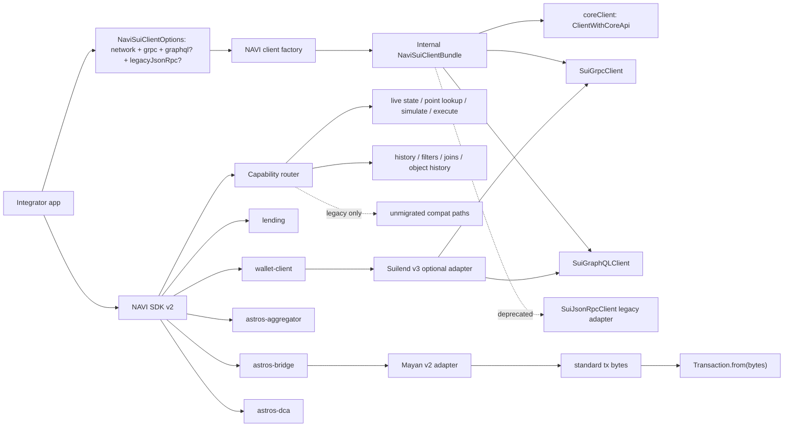
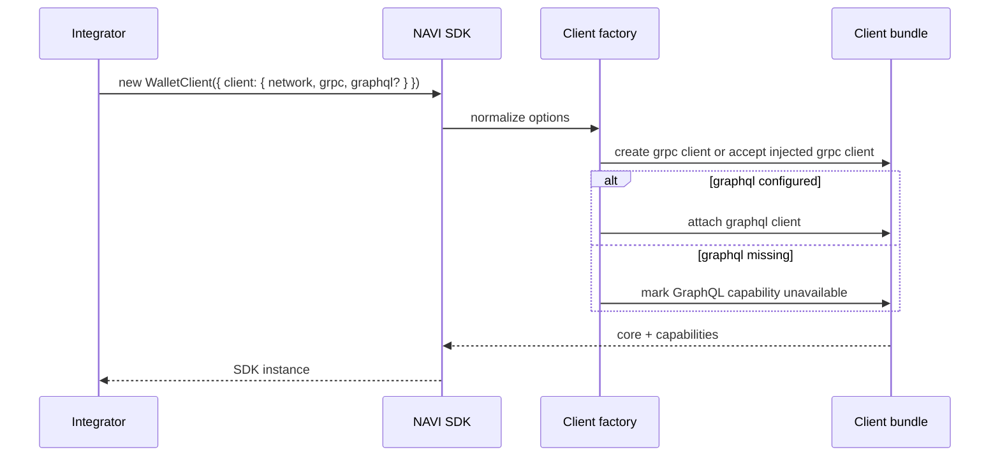
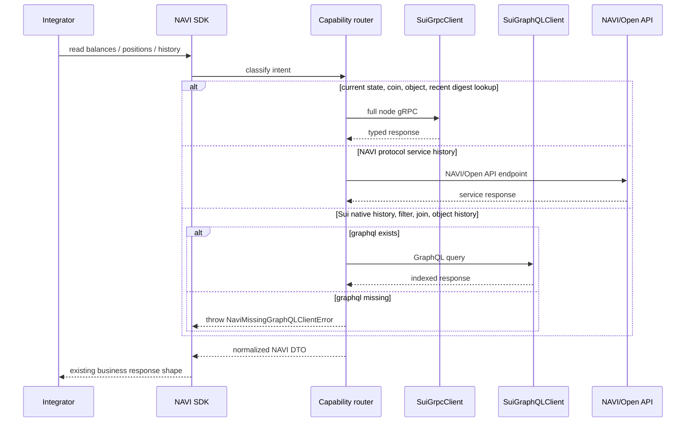
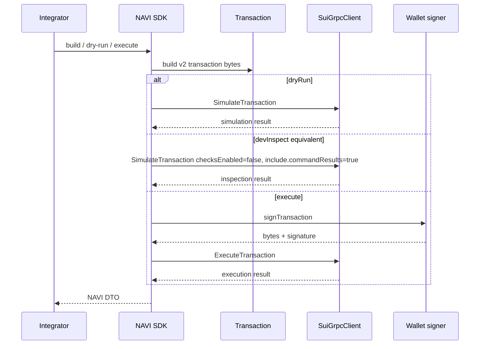

# NAVI SDK v2 gRPC / GraphQL 适配技术设计

Last updated: 2026-06-18

## 背景

NAVI SDK v2 beta 已完成 Sui SDK v2 public contract 迁移：公开 peer 依赖为
`@mysten/sui >=2.0.0`，SDK 包要求 Node.js 22+ 和 ESM，公开 API 不再暴露旧
`@mysten/sui.js`、`TransactionBlock` 或旧 JSON-RPC response contract。

但这不等于已经完成最终数据访问层迁移。当前 SDK 仍有大量
`SuiJsonRpcClient` compat 路径，例如 `getCoins`、`getAllCoins`、
`dryRunTransactionBlock`、`devInspectTransactionBlock`、`getTransactionBlock`
和 `executeTransactionBlock`。

官方迁移约束：

- Sui SDK 2.0 的目标之一是支持新的 gRPC 和 GraphQL API，并转向
  `ClientWithCoreApi` 这类 transport-agnostic contract。
- JSON-RPC 已 deprecated，并计划在 2026 年 7 月停用。
- gRPC 是 full node access、current state、recent point lookup、simulation 和
  transaction execution 的替代接口。
- GraphQL RPC 是 indexed、filterable、historical、joined reads 的替代接口。
- full node gRPC 不会隐式 fallback 到 Archival Store；高保留历史数据必须显式
  使用 GraphQL provider 或 Archival Service endpoint。

参考资料：

- Mysten Sui SDK 2.0 migration:
  <https://sdk.mystenlabs.com/sui/migrations/sui-2.0>
- Mysten `@mysten/sui` migration:
  <https://sdk.mystenlabs.com/sui/migrations/sui-2.0/sui>
- Mysten SDK maintainers guide:
  <https://sdk.mystenlabs.com/sui/migrations/sui-2.0/sdk-maintainers>
- Mysten agent migration prompt:
  <https://sdk.mystenlabs.com/sui/migrations/sui-2.0/agent-prompt>
- Sui JSON-RPC migration guide:
  <https://docs.sui.io/develop/accessing-data/json-rpc-migration>
- Sui Address Balances migration:
  <https://docs.sui.io/onchain-finance/asset-custody/address-balances/migrate-address-balances>
- Sui Address Balances usage:
  <https://docs.sui.io/onchain-finance/asset-custody/address-balances/using-address-balances>
- Sui dApp Kit migration:
  <https://sdk.mystenlabs.com/sui/migrations/sui-2.0/dapp-kit>
- Sui gRPC overview:
  <https://docs.sui.io/develop/accessing-data/grpc/what-is-grpc>
- Suilend SDK guide:
  <https://docs.suilend.fi/ecosystem/suilend-sdk-guide>

执行前还需要读取当前安装版本自带的 LLM 文档，避免只按网页最新文档判断本地依赖。
用 `require.resolve('@mysten/sui/package.json')` 定位 installed package root，再读取：

- `<resolved @mysten/sui package root>/docs/llms-index.md`
- `<resolved @mysten/sui package root>/docs/migrations/*.md`
- `<resolved @mysten/sui package root>/docs/clients/*.md`

## 决策摘要

下一阶段 NAVI SDK 的 client 配置必须是 transport-explicit：

- `grpc` 是 v2 主路径最小必需 transport，用于 live state、coin/object reads、
  simulation 和 transaction execution。
- `graphql` 是按能力开启的 transport。凡是 Sui 原生历史、过滤、事件查询、跨资源
  join、对象/package history，都必须显式要求 GraphQL。
- `legacyJsonRpc` 只作为短期兼容字段。字段名要让使用方知道这是 deprecated 过渡
  路径，不再把泛化的 `url` 当成 v2 主入口。
- SDK 不在 public options 暴露 `archivalGrpc` / `archivalUrl`。如果未来有明确
  old pruned point lookup 需求，再作为高级能力单独设计；普通历史能力优先 GraphQL。
- SDK 不在 public client options 暴露 `configs.suilend/scallop/cetus/haedal` 这类
  protocol-specific transport 配置。它们属于 open-api 或第三方 adapter 内部配置。
- `ClientWithCoreApi` 作为方法级 core API contract 和内部 `coreClient` 使用，不作为
  `WalletClient` / 高层 SDK 初始化的唯一 client 配置入口。
- SDK 内部调用 NAVI/Open API 的路径必须支持 service endpoint 配置。前端和 open-api
  preview 验收不能被硬编码生产 `open-api.naviprotocol.io` 挡住。

## 目标

- 把 NAVI SDK 的长期数据访问架构从 JSON-RPC compat 收敛到
  `SuiGrpcClient` + `SuiGraphQLClient` + limited legacy adapter。
- 不改变现有业务语义：route、amount、status、wallet ownership、gas budget 规则
  不因 transport 迁移改变。
- 方法级 read API 优先接受 `ClientWithCoreApi` 或 NAVI minimal contract，避免把
  `SuiJsonRpcClient` 作为稳定 public contract；高层初始化仍使用显式
  `grpc/graphql/legacyJsonRpc` transport options。
- 让使用方低成本升级：普通用户最小传 `network + grpc`，需要历史/过滤时再传
  `graphql`；短期旧项目可显式传 `legacyJsonRpc`。
- 第三方旧依赖继续 internal 隔离，不穿透 NAVI SDK root bundle 或 public declaration。
  其中 Mayan 已有 Sui v2 版本，本任务应迁到 Mayan v2 并移除 Sui v1 lazy adapter；
  Pyth 等仍未干净支持 v2 的依赖继续隔离。

## 非目标

- 不改变用户交易业务逻辑，不新增真实交易执行路径。
- 不要求前端直接暴露私有 gRPC token。需要 token/metadata 的 transport 由
  open-api 或服务端代理承接。
- 不把 Mayan、Pyth 或其他旧 Sui SDK 依赖公开给 NAVI SDK 使用方。

## 当前 beta PR 和下一阶段 RPC 迁移边界

“不要求当前 beta PR 一次性改完所有 JSON-RPC 调用”的含义不是接受最终版本继续依赖
JSON-RPC，而是区分两个交付阶段：

| 阶段 | 目标 | 验收边界 |
| --- | --- | --- |
| 已执行 beta PR | 完成 Sui SDK v2 public contract、ESM、Node 22、v2 `Transaction`、DTO 包装和旧 raw type 隔离。 | 不破坏升级前业务逻辑；允许短期 compat adapter 存在。 |
| 下一阶段 gRPC/GraphQL 迁移 | 把 SDK release 主路径从 JSON-RPC compat 迁到 gRPC/Core 和 GraphQL。 | release 前不应让主要业务路径依赖 JSON-RPC；剩余 JSON-RPC 只能是显式 `legacyJsonRpc`、内部第三方 adapter 或已记录的非主路径。 |

判断标准：

- 如果方法是 NAVI SDK 发布包的主 read/simulate/execute 路径，应在下一阶段迁到
  gRPC/Core 或 GraphQL，不留“以后再说”。
- 如果路径依赖第三方 SDK 已支持 v2，例如 Mayan，应在本任务迁到 v2 SDK 并移除
  Sui v1 lazy adapter；如果尚未支持 v2，先用 internal adapter 隔离并在 Phase 0 做
  版本 spike。两类路径都不能泄漏旧依赖到 public API。
- 如果路径属于 open-api 非 Copilot stats/history endpoint，不作为 SDK 包发布阻塞，
  但要记录到 open-api repo-wide RPC 迁移清单。
- 如果 SDK 方法内部调用 NAVI/Open API service，必须能把 base URL 切到 preview/staging；
  否则前端引用本地 SDK 时仍会请求生产 open-api，无法验证 SDK + open-api preview 组合。

## 当前状态和差距

### 当前 beta 是否“同时支持 JSON-RPC 和 gRPC”

当前 beta 只能说“底层引入了 Sui SDK v2 能力，并在 Suilend adapter 局部使用
gRPC”，不能说所有 NAVI SDK public 方法已经同时支持 JSON-RPC 和 gRPC。

| 包 | 当前 transport 状态 | 与目标差距 |
| --- | --- | --- |
| `@naviprotocol/lending` | 主路径仍使用 JSON-RPC compat client；Pyth 主路径已换成 NAVI v2 helper。 | `getCoins`、`devInspect` 类 read/simulate 需要 gRPC adapter。 |
| `@naviprotocol/wallet-client` | 默认 client 仍是 `SuiJsonRpcClient`；Suilend adapter 已支持 gRPC。 | dry-run/execute/balance/lending wrapper 需要接入统一 bundle。 |
| `@naviprotocol/astros-aggregator-sdk` | PTB 已是 v2 `Transaction`；coin selection、dry-run、execute 仍是 JSON-RPC compat。 | coin、simulate、execute 需要 gRPC；按 digest 查交易可用 gRPC/GraphQL。 |
| `@naviprotocol/astros-bridge-sdk` | 当前仍用 Mayan v1 internal lazy + `@mysten/sui-v1` alias；Mayan 已有 v2 SDK。 | 本任务应升级到 Mayan v2，移除 Sui v1 lazy adapter；Sui execute 需要 gRPC executor；Bridge status/history 仍是服务端 API。 |
| `@naviprotocol/astros-dca-sdk` | PTB 已是 v2 `Transaction`；coin / dry-run 仍走 JSON-RPC compat。 | coin 和 simulate 需要 gRPC adapter。 |

### SDK 是否涉及 GraphQL 必需场景

当前 SDK 源码中没有直接引入 `SuiGraphQLClient`。现有“history”能力大多不是
Sui GraphQL，而是 NAVI/Astros/Bridge 自有 HTTP API。

| 能力 | 当前实现 | 是否现在必须 GraphQL | 后续规则 |
| --- | --- | --- | --- |
| lending `getTransactions` | `open-api.naviprotocol.io/api/navi/user/transactions`。 | 否。 | 仍按 NAVI API history 处理；如果改成 Sui native tx/event query，必须显式要求 GraphQL。 |
| lending `getUserClaimedRewardHistory` | `open-api.naviprotocol.io/api/navi/user/rewards`。 | 否。 | 仍按 NAVI API history 处理。 |
| bridge `getTransaction` / `getWalletTransactions` | Bridge service API。 | 否。 | 不是 Sui native history。 |
| DCA execution/order history | 当前主要由服务端/API 承接。 | 否。 | 如果改成 Sui event/tx filter，必须显式要求 GraphQL。 |
| aggregator `checkIfNAVIIntegrated(digest)` | `getTransactionBlock({ digest, showEvents })` point lookup。 | 不一定。 | 近期/已知 digest 可用 gRPC `GetTransaction`；如果变成按条件过滤历史交易，则必须 GraphQL。 |
| coin/balance/object/package 当前状态 | JSON-RPC compat。 | 否。 | 目标 gRPC，GraphQL 仅作为前端友好或 join 查询选项。 |
| event/transaction filter、object history、cross-resource join | 当前没有统一 SDK public path。 | 是。 | 调用前必须检查 `graphql`，缺失时抛出明确错误，不能偷偷用 public endpoint 或 JSON-RPC fallback。 |

判断标准：只要功能语义是“历史、过滤、跨资源 join、对象/package 版本历史、深分页一致性”，
就属于 GraphQL 能力边界。SDK 可以在构造时允许不传 `graphql`，但调用这些能力时必须
显式失败，例如 `NaviMissingGraphQLClientError`。

当前 repo 关联范围的具体结论：

- `naviprotocol-monorepo/packages/*` 当前没有直接 `SuiGraphQLClient` import。
- `copilot/apps/lending` 已有一个前端 account-cap 查询直接使用 `SuiGraphQLClient`；
  这是前端接入方能力，不是 NAVI SDK 包 public contract。
- `navi-open-api` 里仍有非 Copilot `queryEvents`、stats、history 类 JSON-RPC 路径；
  这些属于 open-api repo-wide RPC 迁移，不作为 SDK 包 release 主 gate，但应单独记录和
  验收。

## 官方迁移覆盖自查

完成已执行的 SDK v2 beta 迁移和本文规划的 RPC 迁移后，才可以认为 NAVI SDK 对
Mysten Sui SDK 2.0 migration 已闭环。执行前按下面矩阵逐项核对。

| 官方要求 | NAVI 当前判断 | 本文执行项 / 验收口径 |
| --- | --- | --- |
| ESM-only、Node 22+、peer dependency `@mysten/sui ^2`。 | SDK beta 已按 Node 22+/ESM 方向迁移，open-api 当前为 Node 24 服务端。 | 发布前检查每个发布包 `package.json`、`exports`、`engines`、peer deps；CJS `require()` 不作为 v2 支持目标。 |
| 旧 `SuiClient` export 移到 `@mysten/sui/jsonRpc`，JSON-RPC 不再是长期主路径。 | 代码仍有 `SuiJsonRpcClient` compat，Bridge Mayan 有内部旧依赖。 | public declaration 不暴露旧 `SuiClient` / `@mysten/sui.js` / `TransactionBlock` / old raw response；JSON-RPC 只能在 `legacyJsonRpc` 或 third-party internal adapter 出现。 |
| 所有 client constructor 显式传 `network`。 | 当前目标 options 已包含 `network`。 | `grpc`、`graphql`、`legacyJsonRpc` normalize 统一携带 network；禁止隐式从 URL 推断 network。 |
| SDK maintainers 应接受 `ClientWithCoreApi` 并通过 `client.core.*` 访问数据。 | 当前文档已决定：高层初始化不用裸 `ClientWithCoreApi`，内部和 method-level helper 使用。 | read adapter 只调用 `coreClient.core.*`；low-level helper 可接受 `ClientWithCoreApi`；高层 `WalletClient` / 聚合 SDK 仍使用显式 `grpc/graphql/legacyJsonRpc`。 |
| JSON-RPC read/simulate 方法迁到 Core API。 | 当前仍有 `getCoins`、`getAllCoins`、`getObject`、`multiGetObjects`、`dryRunTransactionBlock`、`devInspectTransactionBlock` 等 compat。 | 按 Phase 2 迁到 `listCoins`、`listOwnedObjects`、`getObject(s)`、`listBalances`、`simulateTransaction`；`devInspect` 等价语义必须设置 `checksEnabled: false`，且需要 return values 的路径必须设置 `include.commandResults: true` 并 normalize command results。 |
| `queryTransactionBlocks`、`queryEvents`、`getCheckpoints`、`getEpochs` 等迁到 GraphQL。 | 当前 SDK 没有统一 Sui native history/filter public path，历史多是 NAVI/Open API service。 | 新增或迁移 Sui native history/filter/join 时必须检查 `graphql`；缺失时报 `NaviMissingGraphQLClientError`；不自动使用 public GraphQL 或 JSON-RPC fallback。 |
| coin metadata、stake、past object、metrics 的替代能力分散在 gRPC/GraphQL/indexer。 | 当前主要涉及 coin metadata；stake/past object/metrics 未作为核心 SDK 路径发现。 | 逐方法判断：current metadata 可走 gRPC/Core；historical/past object 或 metrics 走 GraphQL/indexer/service，不用 legacy JSON-RPC 补洞。 |
| `getTotalSupply` 官方建议走 GraphQL `coinMetadata.supply`。 | 当前源码未发现 `getTotalSupply` 主路径。 | 不为未使用能力新增 fallback；未来如需要 total supply，按 GraphQL capability 显式接入。 |
| Address Balances 会改变 balance 查询语义。 | JSON-RPC `totalBalance` 已包含 coin objects + address balance；gRPC/Core 返回 `balance`、`coinBalance`、`addressBalance`。 | `getBalance`/`listBalances` adapter 和 DTO 必须明确字段语义；前端钱包总额默认用 total，coin-object-only 视图必须用 `coinBalance` 或 `listCoins`。 |
| transaction response 是 `Transaction | FailedTransaction` union，include options 和 status shape 已变化。 | beta 已做 NAVI DTO 包装，但仍需覆盖 execute/simulate adapter。 | DTO normalize 必须覆盖 success/failure union、`effects/events/balanceChanges/objectChanges` 缺省值和字段选项；不把 raw Mysten response 作为稳定 contract。 |
| BCS schema、`ExecutionStatus`、Object variants、`unchangedConsensusObjects` 等有 breaking change。 | 当前扫描未发现 raw BCS 解析主路径，但执行前必须再次扫描。 | `rg` 扫 `ObjectBcs`、`ExecutionStatus`、`unchangedSharedObjects`、raw `effects.bcs` parser；发现后按 v2 BCS schema 改并补测试。 |
| `Commands` 改为 `TransactionCommands`。 | 当前扫描未发现旧 import，只有普通变量名。 | 边界扫描继续覆盖 `import { Commands } from '@mysten/sui/transactions'`。 |
| named package plugin / global transaction plugin registry 移除，MVR 配置进入 client。 | 当前未发现依赖全局 plugin。 | 扫 `namedPackagesPlugin`、`setDefaultNamedPackages`、`resolveTransactionPlugin`；若使用 Move registry name，配置到 client `mvr`。 |
| transaction executor 接受 `ClientWithCoreApi`，executor wrapper 返回字段从 `data` 改为 `result`。 | 当前主要使用 signer/client execute path，仍需覆盖 executor 相关 helper。 | 扫 executor 使用；只有 executor wrapper 读取 `result`；direct `client.core.executeTransaction` / `getTransaction` 按 `Transaction | FailedTransaction` union normalize。 |
| v2 transaction 默认 current epoch + 1 过期。 | 这是容易漏的行为差异，当前文档未锁定。 | 审核所有 SDK 构造 PTB 的路径：如果升级前业务依赖“无过期”，显式 `tx.setExpiration({ None: true })`；否则记录接受 v2 默认过期，不静默改变长尾场景。 |
| `@mysten/sui/experimental` export 稳定化。 | 当前源码扫描未发现依赖实验 export。 | 执行前继续扫 `@mysten/sui/experimental`、`Experimental_`；如命中，迁到稳定 export 名称。 |
| zkLogin `legacyAddress` 参数变化。 | 当前源码扫描未发现 NAVI SDK zkLogin address 计算路径。 | 执行前继续扫 `zkLogin`、`legacyAddress`；如新增 zkLogin 能力，必须显式处理 legacy address。 |
| dApp Kit 迁到 `@mysten/dapp-kit-react` 才能获得 gRPC-first client provider。 | Copilot 当前仍使用 `@mysten/dapp-kit@1.0.6`，这属于前端接入方迁移，不是 SDK 包发布阻塞。 | SDK/local frontend 验收可以先沿用现有 dApp Kit；正式前端迁移另开任务，目标为 `DAppKitProvider`、`useCurrentClient().core.*` 和 `SuiGrpcClient`。 |
| wallet builder 的 `sui:reportTransactionEffects` 移除。 | NAVI SDK 不是钱包扩展，但 wallet-client/前端签名执行路径要注意。 | 签名执行统一走 v2 signer/executor union；不依赖 wallet 上报旧 effects。 |
| 第三方 SDK 版本需要按实际 peer/dependency 判断。 | `@mysten/sui` 当前 SDK dev 多为 `2.17.0`，npm 最新为 `2.19.0`；Suilend `3.0.4` peer 精确要求 `@mysten/sui 2.17.0`。 | 不盲升到 `2.19.0`；Phase 0 先做第三方兼容矩阵和 live smoke，再决定是否统一升级。 |

### Address Balances 影响

官方 Address Balances 迁移不要求 NAVI 合约或现有有效交易重写，但会影响余额读取和
展示语义：

- JSON-RPC `suix_getBalance` / `suix_getAllBalances` 返回的 `totalBalance` 已包含
  coin objects 和 address balance，并新增 `fundsInAddressBalance`。
- gRPC/Core `GetBalance` / `ListBalances` 返回 total `balance`、`coinBalance` 和
  `addressBalance`。
- GraphQL `balance` / `balances` 同样提供 `totalBalance`、`coinBalance` 和
  `addressBalance`。

NAVI 执行规则：

- SDK DTO 如果对外暴露 balance，必须说明字段是 total 还是 coin-object-only；推荐保留
  total，并在需要时同时提供 `coinBalance`、`addressBalance`。
- 余额显示默认应使用 total，避免用户通过 address balance 收到的资金不可见。
- coin object 选择、拆币、需要具体 coin object id 的路径必须用 `listCoins` 或
  transaction builder 的 v2 coin intent，不应依赖 JSON-RPC compatibility layer 合成的
  coin object。
- open-api 和 Copilot 的钱包余额、claim/migrate/build 交易验收必须覆盖 address
  balance 字段存在时不误算。

## 架构方案

### 总体架构



### Transport 能力分层

| 层 | 责任 | Public 稳定性 |
| --- | --- | --- |
| `ClientWithCoreApi` / minimal client | `client.core.*` 方法级 contract，用于 transport-agnostic object/coin/balance reads 和 transaction input resolution。 | 稳定，但不是高层初始化入口。 |
| `grpc` | 当前状态、对象、coin/balance、recent point lookup、simulate、execute。 | 目标主路径。 |
| `graphql` | transaction/event filter、历史、join reads、object/package history。 | 目标能力路径。 |
| `legacyJsonRpc` | 尚未迁移方法的短期兼容。 | deprecated，不能作为长期 contract。 |
| third-party adapter | Mayan 迁到 v2 SDK；Pyth 等仍未干净支持 v2 的依赖继续隔离。 | 内部细节，不穿透 public API。 |

### Public client options

面向用户不暴露内部 bundle。推荐 public contract 是分组显式 transport：

```ts
type NaviNetwork = 'mainnet' | 'testnet' | 'devnet' | 'localnet' | (string & {})

type NaviTransportInput<TClient> =
  | { client: TClient }
  | { url: string; headers?: Record<string, string> }

type NaviSuiClientOptions = {
  network: NaviNetwork
  grpc: NaviTransportInput<SuiGrpcClient>
  graphql?: NaviTransportInput<SuiGraphQLClient>

  /**
   * Deprecated compatibility for old JSON-RPC-only paths.
   * New v2 integrations should not treat this as the primary client.
   */
  legacyJsonRpc?: NaviTransportInput<SuiJsonRpcClient>
}
```

设计理由：

- 不保留泛化 `url?: string` 作为 v2 主入口。`url` 会让用户误以为 JSON-RPC 仍是
  v2 默认形态。
- 不用平铺 `grpcUrl`、`graphqlUrl`、`jsonRpcUrl`。平铺字段在生产鉴权场景下不够清晰，
  也无法表达“这个 URL 属于哪个 transport 的高级 client”。
- 生产推荐 `grpc: { client }` / `graphql: { client }`，由接入方自行构造带鉴权、
  metadata 或自定义 transport 的 Mysten client。
- `url + headers` 只作为简化接入，适合 GraphQL、JSON-RPC 或简单 gRPC-web 鉴权。
  如果 provider 需要 gRPC metadata/token，生产方应该注入已经构造好的 `client`。
- `legacyJsonRpc` 字段名明确表达它只是兼容路径。内部实现可以命名为
  `jsonRpcCompat`，但 public API 不应暴露这个内部术语。
- 不暴露 `label`、`fallbacks` 或 endpoint policy。日志标签、重试、限流和多 endpoint
  failover 属于 open-api、provider 或自定义 client 的职责，不应增加普通 SDK 用户的
  初始化成本。

### Internal normalized bundle

SDK 内部可以 normalize 成 bundle，名称可在实现时调整：

```ts
type NaviSuiClientBundle = {
  network: NaviNetwork
  coreClient: ClientWithCoreApi
  grpc: SuiGrpcClient
  graphql?: SuiGraphQLClient
  legacyJsonRpc?: SuiJsonRpcClient
}
```

规则：

- `grpc` 是必需能力。没有 gRPC 时只能进入 deprecated legacy overload，不能宣称是
  完整 v2 transport。
- `coreClient` 优先来自 `grpc`，因为 `SuiGrpcClient` 满足 `ClientWithCoreApi`。只有
  legacy compat path 才允许从 `legacyJsonRpc` 派生 `coreClient`。
- 内部 read adapter 只通过 `coreClient.core.*` 调用 Core API，例如
  `getObject`、`getObjects`、`listOwnedObjects`、`listCoins`、`getBalance`、
  `listBalances`、`getCoinMetadata`、`getDynamicField`、`listDynamicFields`。
- simulate / execute adapter 以 `grpc` capability 为准，可调用
  `bundle.grpc.core.simulateTransaction` / `bundle.grpc.core.executeTransaction`。不要在高层
  execute path 接受任意外部 `ClientWithCoreApi` 来替代 `grpc`。
- `ClientWithCoreApi` 不代表 GraphQL history/filter/join 能力；这些路径必须检查
  `bundle.graphql`。
- `ClientWithCoreApi` 也不作为 legacy JSON-RPC-only 方法的替代；旧方法只能走显式
  `legacyJsonRpc`。
- `graphql` 不要求所有用户必传，但调用 GraphQL-only 能力时必须存在。
- 不在 public bundle 放 `archivalGrpc`。需要 archival 的具体方法以后单独定义
  `archival` capability，不作为普通 SDK 初始化参数。

### Open API service endpoint options

Sui transport 和 NAVI/Open API service endpoint 是两类不同配置，不能混在
`grpc/graphql/legacyJsonRpc` 里。下一阶段需要新增 SDK service 配置，解决前端和
open-api preview 环境联调问题。

推荐 public contract：

```ts
type NaviServiceEndpoint = {
  /**
   * API root. For navi-open-api this includes `/api`.
   * Example: https://open-api.naviprotocol.io/api
   * Preview: https://navi-open-api-git-feat-sui-sdk-v2-navi-fd9a1df6.vercel.app/api
   */
  baseUrl: string
  headers?: Record<string, string>
}

type NaviSdkServiceOptions = {
  naviOpenApi?: NaviServiceEndpoint
  astrosApi?: NaviServiceEndpoint
}

type NaviSdkConfig = {
  services?: NaviSdkServiceOptions
}
```

使用规则：

- 默认不配置时继续走生产 endpoint，保持升级前行为。
- 浏览器前端只允许配置 browser-safe endpoint 和非敏感 headers；私有 token 仍走
  open-api 服务端代理。
- `naviOpenApi.baseUrl` 是 `navi-open-api` 的 API root，必须包含 `/api`。如果接入方拿到
  preview origin，例如 `https://navi-open-api-git-feat-sui-sdk-v2-navi-fd9a1df6.vercel.app/`，
  前端应传 `https://navi-open-api-git-feat-sui-sdk-v2-navi-fd9a1df6.vercel.app/api`。
- `astrosApi.baseUrl` 是 open-aggregator / Astros API origin；现有 aggregator `getQuote`
  的 `swapOptions.baseUrl` 仍保留，因为它当前表示完整 `find_routes` URL。
- 优先级：per-call service options > SDK instance options > global SDK service config >
  production default。
- SSR/server 代码应优先使用 per-call 或 instance options，避免跨请求共享全局配置。
- global service config 是前端 preview/dev 的便利入口；配置变化必须清理相关
  `withCache` / `withSingleton` 缓存，或把 resolved `baseUrl` 纳入 cache key，避免从
  production 切到 preview 后复用旧缓存。

示例：

```ts
configureNaviSdk({
  services: {
    naviOpenApi: {
      baseUrl: `${process.env.NEXT_PUBLIC_OPEN_API_BASE_URL!}`
    },
    astrosApi: {
      baseUrl: process.env.NEXT_PUBLIC_AGGREGATOR_API_HOST!
    }
  }
})
```

如果前端环境变量保存的是 preview origin：

```ts
configureNaviSdk({
  services: {
    naviOpenApi: {
      baseUrl: `${process.env.NEXT_PUBLIC_OPEN_API_ORIGIN!}/api`
    }
  }
})
```

需要迁移的 SDK open-api call site：

| 包 | 当前状态 | 目标 |
| --- | --- | --- |
| `@naviprotocol/lending` | `getConfig`、`getPools`、`getStats`、`getFees`、`getTransactions`、reward history 等硬编码 `https://open-api.naviprotocol.io/api`。 | 统一通过 `resolveNaviOpenApiEndpoint()` 构造 URL，支持 per-call/global `naviOpenApi.baseUrl`。 |
| `@naviprotocol/astros-aggregator-sdk` | `getQuote` 已有 `swapOptions.baseUrl`；positive slippage setting 仍硬编码 open-api internal endpoint。 | 保留现有 quote `baseUrl`，补 service config 给 positive slippage / 其他 open-api 读路径。 |
| `@naviprotocol/astros-bridge-sdk` | 已有 `config({ baseUrl })` 更新 bridge API axios baseURL。 | 与统一 service config 对齐，保留现有 `config` 作为兼容入口。 |
| `@naviprotocol/astros-dca-sdk` | order 查询已有局部 `baseUrl`；默认来自 open-aggregator。 | 保留局部 override，并允许从统一 `astrosApi` default 派生。 |

## 交互流程

### 初始化和能力检查



### Read path routing



### Simulation / execution path



## Fallback 规则

| 场景 | 最小配置 | 缺失时行为 | 禁止行为 |
| --- | --- | --- | --- |
| current object / coin / balance / recent digest lookup | `network + grpc` | 初始化或调用时报缺少 gRPC。 | 偷偷改走 public fullnode 或 JSON-RPC endpoint。 |
| dry-run / devInspect equivalent / execute | `network + grpc` | 报缺少 gRPC 或 signer。 | 为了兼容自动广播到 JSON-RPC。 |
| Sui native history / event filter / transaction filter / cross-resource join | `network + grpc + graphql` | 调用时报缺少 GraphQL。 | 偷偷用 public endpoint 或 legacy JSON-RPC 查询。 |
| NAVI/Open API service history | SDK 内部 service endpoint | 按 service API 错误返回。 | 把 service history 误判为 Sui GraphQL 必需。 |
| legacy unmigrated method | `legacyJsonRpc` | 报明确 deprecated path 未配置。 | 把 `grpc.url` 当 JSON-RPC URL 试。 |

SDK 不做隐式 public endpoint fallback。遇到 provider 限流或上游错误时，SDK 返回明确
错误；缓存、并发控制、重试和多 endpoint failover 应放在 open-api、provider 或注入的
自定义 client 中。

使用方最小接入：

- 只做 current state、PTB、dry-run、execute：传 `network + grpc`。
- 使用历史、过滤、跨资源 join、对象/package history：传 `network + grpc + graphql`。
- 处于旧系统过渡期：传 `network + grpc + graphql + legacyJsonRpc`，但
  `legacyJsonRpc` 不作为 release 后长期保障。

## 第三方 SDK 参考

截至 2026-06-18 的 npm/package 审计结论：

| SDK / 包 | 当前本地/声明版本 | npm latest / 候选版本 | NAVI 动作 |
| --- | --- | --- | --- |
| `@mysten/sui` | SDK dev deps 多为 `2.17.0`；peer 为 `>=2.0.0`。 | npm latest `2.19.0`。`2.18.0` 增加 `Transaction.from(..., { intentResolvers })`、升级 `@mysten/bcs@2.1.0` / `@mysten/utils@0.4.0`；`2.19.0` 新增 boolean-returning signature verify helpers。 | 是否升级到 `2.19.0` 不预设结论，按实测判断：若 Mayan/Suilend/open-api/Copilot smoke 均兼容且能减少风险，可升；若 Suilend 精确 peer 或依赖树不稳定，保持 `2.17.0` 并记录原因。 |
| Suilend v3 (`@suilend/sdk`) | SDK/open-api 使用 `3.0.4`。 | latest `3.0.4`；peer 精确要求 `@mysten/sui 2.17.0`、`@mysten/bcs 2.0.1`、`@pythnetwork/pyth-sui-js 2.2.0`。 | 参考“gRPC 和 GraphQL 分能力注入”，但不盲升 Mysten 到 `2.19.0`；Suilend adapter smoke 是升级 gate。 |
| Pyth (`@pythnetwork/pyth-sui-js`) | wallet-client/Suilend peer 使用 `2.2.0`。 | latest `3.0.0` 仍声明 `@mysten/sui ^1.3.0`。 | 继续保留 NAVI v2 Pyth helper / adapter；不能因为 Pyth 版本号升级就移除 helper。helper 内部 read path 需迁到 Core API。 |
| Mayan (`@mayanfinance/swap-sdk`) | Bridge SDK 使用 `13.3.0` + `@mysten/sui-v1` alias。 | latest `15.0.0` 已依赖 `@mysten/sui ^2.17.0`。 | 本任务应升级 Mayan 到 v2 版本并移除 `@mysten/sui-v1` alias / 旧 lazy adapter；Phase 0 spike 是验证 gate，必须覆盖 Sui-source bridge build/sign/execute bytes，失败才保留隔离并记录阻断。 |
| Scallop (`@scallop-io/sui-scallop-sdk`) | open-api 使用 `^3.0.2`。 | `3.0.2` 存在且依赖 `@mysten/sui ^2.11.0`；npm dist-tag `latest` 仍可能指向 `2.4.5`。 | open-api/Copilot Scallop adapter 优先注入 gRPC client；Pyth 旧依赖只允许内部隔离。 |
| Cetus Aggregator (`@cetusprotocol/aggregator-sdk`) | open-api 使用 `^1.5.8`。 | latest/candidate `1.6.1` 已依赖 `@mysten/sui ^2.16.3`。 | 可作为 open-api 依赖升级候选，但必须和 action build/dry-run smoke 一起做，不混入 SDK 核心迁移。 |
| Haedal (`haedal-vault-sdk`、`haedal-farm-sdk`) | open-api vault 使用 `^2.5.5`，farm 使用 `^1.2.1`。 | vault latest `2.5.6`，peer 对 `@mysten/sui` 放宽为 `*`；farm latest `1.2.1`，仍依赖 Pyth `^2.4.0`。 | open-api adapter 内部隔离第三方依赖；余额/stats/event query 仍按 gRPC/GraphQL 规则迁移。 |

2026-06-19 实测更新：

- `@mysten/sui@2.19.0` 不再只是候选。Mayan v15 的 Sui-source route 在临时
  `@mysten/sui@2.19.0` 环境中可以 build，而 `2.17.0` 下会在 SUI-input route
  解析阶段报 `ArgumentWithoutValue`。因此五个 v2 发布包的 dev dependency 升级到
  `2.19.0`；public peer contract 仍保持 `>=2.0.0`。
- `pnpm install` 会报告 Suilend `@suilend/sdk@3.0.4` / `@suilend/sui-fe@3.0.7`
  精确 peer `@mysten/sui@2.17.0` 不满足。该风险不能只靠 lockfile 判断，必须以
  wallet-client build、Suilend init/live smoke、open-api/Copilot tarball smoke 作为
  gate。
- Mayan v15 Sui-source build/sign gate 已通过一条稳定路线：
  Sui SUI -> Arbitrum USDC，`NAVI_SMOKE_BRIDGE_AMOUNT=1`，
  `NAVI_SMOKE_BRIDGE_TO_CHAIN=42161`，Core simulate 不广播，bytes length 2632，
  signature count 1。
- Mayan v15 Sui SUI -> Solana USDC route 当前可能返回内部 Sui swap PTB，Core build
  会报 `ArgumentWithoutValue`。这属于第三方 route 语义风险；默认 smoke 不使用该路线，
  Solana route 需要单独 route-level gate 后才能作为 release execute 证据。

结论：参考第三方 SDK 的方向是“client/transport injection first”，不是把各协议
provider 参数摊到 NAVI SDK public options。`configs.suilend/scallop/cetus/haedal`
属于 open-api adapter 或上层聚合服务配置，不属于通用 SDK client contract。

## 接入方设计

### SDK 使用方

推荐 production 接入：注入已构造 client。私有 gRPC provider 常需要 metadata 或
custom transport，推荐在接入方构造后传入 SDK。

```ts
new WalletClient({
  signer,
  client: {
    network: 'mainnet',
    grpc: { client: grpcClient },
    graphql: { client: graphqlClient },
    legacyJsonRpc: { client: jsonRpcClient }
  }
})
```

简化 production 接入：provider 鉴权可以用 HTTP/gRPC-web headers 表达时，可直接传
URL 和 headers。

```ts
new WalletClient({
  signer,
  client: {
    network: 'mainnet',
    grpc: {
      url: `https://${process.env.SUI_GRPC_ENDPOINT!}`,
      headers: { 'x-token': process.env.SUI_GRPC_TOKEN! }
    },
    graphql: {
      url: process.env.SUI_GRAPHQL_URL!
    }
  }
})
```

官方 public endpoint 只适合低流量开发和 demo；多协议、高并发或生产流量应使用私有
endpoint/client，避免限流和不稳定错误。

### navi-open-api

open-api 是服务端接入方，应该承担生产 endpoint 和鉴权差异：

- 本地 `navi-open-api/.env.local` 已确认存在 `SUI_JSON_RPC_URL`、
  `SUI_GRPC_ENDPOINT`、`SUI_GRPC_TOKEN`、`SUI_GRAPHQL_URL`；文档和日志只记录变量名，
  不记录具体值。
- `SUI_GRPC_ENDPOINT` + `SUI_GRPC_TOKEN` 构造 gRPC client。
- `SUI_GRAPHQL_URL` 构造 GraphQL client。
- `SUI_JSON_RPC_URL` 只传给 `legacyJsonRpc`。
- Ankr 类 provider 的 `SUI_GRPC_ENDPOINT` 保持 host-only，native `grpcurl` 使用
  `${SUI_GRPC_ENDPOINT}:443`，gRPC-web client 使用 `https://${SUI_GRPC_ENDPOINT}`；
  鉴权通过 `x-token` metadata/header。
- 每个 transport 单独 smoke：JSON-RPC 成功不代表 gRPC 可用，gRPC 成功也不代表
  GraphQL 可用。
- 有 provider metadata/token 的 gRPC，不应只传 URL 给 SDK；应注入已构造 client。
- 本地测试取 env 的顺序：当前进程 env > repo 正常加载的 `.env.local` > 可选全局
  shell env / 统一 env 文件。可以全局保留常用非敏感 URL；token 属于 secret，不提交、
  不打印，repo 脚本也不直接 source 个人 shell 文件。

open-api 目标形态：

```ts
const client = {
  network: 'mainnet',
  grpc: { client: grpcClient },
  graphql: { client: graphqlClient },
  legacyJsonRpc: { url: jsonRpcUrl }
}
```

### 前端三个主要 app

当前作为主要 SDK 接入方跟踪的 frontend apps 是：

| App | 当前观察 | 目标接入方式 |
| --- | --- | --- |
| `copilot/apps/lending` (`@naviprotocol/lending-next`) | 使用 `@naviprotocol/lending`、aggregator SDK、`SuiJsonRpcClient` + `NAVIHttpTransport`；已有一个直接 `SuiGraphQLClient` account-cap 查询。 | 继续让钱包 UI 使用 dapp-kit；NAVI SDK v2 复杂 read/action 优先通过 open-api 或传显式 `grpc`/`graphql`。浏览器只能使用无 secret 的 browser-safe endpoint。 |
| `copilot/apps/astros` (`@naviprotocol/astros`) | 使用 aggregator、bridge、DCA SDK；当前 chain service 仍是 `SuiJsonRpcClient`。 | swap/bridge/DCA SDK 调用迁到显式 `grpc`；交易/事件过滤或历史页需要 `graphql` 或 open-api。 |
| `copilot/apps/astros-aggregator` (`@naviprotocol/astros-aggregator`) | 使用 aggregator、bridge、DCA SDK；当前 chain service 仍是 `SuiJsonRpcClient`。 | 与 Astros 相同，不能把 `NEXT_PUBLIC_SUI_RPC_URL` 当成 gRPC。 |

前端公共规则：

- 不在浏览器暴露 `SUI_GRPC_TOKEN`。带 token/metadata 的 gRPC 走 open-api。
- `NEXT_PUBLIC_SUI_RPC_URL` 只能继续作为 deprecated legacy JSON-RPC 配置。
- SDK 内部调用 NAVI/Open API 的路径必须允许前端配置 preview endpoint。建议前端统一
  使用 `NEXT_PUBLIC_OPEN_API_BASE_URL=https://...vercel.app/api`，并在 app 启动时调用
  `configureNaviSdk({ services: { naviOpenApi: { baseUrl } } })`。
- 如果没有配置 SDK service endpoint，即使前端安装了本地 SDK tarball，SDK 内部
  open-api 读路径仍会打生产环境，不能作为 preview 联调通过证据。
- 如 provider 提供 browser-safe gRPC-web，可配置 `NEXT_PUBLIC_SUI_GRPC_URL`。
- 如前端需要历史/过滤/join read，可配置 `NEXT_PUBLIC_SUI_GRAPHQL_URL`，否则走
  open-api 聚合接口。
- `NEXT_PUBLIC_SUI_GRAPHQL_URL` 必须是 browser-safe、无 token 的 endpoint；带 token 的
  GraphQL 同样只能走 open-api 或服务端代理。
- `volo`、`lending-review` 等较小 SDK 消费方跟随 Lending 模式，作为后续验收扩展。

## 执行计划

### Phase 0：执行前官方迁移审计

目标是在写代码前确认“官方 v2 迁移项是否都被覆盖”，避免只完成 JSON-RPC 到 gRPC
这一条线。

- 读取网页文档和本地安装包文档：`sui-2.0`、`sui`、`json-rpc-migration`、
  `sdk-maintainers`、`dapp-kit`、`agent-prompt`、resolved `@mysten/sui` package root
  下的 `docs/*`。
- 运行边界扫描，至少覆盖：
  `@mysten/sui.js`、`TransactionBlock`、旧 `SuiClient` public import、
  `client.getObject`、`client.getOwnedObjects`、`multiGetObjects`、`getCoins`、
  `dryRunTransactionBlock`、`devInspectTransactionBlock`、`queryTransactionBlocks`、
  `queryEvents`、`ObjectBcs`、`ExecutionStatus`、`unchangedSharedObjects`、
  `Commands`、`namedPackagesPlugin`、executor `data` result、
  `@mysten/sui/experimental`、`Experimental_`、`@mysten/sui/graphql/schemas`、
  `graphql/schemas/latest`、`graphql/schemas/2024`、`zkLogin`、`legacyAddress`。
- 对每个命中点归类：迁 gRPC/Core、迁 GraphQL、保留 NAVI service、保留 internal
  legacy adapter、删除或标记 deprecated。
- 审计 Address Balances 影响：`getBalance`、`getAllBalances`、`listBalances`、
  open-api wallet/protocol balance display、Copilot wallet total 和 coin-object-only
  视图。
- 审计第三方 SDK 版本：Pyth、Mayan、Suilend、Scallop、Cetus、Haedal 及其
  `@mysten/sui` peer/dependency；只有通过 build/type/live smoke 的升级才进入实现。
- Mayan 是本任务内升级项：确认 `@mayanfinance/swap-sdk` v2 版本 API、Sui-source route
  bytes、sign 和 execute 语义，再移除 `@mysten/sui-v1` alias 和旧 lazy import。
- `@mysten/sui@2.19.0` 只作为实测候选：记录升级收益、Suilend peer 影响、lockfile
  变化和 SDK/open-api/Copilot smoke 结果，再决定升级或保持 `2.17.0`。
- 记录 transaction expiration 判断：每个 SDK 构造 PTB 的函数都要确认是否需要
  `tx.setExpiration({ None: true })` 来保持升级前行为。
- 新增或指定真实 provider smoke 脚本，覆盖 gRPC、GraphQL 和 legacy JSON-RPC 三种
  transport；不能用静态边界扫描代替 live endpoint 验证。
- 若 Phase 0 发现 P0/P1 漏项，例如 public contract 变化、主路径仍只能 JSON-RPC、
  第三方升级会改变桥/交易构造语义，先回写本文档并确认方案后再写代码。

### Phase 1：client factory / type contract

- 新增 SDK 内部 normalized bundle。
- 新增 SDK service endpoint 配置，至少覆盖 `naviOpenApi.baseUrl`；浏览器 preview
  使用 `NEXT_PUBLIC_OPEN_API_BASE_URL` 注入，默认仍为 production。
- public 方法参数从具体 `SuiJsonRpcClient` 收敛到 `ClientWithCoreApi` 或 minimal
  capability interface。
- 内部 adapter 统一通过 `bundle.coreClient.core.*` 调 Core API；不要继续调用旧
  `client.getObject`、`client.getOwnedObjects`、`client.multiGetObjects` 形态。
- 保留旧 JSON-RPC compat overload，但标记 deprecated，并要求调用方显式传
  `legacyJsonRpc`。
- 补 type tests：`grpc`、`graphql`、`legacyJsonRpc` 分别覆盖 expected path。
- 补 service endpoint tests：默认 production、global preview、per-call override、
  base URL 进入 cache key 或配置切换时清缓存。

### Phase 2：gRPC read/simulate/execute adapter

优先迁移：

1. `core.getObject` / `core.getObjects` / `core.listOwnedObjects`。
2. `core.listCoins` / `core.getBalance` / `core.listBalances`，并验证
   `balance`、`coinBalance`、`addressBalance` 语义。
3. `core.getCoinMetadata`、`core.getDynamicField`、`core.listDynamicFields`。
4. `core.getMoveFunction`，仅在旧 `getNormalizedMoveFunction` 或
   `getMoveFunctionArgTypes` 语义存在时迁移。
5. `core.simulateTransaction` for dry-run。
6. `core.simulateTransaction` with `checksEnabled: false` for devInspect equivalent；
   依赖旧 `returnValues` 的路径必须设置 `include.commandResults: true`，并把
   `commandResults` normalize 到现有解析器或 DTO。
7. `core.executeTransaction` for execution，并统一处理
   `Transaction | FailedTransaction` union。
8. Bridge Mayan Sui-source path 迁到 `@mayanfinance/swap-sdk` v2，删除 Sui v1 client
   alias/lazy import；如果 v2 API 返回 bytes 或 transaction shape 有差异，先 normalize
   到现有 NAVI Bridge DTO，再进入 signer/executor。

Pyth helper 属于 Phase 2 read adapter 范围：官方 `@pythnetwork/pyth-sui-js@3.0.0`
仍依赖 Sui v1，所以 NAVI 继续保留自有 v2 helper，但 helper 内部不能继续要求旧
`getObject` / `getDynamicFieldObject` 兼容方法；应迁到 `ClientWithCoreApi` +
`core.getObject` / `core.getDynamicField`。

### Phase 3：GraphQL 能力接入

- 只为真实 GraphQL-only 语义引入 GraphQL。
- lending 现有 service history 不强行改 GraphQL。
- 如果新增 Sui native transaction/event filter、object history、join query，必须检查
  `graphql` 并提供清晰错误。
- 不提供 public GraphQL 或 public gRPC 自动 fallback；生产多 endpoint/failover 由
  open-api、provider 或注入的自定义 client 负责。

### Phase 4：接入方改造

- open-api 使用本地打包后的 NAVI SDK 验证服务端接入，覆盖 `@naviprotocol/lending`、
  aggregator、bridge、DCA 四个 beta 包。
- 前端使用本地 SDK tarball 时，必须把 SDK 内部 open-api base URL 指向 open-api preview，
  例如 `https://navi-open-api-git-feat-sui-sdk-v2-navi-fd9a1df6.vercel.app/api`。
- open-api endpoint smoke 覆盖 JSON-RPC、gRPC、GraphQL 三个 transport。
- Copilot 前端主要 app 验证不把 JSON-RPC URL 误传为 gRPC。
- SDK live smoke 覆盖 read、dry-run、devInspect equivalent、transaction build/sign、
  Suilend init；真实 execute 作为独立 gate。
- Copilot 使用本地打包后的 SDK 做真实接入验证，确认 package exports、类型、
  bundler 和钱包流程都能跑通。

## 测试计划和验收标准

### SDK 包内验证

在 `naviprotocol-monorepo` 执行，优先覆盖五个发布包：

```bash
pnpm --filter @naviprotocol/lending build:lib
pnpm --filter @naviprotocol/lending test
pnpm --filter @naviprotocol/lending test:types
pnpm --filter @naviprotocol/wallet-client build:lib
pnpm --filter @naviprotocol/wallet-client test
pnpm --filter @naviprotocol/wallet-client test:types
pnpm --filter @naviprotocol/astros-aggregator-sdk build:lib
pnpm --filter @naviprotocol/astros-aggregator-sdk test
pnpm --filter @naviprotocol/astros-aggregator-sdk test:types
pnpm --filter @naviprotocol/astros-bridge-sdk build:lib
pnpm --filter @naviprotocol/astros-bridge-sdk test
pnpm --filter @naviprotocol/astros-dca-sdk build:lib
pnpm --filter @naviprotocol/astros-dca-sdk test
pnpm --filter @naviprotocol/astros-dca-sdk test:types
pnpm test:sdk-v2-boundaries
```

验收标准：

- build、unit tests、type tests 全部通过。
- public `.d.ts` 不暴露旧 Sui SDK v1、`TransactionBlock`、旧 raw JSON-RPC response
  contract。
- `ClientWithCoreApi` 只出现在 method-level helper、adapter 或内部 `coreClient`
  语义中；高层初始化仍是 `NaviSuiClientOptions`。
- SDK service config 类型稳定导出，`naviOpenApi.baseUrl` 和 `astrosApi.baseUrl` 不与
  `grpc.url` / `graphql.url` 混淆。
- DTO normalization 不改变原业务返回语义；`effects/events/balanceChanges/objectChanges`
  缺省值和 failure union 都有测试。
- balance adapter 和前端/open-api fixture 至少覆盖一个非零 `addressBalance` 场景，
  证明展示 total 与 coin-object-only/action build 分支不会混淆。
- GraphQL-only 功能缺少 `graphql` 时有明确错误测试，不出现隐式 public fallback。
- `legacyJsonRpc` 未配置时，旧 compat 路径失败信息可诊断，不误用 `grpc.url`。

### Provider live smoke

先做无资金风险的链上读和 simulate。本轮迁移已允许在必要时使用测试钱包做小额真实
交易 gate，但真实 execute 不是默认 smoke。本阶段需要新增或复用真实 provider smoke
脚本，不能用静态边界扫描替代 live endpoint 验证。示例：

```bash
SUI_GRPC_ENDPOINT=... SUI_GRPC_TOKEN=... SUI_GRAPHQL_URL=... SUI_JSON_RPC_URL=... node scripts/sui-v2-transport-smoke.mjs
```

smoke 覆盖：

- gRPC current state：object、owned objects、coin/balance、recent transaction point
  lookup。
- gRPC simulation：dry-run 和 `checksEnabled: false` devInspect equivalent；后者需覆盖
  `include.commandResults: true`。
- GraphQL：最小 transaction/event/history 查询；没有 `SUI_GRAPHQL_URL` 时验证明确失败。
- legacy JSON-RPC：只覆盖还未迁移的 deprecated path。
- provider 鉴权：Ankr 等需要 metadata 的 gRPC 使用注入 client 或明确 headers/metadata，
  不把 JSON-RPC URL 传给 gRPC。
- open-api preview：至少一个 lending open-api 读路径使用
  `https://navi-open-api-git-feat-sui-sdk-v2-navi-fd9a1df6.vercel.app/api` 或等价 preview
  API root，并通过请求日志/测试 mock 证明没有打 production `open-api.naviprotocol.io`。

真实 execute 只在核心路径需要链上确认时运行，且必须满足：

- 私钥只来自进程环境变量，例如 `FE_E2E_SUI_PRIVATE_KEY`，不打印、不写文件、不进浏览器
  bundle。
- 交易金额为测试钱包可承受的最小值或只执行无价值 claim/build 路径。
- 记录 digest、effects success/failure 和回滚/后置状态验证。

### open-api Copilot 范围验收

本节验收的是 `navi-open-api` 作为 Copilot 接入方的 gRPC/GraphQL 迁移，不代表
open-api repo 内所有非 Copilot JSON-RPC endpoint 已清零。非 Copilot 的
`queryEvents`/stats 类路径需要在 open-api repo-wide RPC 迁移中另行处理或记录为非阻塞
handoff。

在 `navi-open-api` 执行：

```bash
npm test
npm run build
npm run start -- -p 3101
COPILOT_OPEN_API_BASE_URL=http://127.0.0.1:3101 COPILOT_SMOKE_WALLETS=0x439f285f559997df4b4ad42c282581b1ca991631ab020a29c8031a0849b7e30f npm run copilot:smoke
```

验收标准：

- `SUI_JSON_RPC_URL`、`SUI_GRPC_ENDPOINT` + `SUI_GRPC_TOKEN`、`SUI_GRAPHQL_URL` 分别被
  传给正确 transport。
- `NEXT_PUBLIC_OPEN_API_BASE_URL` / SDK `services.naviOpenApi.baseUrl` 指向 open-api
  preview 时，SDK 内部 `getPools`、`getTransactions`、reward history 等 open-api 调用
  不落回 production。
- JSON-RPC smoke 通过不代表 gRPC 通过；三种 transport 必须分别有成功证据。
- Copilot read/action build smoke 不出现 `UNAUTHENTICATED`、`NOT_FOUND`、
  `all_providers_failed`、429 这类 provider 配置或限流问题。若是上游临时抖动，
  必须以单协议重试和 partial failure 证据说明，不作为完整通过证据。
- 服务端可以使用私有 token；浏览器响应和日志不得泄露 token。

### open-api 本地 SDK 集成验收

`navi-open-api` 已直接依赖 `@naviprotocol/lending`、
`@naviprotocol/astros-aggregator-sdk`、`@naviprotocol/astros-bridge-sdk`、
`@naviprotocol/astros-dca-sdk`。SDK gRPC/GraphQL 迁移完成后，open-api 应作为服务端
接入方使用本地 tarball 做一次集成验证。

在 `naviprotocol-monorepo` 打包后，进入 `navi-open-api`：

```bash
npm install /tmp/navi-sdk-pack/naviprotocol-lending-*.tgz \
  /tmp/navi-sdk-pack/naviprotocol-astros-aggregator-sdk-*.tgz \
  /tmp/navi-sdk-pack/naviprotocol-astros-bridge-sdk-*.tgz \
  /tmp/navi-sdk-pack/naviprotocol-astros-dca-sdk-*.tgz
npm test
npm run build
npm run start -- -p 3101
COPILOT_OPEN_API_BASE_URL=http://127.0.0.1:3101 COPILOT_SMOKE_WALLETS=0x439f285f559997df4b4ad42c282581b1ca991631ab020a29c8031a0849b7e30f npm run copilot:smoke
```

验收标准：

- open-api 能解析本地 SDK tarball 的 ESM exports 和 `@mysten/sui` peer 依赖。
- `pages/api/astros/ptb`、Copilot NAVI/aggregator/bridge/DCA 相关 lazy import 不因
  client option 或 DTO 类型变化失败。
- provider env 使用正确：`SUI_GRPC_ENDPOINT` 不被当成 JSON-RPC URL，
  `SUI_JSON_RPC_URL` 不被传给 gRPC。
- service env 使用正确：open-api preview URL 传给 SDK `services.naviOpenApi.baseUrl`，
  aggregator/bridge URL 传给 `astrosApi` 或既有 `baseUrl`，二者不互相替代。
- 非 Copilot 的 `queryEvents`、stats、veNavx 等 JSON-RPC 路径如果尚未迁移，必须在
  open-api repo-wide RPC 清单中记录，不阻塞 SDK 包 release gate。
- 本地 tarball 造成的 `package.json` / lockfile 改动可以保留在测试工作区继续验证；
  是否提交到 open-api 由 open-api 依赖升级任务决定，不混入 SDK repo commit。

### Copilot 本地 SDK 集成验收

在 `naviprotocol-monorepo` 先构建并打包 SDK，再接入 `copilot` 验证。建议使用本地
tarball smoke，因为它更接近 npm 发布包；临时 dependency/lockfile 改动只作为验证，不随
本次 SDK RPC 迁移提交，除非明确进入前端迁移任务。

```bash
rm -rf /tmp/navi-sdk-pack && mkdir -p /tmp/navi-sdk-pack
pnpm --filter @naviprotocol/lending build:lib
pnpm --filter @naviprotocol/astros-aggregator-sdk build:lib
pnpm --filter @naviprotocol/astros-bridge-sdk build:lib
pnpm --filter @naviprotocol/astros-dca-sdk build:lib
pnpm --filter @naviprotocol/wallet-client build:lib
pnpm --filter @naviprotocol/lending pack --pack-destination /tmp/navi-sdk-pack
pnpm --filter @naviprotocol/astros-aggregator-sdk pack --pack-destination /tmp/navi-sdk-pack
pnpm --filter @naviprotocol/astros-bridge-sdk pack --pack-destination /tmp/navi-sdk-pack
pnpm --filter @naviprotocol/astros-dca-sdk pack --pack-destination /tmp/navi-sdk-pack
pnpm --filter @naviprotocol/wallet-client pack --pack-destination /tmp/navi-sdk-pack
```

在 `copilot` 侧验证：

```bash
pnpm --filter @naviprotocol/lending-next add /tmp/navi-sdk-pack/naviprotocol-lending-*.tgz /tmp/navi-sdk-pack/naviprotocol-astros-aggregator-sdk-*.tgz
pnpm --filter @naviprotocol/astros add /tmp/navi-sdk-pack/naviprotocol-astros-aggregator-sdk-*.tgz /tmp/navi-sdk-pack/naviprotocol-astros-bridge-sdk-*.tgz /tmp/navi-sdk-pack/naviprotocol-astros-dca-sdk-*.tgz
pnpm --filter @naviprotocol/astros-aggregator add /tmp/navi-sdk-pack/naviprotocol-astros-aggregator-sdk-*.tgz /tmp/navi-sdk-pack/naviprotocol-astros-bridge-sdk-*.tgz /tmp/navi-sdk-pack/naviprotocol-astros-dca-sdk-*.tgz
pnpm --filter @naviprotocol/lending-next typecheck
pnpm --filter @naviprotocol/lending-next build
pnpm --filter @naviprotocol/astros typecheck
pnpm --filter @naviprotocol/astros build
pnpm --filter @naviprotocol/astros-aggregator typecheck
pnpm --filter @naviprotocol/astros-aggregator build
```

smoke 完成后，`copilot` 的临时 `package.json` / `pnpm-lock.yaml` 改动可以保留在
测试工作区，方便后续继续验证；是否提交由前端依赖升级任务决定，不混入 SDK repo
commit。

有测试钱包环境时，再执行现有 Web3 E2E：

```bash
FE_E2E_SUI_PRIVATE_KEY=... pnpm --filter @naviprotocol/lending-next e2e:web3
FE_E2E_SUI_PRIVATE_KEY=... pnpm --filter @naviprotocol/astros e2e:web3
```

验收标准：

- 本地打包 SDK 被 Copilot 正确解析，Next build/typecheck 不因 ESM exports、peer deps
  或 v2 client 类型失败。
- Copilot 环境能把 SDK open-api base URL 配成 preview；配置后浏览器或 mock evidence
  证明 SDK open-api 读路径请求 preview `/api`，不是生产 open-api。
- Lending、Astros 的钱包连接、读数据、build transaction、dry-run/simulate 路径通过
  现有 Web3 E2E 或等价浏览器 smoke。
- Astros Aggregator 当前没有 `e2e:web3` 脚本，验收口径是本地 SDK package
  typecheck/build 通过；如要证明运行时钱包/交易路径，需要补手动 browser smoke 或新增
  E2E 脚本。
- 浏览器端不出现 `FE_E2E_SUI_PRIVATE_KEY`、`SUI_GRPC_TOKEN` 或私有 provider token。
- 当前 Copilot 仍使用 legacy `@mysten/dapp-kit@1.0.6`，这不阻塞 SDK RPC 迁移验收；
  但正式前端 gRPC-first provider 迁移需另按 dApp Kit v2 文档执行。

### 最终验收清单

- 官方迁移覆盖矩阵每一项都有“已迁移、无需迁移、内部隔离、前端后续任务”之一的结论。
- SDK 五个发布包 build/test/type-test/boundary scan 通过。
- Address Balances 字段语义已覆盖：SDK DTO、open-api/Copilot 余额显示、coin-object-only
  路径均有明确判断。
- Pyth、Mayan、Suilend、Scallop、Cetus、Haedal 的版本结论已记录；Mayan v2 迁移完成
  或有明确阻断，任何第三方升级都有 build/type/live smoke 证据。
- SDK service endpoint 配置完成；前端本地 SDK tarball + open-api preview 组合能被验证，
  不再被硬编码 production open-api 阻断。
- open-api 使用本地 SDK tarball build/test/smoke 通过，或记录明确阻断。
- open-api Copilot 范围的三 transport smoke 和 Copilot smoke 通过；repo-wide
  非 Copilot endpoint 另行列入 open-api 迁移清单。
- Copilot 三个主要 app 使用本地打包 SDK typecheck/build 通过；至少 Lending 和 Astros
  Web3 E2E 通过或给出明确环境阻断，Astros Aggregator 若无 E2E 则补手动 browser smoke
  或记录为包接入验证。
- 没有新增 public endpoint 自动 fallback；生产推荐仍是注入私有 `grpc`/`graphql`
  client。
- 没有真实资金风险操作被混入默认测试；真实 execute 证据必须独立记录。

## 风险和缓解

| 风险 | 影响 | 缓解 |
| --- | --- | --- |
| JSON-RPC 2026 年 7 月停用 | legacy compat 生产路径失效。 | release 前把主路径迁到 gRPC/GraphQL，legacy 显式 deprecated。 |
| GraphQL 未配置但调用历史/filter 功能 | 用户遇到运行时失败。 | 抛明确 missing GraphQL error，文档列出能力矩阵。 |
| gRPC 无 archival fallback | 老对象/交易在 full node 返回 not found。 | 普通历史走 GraphQL；特殊高保留 point lookup 以后单独 archival capability。 |
| provider endpoint 鉴权差异 | URL-only 设计无法传 metadata/header。 | public options 支持 client injection；open-api 负责私有 token。 |
| 前端直接接 gRPC 受限 | 浏览器不可用或泄露 token。 | 前端优先 open-api；仅 browser-safe endpoint 直接使用。 |
| SDK 内部 open-api 域名硬编码生产 | 前端安装本地 SDK 也无法验证 open-api preview。 | 增加 SDK service endpoint config；默认 production，但 preview/test 可显式配置。 |
| open-api service config 与缓存不一致 | 切换 preview 后仍复用 production 缓存。 | resolved `baseUrl` 纳入 cache key，或配置切换时清理 service cache。 |
| 第三方 SDK 仍旧 | bundle 污染或运行失败。 | Mayan 升级到 v2；其他未支持 v2 的依赖走 internal adapter 和 public declaration scan。 |
| Pyth 最新包仍依赖 Sui v1 | 移除自有 helper 会重新引入 v1 client。 | 保留 NAVI v2 helper，并把 helper read path 迁到 Core API。 |
| Mayan v2 迁移改变 bridge bytes 或执行语义 | Sui-source bridge route 可能构造失败或交易行为变化。 | 本任务升级到 Mayan v2，但必须以 Sui-source route build/sign/execute smoke 为 gate；失败则记录阻断并保留隔离。 |
| `@mysten/sui@2.19.0` 与 Suilend peer 不一致 | 依赖树或类型解析可能不稳定。 | 不预设升级；以 Mayan/Suilend/open-api/Copilot 兼容 smoke 决定，保持或升级都要记录判断依据。 |
| Address Balances 改变余额语义 | 前端钱包余额或 coin-only 计算显示不一致。 | DTO 明确 total/coin/address 字段；UI 默认 total，coin-object-only 路径显式使用 `coinBalance`/`listCoins`。 |
| v2 transaction 默认过期改变长尾行为 | 用户签名延迟或离线签名流程更容易过期。 | 每个 PTB builder 明确判断；需要保持旧逻辑时设置 `tx.setExpiration({ None: true })`。 |
| Copilot 仍使用 legacy dApp Kit | 前端 provider 仍偏 JSON-RPC，不能证明 dApp Kit gRPC-first 完成。 | SDK RPC 迁移验收先验证本地包接入；正式 dApp Kit v2 迁移单独排期。 |
| 本地 tarball 验证污染接入方 lockfile | smoke 变成无关依赖改动。 | open-api/Copilot tarball 改动可保留在测试工作区，但不随 SDK repo commit 提交。 |

## 验证策略

| Gate | 要求 |
| --- | --- |
| Official migration audit | 官方迁移覆盖矩阵逐项有结论，遗漏项回写本文档。 |
| Type compatibility | `grpc`、`graphql`、`legacyJsonRpc` options 均有类型覆盖。 |
| Service endpoint config | `naviOpenApi.baseUrl` / `astrosApi.baseUrl` 支持 default、preview、per-call override 和 cache isolation。 |
| Boundary scan | public declarations 不含 `@mysten/sui.js`、`TransactionBlock`、旧 raw response contract。 |
| Bundle scan | root bundle 不加载 Sui v1；Mayan 走 v2 adapter，Suilend/Pyth optional adapter 不穿透 public API。 |
| Adapter tests | pagination、field mask、missing GraphQL、legacy disabled、DTO normalization。 |
| Address balance tests | `getBalance`/`listBalances` total、coinBalance、addressBalance 语义明确；前端余额显示和 coin selection 不混淆。 |
| Third-party dependency spike | Mayan v2 迁移通过；Pyth/Suilend/Scallop/Cetus/Haedal 版本矩阵通过，不能通过的继续 internal adapter。 |
| Provider smoke | SDK/open-api 分别 live 验证 JSON-RPC、gRPC、GraphQL endpoint。 |
| open-api local package | open-api 使用 SDK tarball build/test/copilot smoke 通过，或记录环境/依赖阻断。 |
| open-api Copilot smoke | build/start/copilot smoke 通过，provider 失败必须有可解释证据；非 Copilot endpoint 不混入本 gate。 |
| Frontend local package | Copilot Lending/Astros/Astros Aggregator 使用本地打包 SDK typecheck/build；Lending/Astros 通过 Web3 E2E 或记录环境阻断；Astros Aggregator 如无 E2E，补手动 browser smoke 或仅记录包接入验证。 |
| Frontend contract | 不把 `NEXT_PUBLIC_SUI_RPC_URL` 当 v2 gRPC 主入口，不泄露私有 token。 |

## 最终结论

当前 SDK 涉及 GraphQL 规则，但不是因为现有源码已经直接依赖 `SuiGraphQLClient`。
真正的判断标准是功能语义：凡是 Sui 原生历史、过滤、跨资源 join、对象/package
history，SDK 必须显式要求 `graphql`。现有 NAVI service history 可以继续走服务端
API，不需要为了形式改成 GraphQL。

当前 beta PR 可以保留 JSON-RPC compat，是为了先完成 Sui SDK v2 contract 和不破坏业务
逻辑；下一阶段 RPC 迁移的 release 验收不能继续让主 read/simulate/execute 路径依赖
JSON-RPC。剩余 JSON-RPC 只能是显式 `legacyJsonRpc`、内部第三方 adapter 或已记录的
open-api 非主路径。

Address Balances 是本轮执行前必须纳入的官方变化：它不要求合约重写，但会影响余额查询
字段语义。SDK/open-api/Copilot 需要明确 total balance、coin balance 和 address
balance，避免前端显示或 coin-object-only 逻辑偏差。

下一阶段最合理的用户接口不是平铺参数，也不是万能 `url`，而是：

- `client.grpc`：v2 主路径最小必需。
- `client.graphql`：历史/过滤/join 能力必需。
- `client.legacyJsonRpc`：deprecated 兼容。

这样既符合官方迁移方向，也能让 open-api 和前端按各自运行环境接入，不把 provider
鉴权和第三方 SDK 内部差异暴露成用户必须理解的复杂配置。
