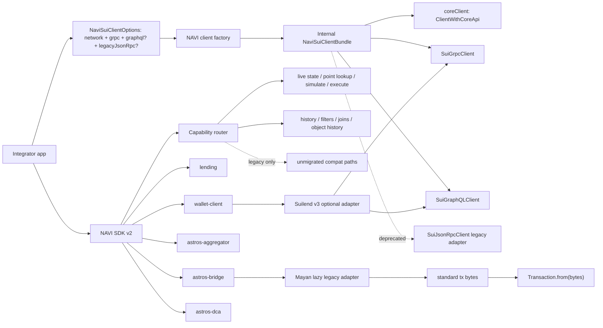
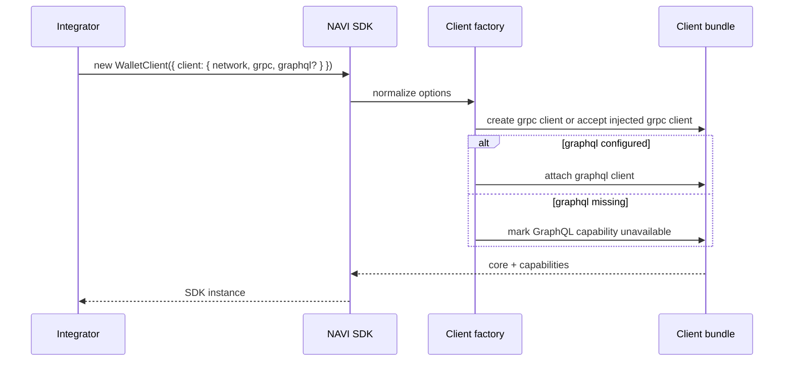
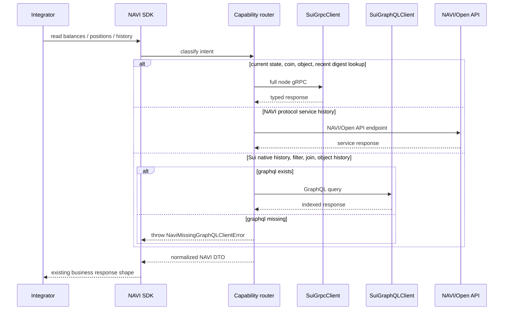
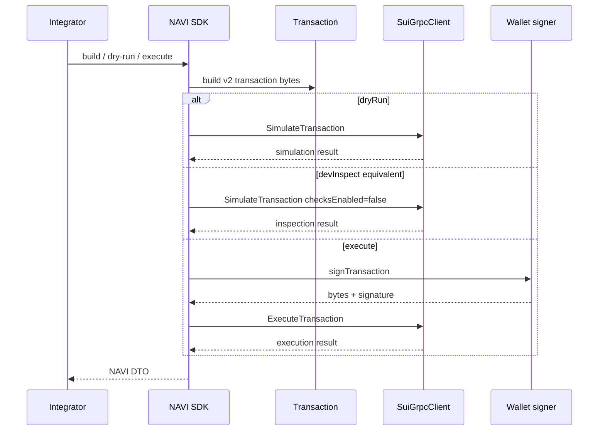

# NAVI SDK v2 gRPC / GraphQL 适配技术设计

Last updated: 2026-06-17

## 背景

NAVI SDK v2 beta 已完成 Sui SDK v2 public contract 迁移：公开 peer 依赖为
`@mysten/sui >=2.0.0`，SDK 包要求 Node.js 22+ 和 ESM，公开 API 不再暴露旧
`@mysten/sui.js`、`TransactionBlock` 或旧 JSON-RPC response contract。

但这不等于已经完成最终数据访问层迁移。当前 SDK 仍有大量
`SuiJsonRpcClient` compat 路径，例如 `getCoins`、`getAllCoins`、
`dryRunTransactionBlock`、`devInspectTransactionBlock`、`getTransactionBlock`
和 `executeTransactionBlock`。

官方迁移约束：

- Sui SDK 2.0 的目标之一是支持新的 gRPC 和 GraphQL API，并转向
  `ClientWithCoreApi` 这类 transport-agnostic contract。
- JSON-RPC 已 deprecated，并计划在 2026 年 7 月停用。
- gRPC 是 full node access、current state、recent point lookup、simulation 和
  transaction execution 的替代接口。
- GraphQL RPC 是 indexed、filterable、historical、joined reads 的替代接口。
- full node gRPC 不会隐式 fallback 到 Archival Store；高保留历史数据必须显式
  使用 GraphQL provider 或 Archival Service endpoint。

参考资料：

- Mysten Sui SDK 2.0 migration:
  <https://sdk.mystenlabs.com/sui/migrations/sui-2.0>
- Sui JSON-RPC migration guide:
  <https://docs.sui.io/develop/accessing-data/json-rpc-migration>
- Sui gRPC overview:
  <https://docs.sui.io/develop/accessing-data/grpc/what-is-grpc>
- Suilend SDK guide:
  <https://docs.suilend.fi/ecosystem/suilend-sdk-guide>

## 决策摘要

下一阶段 NAVI SDK 的 client 配置必须是 transport-explicit：

- `grpc` 是 v2 主路径最小必需 transport，用于 live state、coin/object reads、
  simulation 和 transaction execution。
- `graphql` 是按能力开启的 transport。凡是 Sui 原生历史、过滤、事件查询、跨资源
  join、对象/package history，都必须显式要求 GraphQL。
- `legacyJsonRpc` 只作为短期兼容字段。字段名要让使用方知道这是 deprecated 过渡
  路径，不再把泛化的 `url` 当成 v2 主入口。
- SDK 不在 public options 暴露 `archivalGrpc` / `archivalUrl`。如果未来有明确
  old pruned point lookup 需求，再作为高级能力单独设计；普通历史能力优先 GraphQL。
- SDK 不在 public client options 暴露 `configs.suilend/scallop/cetus/haedal` 这类
  protocol-specific transport 配置。它们属于 open-api 或第三方 adapter 内部配置。
- `ClientWithCoreApi` 作为方法级 core API contract 和内部 `coreClient` 使用，不作为
  `WalletClient` / 高层 SDK 初始化的唯一 client 配置入口。

## 目标

- 把 NAVI SDK 的长期数据访问架构从 JSON-RPC compat 收敛到
  `SuiGrpcClient` + `SuiGraphQLClient` + limited legacy adapter。
- 不改变现有业务语义：route、amount、status、wallet ownership、gas budget 规则
  不因 transport 迁移改变。
- 方法级 read API 优先接受 `ClientWithCoreApi` 或 NAVI minimal contract，避免把
  `SuiJsonRpcClient` 作为稳定 public contract；高层初始化仍使用显式
  `grpc/graphql/legacyJsonRpc` transport options。
- 让使用方低成本升级：普通用户最小传 `network + grpc`，需要历史/过滤时再传
  `graphql`；短期旧项目可显式传 `legacyJsonRpc`。
- 第三方旧依赖继续 lazy/internal 隔离，不穿透 NAVI SDK root bundle 或 public
  declaration。

## 非目标

- 不要求当前 beta PR 一次性改完所有 JSON-RPC 调用。
- 不改变用户交易业务逻辑，不新增真实交易执行路径。
- 不要求前端直接暴露私有 gRPC token。需要 token/metadata 的 transport 由
  open-api 或服务端代理承接。
- 不把 Mayan、Pyth 或其他旧 Sui SDK 依赖公开给 NAVI SDK 使用方。

## 当前状态和差距

### 当前 beta 是否“同时支持 JSON-RPC 和 gRPC”

当前 beta 只能说“底层引入了 Sui SDK v2 能力，并在 Suilend adapter 局部使用
gRPC”，不能说所有 NAVI SDK public 方法已经同时支持 JSON-RPC 和 gRPC。

| 包 | 当前 transport 状态 | 与目标差距 |
| --- | --- | --- |
| `@naviprotocol/lending` | 主路径仍使用 JSON-RPC compat client；Pyth 主路径已换成 NAVI v2 helper。 | `getCoins`、`devInspect` 类 read/simulate 需要 gRPC adapter。 |
| `@naviprotocol/wallet-client` | 默认 client 仍是 `SuiJsonRpcClient`；Suilend adapter 已支持 gRPC。 | dry-run/execute/balance/lending wrapper 需要接入统一 bundle。 |
| `@naviprotocol/astros-aggregator-sdk` | PTB 已是 v2 `Transaction`；coin selection、dry-run、execute 仍是 JSON-RPC compat。 | coin、simulate、execute 需要 gRPC；按 digest 查交易可用 gRPC/GraphQL。 |
| `@naviprotocol/astros-bridge-sdk` | Mayan v1 internal lazy；Sui-source execution 仍需要 compat execute。 | Sui execute 需要 gRPC executor；Bridge status/history 仍是服务端 API。 |
| `@naviprotocol/astros-dca-sdk` | PTB 已是 v2 `Transaction`；coin / dry-run 仍走 JSON-RPC compat。 | coin 和 simulate 需要 gRPC adapter。 |

### SDK 是否涉及 GraphQL 必需场景

当前 SDK 源码中没有直接引入 `SuiGraphQLClient`。现有“history”能力大多不是
Sui GraphQL，而是 NAVI/Astros/Bridge 自有 HTTP API。

| 能力 | 当前实现 | 是否现在必须 GraphQL | 后续规则 |
| --- | --- | --- | --- |
| lending `getTransactions` | `open-api.naviprotocol.io/api/navi/user/transactions`。 | 否。 | 仍按 NAVI API history 处理；如果改成 Sui native tx/event query，必须显式要求 GraphQL。 |
| lending `getUserClaimedRewardHistory` | `open-api.naviprotocol.io/api/navi/user/rewards`。 | 否。 | 仍按 NAVI API history 处理。 |
| bridge `getTransaction` / `getWalletTransactions` | Bridge service API。 | 否。 | 不是 Sui native history。 |
| DCA execution/order history | 当前主要由服务端/API 承接。 | 否。 | 如果改成 Sui event/tx filter，必须显式要求 GraphQL。 |
| aggregator `checkIfNAVIIntegrated(digest)` | `getTransactionBlock({ digest, showEvents })` point lookup。 | 不一定。 | 近期/已知 digest 可用 gRPC `GetTransaction`；如果变成按条件过滤历史交易，则必须 GraphQL。 |
| coin/balance/object/package 当前状态 | JSON-RPC compat。 | 否。 | 目标 gRPC，GraphQL 仅作为前端友好或 join 查询选项。 |
| event/transaction filter、object history、cross-resource join | 当前没有统一 SDK public path。 | 是。 | 调用前必须检查 `graphql`，缺失时抛出明确错误，不能偷偷用 public endpoint 或 JSON-RPC fallback。 |

判断标准：只要功能语义是“历史、过滤、跨资源 join、对象/package 版本历史、深分页一致性”，
就属于 GraphQL 能力边界。SDK 可以在构造时允许不传 `graphql`，但调用这些能力时必须
显式失败，例如 `NaviMissingGraphQLClientError`。

## 架构方案

### 总体架构



### Transport 能力分层

| 层 | 责任 | Public 稳定性 |
| --- | --- | --- |
| `ClientWithCoreApi` / minimal client | `client.core.*` 方法级 contract，用于 transport-agnostic object/coin/balance reads 和 transaction input resolution。 | 稳定，但不是高层初始化入口。 |
| `grpc` | 当前状态、对象、coin/balance、recent point lookup、simulate、execute。 | 目标主路径。 |
| `graphql` | transaction/event filter、历史、join reads、object/package history。 | 目标能力路径。 |
| `legacyJsonRpc` | 尚未迁移方法的短期兼容。 | deprecated，不能作为长期 contract。 |
| third-party legacy adapter | Mayan/Pyth 等旧依赖隔离。 | 内部细节。 |

### Public client options

面向用户不暴露内部 bundle。推荐 public contract 是分组显式 transport：

```ts
type NaviNetwork = 'mainnet' | 'testnet' | 'devnet' | 'localnet' | (string & {})

type NaviTransportInput<TClient> =
  | { client: TClient }
  | { url: string; headers?: Record<string, string> }

type NaviSuiClientOptions = {
  network: NaviNetwork
  grpc: NaviTransportInput<SuiGrpcClient>
  graphql?: NaviTransportInput<SuiGraphQLClient>

  /**
   * Deprecated compatibility for old JSON-RPC-only paths.
   * New v2 integrations should not treat this as the primary client.
   */
  legacyJsonRpc?: NaviTransportInput<SuiJsonRpcClient>
}
```

设计理由：

- 不保留泛化 `url?: string` 作为 v2 主入口。`url` 会让用户误以为 JSON-RPC 仍是
  v2 默认形态。
- 不用平铺 `grpcUrl`、`graphqlUrl`、`jsonRpcUrl`。平铺字段在生产鉴权场景下不够清晰，
  也无法表达“这个 URL 属于哪个 transport 的高级 client”。
- 生产推荐 `grpc: { client }` / `graphql: { client }`，由接入方自行构造带鉴权、
  metadata 或自定义 transport 的 Mysten client。
- `url + headers` 只作为简化接入，适合 GraphQL、JSON-RPC 或简单 gRPC-web 鉴权。
  如果 provider 需要 gRPC metadata/token，生产方应该注入已经构造好的 `client`。
- `legacyJsonRpc` 字段名明确表达它只是兼容路径。内部实现可以命名为
  `jsonRpcCompat`，但 public API 不应暴露这个内部术语。
- 不暴露 `label`、`fallbacks` 或 endpoint policy。日志标签、重试、限流和多 endpoint
  failover 属于 open-api、provider 或自定义 client 的职责，不应增加普通 SDK 用户的
  初始化成本。

### Internal normalized bundle

SDK 内部可以 normalize 成 bundle，名称可在实现时调整：

```ts
type NaviSuiClientBundle = {
  network: NaviNetwork
  coreClient: ClientWithCoreApi
  grpc: SuiGrpcClient
  graphql?: SuiGraphQLClient
  legacyJsonRpc?: SuiJsonRpcClient
}
```

规则：

- `grpc` 是必需能力。没有 gRPC 时只能进入 deprecated legacy overload，不能宣称是
  完整 v2 transport。
- `coreClient` 优先来自 `grpc`，因为 `SuiGrpcClient` 满足 `ClientWithCoreApi`。只有
  legacy compat path 才允许从 `legacyJsonRpc` 派生 `coreClient`。
- 内部 read adapter 只通过 `coreClient.core.*` 调用 Core API，例如
  `getObject`、`getObjects`、`listOwnedObjects`、`listCoins`、`getBalance`、
  `listBalances`、`getCoinMetadata`、`getDynamicField`、`listDynamicFields`。
- simulate / execute adapter 以 `grpc` capability 为准，可调用
  `bundle.grpc.core.simulateTransaction` / `bundle.grpc.core.executeTransaction`。不要在高层
  execute path 接受任意外部 `ClientWithCoreApi` 来替代 `grpc`。
- `ClientWithCoreApi` 不代表 GraphQL history/filter/join 能力；这些路径必须检查
  `bundle.graphql`。
- `ClientWithCoreApi` 也不作为 legacy JSON-RPC-only 方法的替代；旧方法只能走显式
  `legacyJsonRpc`。
- `graphql` 不要求所有用户必传，但调用 GraphQL-only 能力时必须存在。
- 不在 public bundle 放 `archivalGrpc`。需要 archival 的具体方法以后单独定义
  `archival` capability，不作为普通 SDK 初始化参数。

## 交互流程

### 初始化和能力检查



### Read path routing



### Simulation / execution path



## Fallback 规则

| 场景 | 最小配置 | 缺失时行为 | 禁止行为 |
| --- | --- | --- | --- |
| current object / coin / balance / recent digest lookup | `network + grpc` | 初始化或调用时报缺少 gRPC。 | 偷偷改走 public fullnode 或 JSON-RPC endpoint。 |
| dry-run / devInspect equivalent / execute | `network + grpc` | 报缺少 gRPC 或 signer。 | 为了兼容自动广播到 JSON-RPC。 |
| Sui native history / event filter / transaction filter / cross-resource join | `network + grpc + graphql` | 调用时报缺少 GraphQL。 | 偷偷用 public endpoint 或 legacy JSON-RPC 查询。 |
| NAVI/Open API service history | SDK 内部 service endpoint | 按 service API 错误返回。 | 把 service history 误判为 Sui GraphQL 必需。 |
| legacy unmigrated method | `legacyJsonRpc` | 报明确 deprecated path 未配置。 | 把 `grpc.url` 当 JSON-RPC URL 试。 |

SDK 不做隐式 public endpoint fallback。遇到 provider 限流或上游错误时，SDK 返回明确
错误；缓存、并发控制、重试和多 endpoint failover 应放在 open-api、provider 或注入的
自定义 client 中。

使用方最小接入：

- 只做 current state、PTB、dry-run、execute：传 `network + grpc`。
- 使用历史、过滤、跨资源 join、对象/package history：传 `network + grpc + graphql`。
- 处于旧系统过渡期：传 `network + grpc + graphql + legacyJsonRpc`，但
  `legacyJsonRpc` 不作为 release 后长期保障。

## 第三方 SDK 参考

| SDK | 观察结论 | NAVI 可参考点 |
| --- | --- | --- |
| Suilend v3 | 核心协议路径显式使用 `SuiGrpcClient`；历史/最近交易工具使用 `SuiGraphQLClient`。 | 参考“gRPC 和 GraphQL 分能力注入”，不参考一个万能 `url`。 |
| Scallop / Cetus / Haedal | v2 SDK 多数开始支持 Sui v2 client 或 grpc/graphql client 注入；部分旧路径仍可能 URL-only。 | NAVI wrapper 优先向下传已鉴权 client；URL-only path 只能 best-effort。 |
| Mayan | 仍有 Sui v1 依赖。 | 继续 Bridge lazy internal adapter，只输出 v2 transaction boundary。 |
| Pyth | 仍可能被 Suilend optional peer 间接使用。 | lending 主路径继续用 NAVI v2 helper；旧依赖不穿透 public API。 |

结论：参考第三方 SDK 的方向是“client/transport injection first”，不是把各协议
provider 参数摊到 NAVI SDK public options。`configs.suilend/scallop/cetus/haedal`
属于 open-api adapter 或上层聚合服务配置，不属于通用 SDK client contract。

## 接入方设计

### SDK 使用方

推荐 production 接入：注入已构造 client。私有 gRPC provider 常需要 metadata 或
custom transport，推荐在接入方构造后传入 SDK。

```ts
new WalletClient({
  signer,
  client: {
    network: 'mainnet',
    grpc: { client: grpcClient },
    graphql: { client: graphqlClient },
    legacyJsonRpc: { client: jsonRpcClient }
  }
})
```

简化 production 接入：provider 鉴权可以用 HTTP/gRPC-web headers 表达时，可直接传
URL 和 headers。

```ts
new WalletClient({
  signer,
  client: {
    network: 'mainnet',
    grpc: {
      url: process.env.SUI_GRPC_URL!,
      headers: { 'x-token': process.env.SUI_GRPC_TOKEN! }
    },
    graphql: {
      url: process.env.SUI_GRAPHQL_URL!,
      headers: { Authorization: `Bearer ${process.env.SUI_GRAPHQL_TOKEN}` }
    }
  }
})
```

官方 public endpoint 只适合低流量开发和 demo；多协议、高并发或生产流量应使用私有
endpoint/client，避免限流和不稳定错误。

### navi-open-api

open-api 是服务端接入方，应该承担生产 endpoint 和鉴权差异：

- `SUI_GRPC_ENDPOINT` + `SUI_GRPC_TOKEN` 构造 gRPC client。
- `SUI_GRAPHQL_URL` 构造 GraphQL client。
- `SUI_JSON_RPC_URL` 只传给 `legacyJsonRpc`。
- 每个 transport 单独 smoke：JSON-RPC 成功不代表 gRPC 可用，gRPC 成功也不代表
  GraphQL 可用。
- 有 provider metadata/token 的 gRPC，不应只传 URL 给 SDK；应注入已构造 client。

open-api 目标形态：

```ts
const client = {
  network: 'mainnet',
  grpc: { client: grpcClient },
  graphql: { client: graphqlClient },
  legacyJsonRpc: { url: jsonRpcUrl }
}
```

### 前端三个主要 app

当前作为主要 SDK 接入方跟踪的 frontend apps 是：

| App | 当前观察 | 目标接入方式 |
| --- | --- | --- |
| `copilot/apps/lending` (`@naviprotocol/lending-next`) | 使用 `@naviprotocol/lending`、aggregator SDK、`SuiJsonRpcClient` + `NAVIHttpTransport`；已有一个直接 `SuiGraphQLClient` account-cap 查询。 | 继续让钱包 UI 使用 dapp-kit；NAVI SDK v2 复杂 read/action 优先通过 open-api 或传显式 `grpc`/`graphql`。浏览器只能使用无 secret 的 browser-safe endpoint。 |
| `copilot/apps/astros` (`@naviprotocol/astros`) | 使用 aggregator、bridge、DCA SDK；当前 chain service 仍是 `SuiJsonRpcClient`。 | swap/bridge/DCA SDK 调用迁到显式 `grpc`；交易/事件过滤或历史页需要 `graphql` 或 open-api。 |
| `copilot/apps/astros-aggregator` (`@naviprotocol/astros-aggregator`) | 使用 aggregator、bridge、DCA SDK；当前 chain service 仍是 `SuiJsonRpcClient`。 | 与 Astros 相同，不能把 `NEXT_PUBLIC_SUI_RPC_URL` 当成 gRPC。 |

前端公共规则：

- 不在浏览器暴露 `SUI_GRPC_TOKEN`。带 token/metadata 的 gRPC 走 open-api。
- `NEXT_PUBLIC_SUI_RPC_URL` 只能继续作为 deprecated legacy JSON-RPC 配置。
- 如 provider 提供 browser-safe gRPC-web，可配置 `NEXT_PUBLIC_SUI_GRPC_URL`。
- 如前端需要历史/过滤/join read，可配置 `NEXT_PUBLIC_SUI_GRAPHQL_URL`，否则走
  open-api 聚合接口。
- `volo`、`lending-review` 等较小 SDK 消费方跟随 Lending 模式，作为后续验收扩展。

## 实施计划

### Phase 0：文档和 contract 锁定

- 锁定 `NaviSuiClientOptions` 的 transport-explicit 设计。
- 迁移文档明确：当前 beta JSON-RPC compat 是过渡路径，不是最终 v2 主路径。
- 明确 GraphQL-only 功能的缺失行为。

### Phase 1：client factory / type contract

- 新增 SDK 内部 normalized bundle。
- public 方法参数从具体 `SuiJsonRpcClient` 收敛到 `ClientWithCoreApi` 或 minimal
  capability interface。
- 内部 adapter 统一通过 `bundle.coreClient.core.*` 调 Core API；不要继续调用旧
  `client.getObject`、`client.getOwnedObjects`、`client.multiGetObjects` 形态。
- 保留旧 JSON-RPC compat overload，但标记 deprecated。
- 补 type tests：`grpc`、`graphql`、`legacyJsonRpc` 分别覆盖 expected path。

### Phase 2：gRPC read/simulate/execute adapter

优先迁移：

1. `core.getObject` / `core.getObjects` / `core.listOwnedObjects`。
2. `core.listCoins` / `core.getBalance` / `core.listBalances`。
3. `core.getCoinMetadata`、`core.getDynamicField`、`core.listDynamicFields`。
4. `core.simulateTransaction` for dry-run。
5. `core.simulateTransaction` with `checksEnabled: false` for devInspect equivalent。
6. `core.executeTransaction` for execution。

### Phase 3：GraphQL 能力接入

- 只为真实 GraphQL-only 语义引入 GraphQL。
- lending 现有 service history 不强行改 GraphQL。
- 如果新增 Sui native transaction/event filter、object history、join query，必须检查
  `graphql` 并提供清晰错误。

### Phase 4：接入方验收

- open-api endpoint smoke 覆盖 JSON-RPC、gRPC、GraphQL 三个 transport。
- 前端三个主要 app 验证不把 JSON-RPC URL 误传为 gRPC。
- SDK live smoke 覆盖 read、dry-run、execute no-broadcast、Suilend init。

## 风险和缓解

| 风险 | 影响 | 缓解 |
| --- | --- | --- |
| JSON-RPC 2026 年 7 月停用 | legacy compat 生产路径失效。 | release 前把主路径迁到 gRPC/GraphQL，legacy 显式 deprecated。 |
| GraphQL 未配置但调用历史/filter 功能 | 用户遇到运行时失败。 | 抛明确 missing GraphQL error，文档列出能力矩阵。 |
| gRPC 无 archival fallback | 老对象/交易在 full node 返回 not found。 | 普通历史走 GraphQL；特殊高保留 point lookup 以后单独 archival capability。 |
| provider endpoint 鉴权差异 | URL-only 设计无法传 metadata/header。 | public options 支持 client injection；open-api 负责私有 token。 |
| 前端直接接 gRPC 受限 | 浏览器不可用或泄露 token。 | 前端优先 open-api；仅 browser-safe endpoint 直接使用。 |
| 第三方 SDK 仍旧 | bundle 污染或运行失败。 | lazy/internal adapter 和 public declaration scan。 |

## 验证策略

| Gate | 要求 |
| --- | --- |
| Type compatibility | `grpc`、`graphql`、`legacyJsonRpc` options 均有类型覆盖。 |
| Boundary scan | public declarations 不含 `@mysten/sui.js`、`TransactionBlock`、旧 raw response contract。 |
| Bundle scan | root bundle 不加载 Mayan/Sui v1/Suilend optional adapter。 |
| Adapter tests | pagination、field mask、missing GraphQL、legacy disabled、DTO normalization。 |
| Provider smoke | open-api 分别验证 JSON-RPC、gRPC、GraphQL endpoint。 |
| Frontend contract | Lending/Astros/Astros Aggregator 不把 `NEXT_PUBLIC_SUI_RPC_URL` 当 v2 gRPC 主入口。 |

## 最终结论

当前 SDK 涉及 GraphQL 规则，但不是因为现有源码已经直接依赖 `SuiGraphQLClient`。
真正的判断标准是功能语义：凡是 Sui 原生历史、过滤、跨资源 join、对象/package
history，SDK 必须显式要求 `graphql`。现有 NAVI service history 可以继续走服务端
API，不需要为了形式改成 GraphQL。

下一阶段最合理的用户接口不是平铺参数，也不是万能 `url`，而是：

- `client.grpc`：v2 主路径最小必需。
- `client.graphql`：历史/过滤/join 能力必需。
- `client.legacyJsonRpc`：deprecated 兼容。

这样既符合官方迁移方向，也能让 open-api 和前端按各自运行环境接入，不把 provider
鉴权和第三方 SDK 内部差异暴露成用户必须理解的复杂配置。
