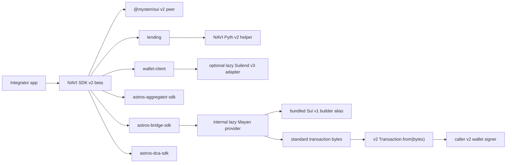
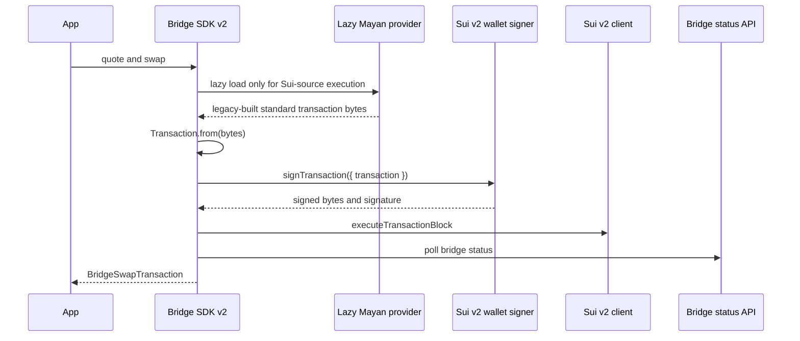

# Sui SDK v2 Upgrade Plan

Last updated: 2026-06-08

## Decision

NAVI SDK v2 is a Sui SDK 2.x beta line, not a partial compatibility shim. The
v1 SDK line remains available for legacy consumers. The v2 line must keep
business semantics aligned with v1 while moving public SDK contracts to Sui SDK
2.x.

The current SDK-side decision is:

- Use `@mysten/sui@2` as the public Sui SDK peer.
- Require Node.js 22 or newer and ESM imports.
- Expose Sui SDK v2 `Transaction` and NAVI DTOs, not legacy `TransactionBlock`
  or old Sui JSON-RPC response types.
- Keep unavoidable Sui v1 third-party code internal, lazy, and out of root
  entry points.
- Preserve upgrade cost for integrators: existing NAVI business flows should
  keep the same route, amount, status, and wallet ownership semantics unless an
  explicit bug fix is documented.

## Scope

The SDK v2 beta scope covers:

| Package                               | Status                  | Notes                                                                                                           |
| ------------------------------------- | ----------------------- | --------------------------------------------------------------------------------------------------------------- |
| `@naviprotocol/lending`               | In scope                | Sui SDK v2 imports, v2 transaction builders, NAVI Pyth v2 helper, read and PTB compatibility.                   |
| `@naviprotocol/wallet-client`         | In scope                | Sui SDK v2 client wrapper, dry-run/execute DTOs, lending/swap/balance wrappers, optional Suilend adapter.       |
| `@naviprotocol/astros-aggregator-sdk` | In scope                | v2 `Transaction` PTB helpers and compatible execute/dry-run result DTOs.                                        |
| `@naviprotocol/astros-bridge-sdk`     | In scope                | Public Sui v2 API with an internal lazy Mayan provider for Sui-source Bridge paths.                             |
| `@naviprotocol/astros-dca-sdk`        | In scope                | v2 transaction creation, cancel, and dry-run DTOs.                                                              |
| Copilot / open-api                    | Related, separate owner | Use SDK results and dependency-boundary decisions, but keep backend/frontend implementation documents separate. |

## Architecture

## Integration Rules

1. Public code imports Sui SDK v2 from `@mysten/sui/*`.
2. Consumers must not pass `@mysten/sui.js` clients or v1 `TransactionBlock`
   objects into SDK v2 APIs.
3. SDK methods return NAVI DTOs. Aggregator execute results are a compatible
   superset: normalized fields are present, passthrough fields are preserved,
   and `raw` is available for debugging/compatibility.
4. JSON-RPC remains a compatibility transport through Sui SDK v2
   `SuiJsonRpcClient`; it is not a reason to expose old v1 types.
5. Real execute tests require explicit authorization and small test amounts.

## Dependency Boundaries

| Dependency                         | Current rule                                                                                                 |
| ---------------------------------- | ------------------------------------------------------------------------------------------------------------ |
| `@mysten/sui`                      | Public peer dependency, `>=2.0.0`.                                                                           |
| `@mysten/sui.js`                   | Not allowed in SDK v2 public declarations, root bundles, or production dependencies.                         |
| `@pythnetwork/pyth-sui-js`         | Not a `lending` runtime dependency. It is only an optional peer needed by the Suilend v3 adapter path.       |
| `@suilend/sdk` / `@suilend/sui-fe` | Optional peer dependencies in `wallet-client`, v3 range only, lazy loaded by the Suilend adapter.            |
| `@mayanfinance/swap-sdk`           | Bridge package dev/build input only; bundled into the Bridge lazy chunk, not a published runtime dependency. |
| `@mysten/sui-v1` alias             | Bridge package dev/build input only; allowed only inside Mayan lazy artifacts and tests.                     |

## Suilend Policy

`wallet-client` preserves the previous default behavior: the lending protocol
registry tries to load Suilend unless `configs.lending.enableSuilend` is set to
`false`.

Current code uses:

- `@suilend/sdk@3.0.4`
- `@suilend/sui-fe@3.0.7`
- `@mysten/bcs@2.0.1`
- `@pythnetwork/pyth-sui-js@2.2.0`

These are optional peers. Apps that use Suilend migration paths should install
them. Apps that do not use Suilend can opt out to avoid loading that adapter.

The adapter is loaded from the wallet lending module only. It must not appear in
the wallet root bundle.

## Bridge Policy

Bridge keeps the v1 business flow:

The v2 change is an integration-boundary change, not a business-flow change.
Mayan and Sui v1 stay internal. Integrators provide only the v2 wallet
connection and, for custom Sui networks, an explicit `rpcUrl`.

Gas behavior must match v1 unless the caller opts in. The Bridge Sui path only
sets `gasBudget` when the user explicitly passes one.

## Verification Gates

The SDK v2 beta cannot be considered release-ready unless these gates are true
or explicitly recorded as blockers:

| Gate                  | Requirement                                                                                                      |
| --------------------- | ---------------------------------------------------------------------------------------------------------------- |
| Build / typecheck     | Target SDK packages pass build and type checks on Node.js 22.                                                    |
| Unit / contract tests | Deterministic package tests pass.                                                                                |
| Public API scan       | No legacy `SuiClient`, `TransactionBlock`, `@mysten/sui.js`, or raw v1 response contract in public declarations. |
| Boundary scan         | Root bundles do not load Mayan/Sui v1 or Suilend optional adapters.                                              |
| Bridge bytes gate     | Real v1 transaction bytes can be parsed by v2 `Transaction.from(bytes)`.                                         |
| Suilend gate          | Suilend v3 adapter initializes through Sui SDK v2 gRPC client and remains optional/lazy.                         |
| Live smoke            | Main read/dry-run paths pass with controlled RPC and current valid fixture wallets/routes.                       |

## Current Blockers

The deterministic SDK gates are in place. Final release acceptance still needs a
clean live smoke pass or an accepted blocker record for:

- live route API failures for old aggregator/migration pairs;
- live test wallet balances and Suilend/NAVI account state;
- repay dry-run account-state aborts;
- any frontend-owned Sui v1 dependency paths outside SDK package ownership.

These blockers do not justify changing SDK business logic. They require updated
fixtures/routes, controlled RPC, or owner handoff.
