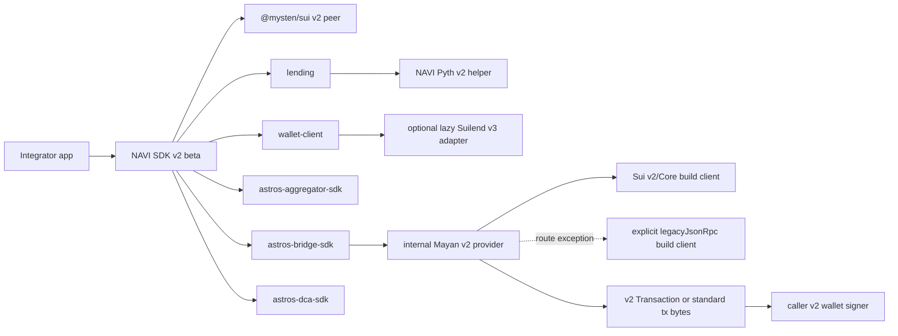
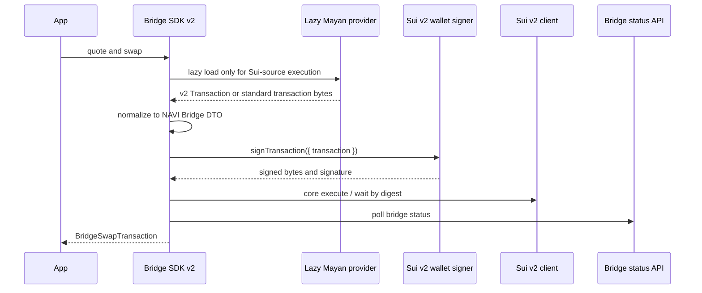

# Sui SDK v2 Upgrade Plan

Last updated: 2026-06-22

## Decision

NAVI SDK v2 is a Sui SDK 2.x beta line, not a partial compatibility shim. The
v1 SDK line remains available for legacy consumers. The v2 line must keep
business semantics aligned with v1 while moving public SDK contracts to Sui SDK
2.x.

The current SDK-side decision is:

- Use `@mysten/sui@2` as the public Sui SDK peer.
- Require Node.js 22 or newer and ESM imports.
- Expose Sui SDK v2 `Transaction` and NAVI DTOs, not legacy `TransactionBlock`
  or old Sui JSON-RPC response types.
- Keep unavoidable legacy third-party compatibility internal, lazy, and out of
  root entry points. The current Bridge implementation uses Mayan v2 and no
  longer keeps an `@mysten/sui-v1` alias.
- Treat JSON-RPC as a deprecated compatibility transport. SDK v2 release paths
  use explicit `grpc`, optional `graphql`, and deprecated `legacyJsonRpc`
  capabilities instead of a generic `url`.
- Preserve upgrade cost for integrators: existing NAVI business flows should
  keep the same route, amount, status, and wallet ownership semantics unless an
  explicit bug fix is documented.

## Scope

The SDK v2 beta scope covers:

| Package                               | Status                  | Notes                                                                                                           |
| ------------------------------------- | ----------------------- | --------------------------------------------------------------------------------------------------------------- |
| `@naviprotocol/lending`               | In scope                | Sui SDK v2 imports, v2 transaction builders, NAVI Pyth v2 helper, read and PTB compatibility.                   |
| `@naviprotocol/wallet-client`         | In scope                | Sui SDK v2 client wrapper, dry-run/execute DTOs, lending/swap/balance wrappers, optional Suilend adapter.       |
| `@naviprotocol/astros-aggregator-sdk` | In scope                | v2 `Transaction` PTB helpers and compatible execute/dry-run result DTOs.                                        |
| `@naviprotocol/astros-bridge-sdk`     | In scope                | Public Sui v2 API with an internal Mayan v2 provider for Sui-source Bridge paths.                               |
| `@naviprotocol/astros-dca-sdk`        | In scope                | v2 transaction creation, cancel, and dry-run DTOs.                                                              |
| Copilot / open-api                    | Related, separate owner | Use SDK results and dependency-boundary decisions, but keep backend/frontend implementation documents separate. |

## Related Design Documents

- [NAVI SDK v2 gRPC / GraphQL adaptation technical design](./grpc-adaptation-technical-design.md)
- [Sui SDK v2 Acceptance](./acceptance.md)

## Current Implementation Status

The SDK-side migration is acceptance-ready as of 2026-06-22. The five release
packages use `@mysten/sui@2.20.2` as their dev dependency and keep
`@mysten/sui >=2.0.0` as the public peer contract. Main read, simulate, execute,
and route-build paths are normalized through Sui v2 gRPC/Core clients. GraphQL
is an optional capability for Sui-native history/filter/join semantics.

Remaining JSON-RPC is limited to explicit `legacyJsonRpc` compatibility or the
documented Mayan route-build adapter boundary. The Sui-source Bridge path uses
`@mayanfinance/swap-sdk@15.0.0`; the previous temporary `@mysten/sui-v1` alias
has been removed.

Open API and Copilot tarball validation remain cross-repo integration gates and
are tracked separately from SDK package acceptance.

## Architecture



## Integration Rules

1. Public code imports Sui SDK v2 from `@mysten/sui/*`.
2. Consumers must not pass `@mysten/sui.js` clients or v1 `TransactionBlock`
   objects into SDK v2 APIs.
3. SDK methods return NAVI DTOs. Aggregator execute results are a compatible
   superset: normalized fields are present, passthrough fields are preserved,
   and `raw` is available for debugging/compatibility.
4. JSON-RPC remains only as explicit deprecated `legacyJsonRpc` compatibility
   through Sui SDK v2 `SuiJsonRpcClient`; it is not a reason to expose old v1
   types or document JSON-RPC as the primary integration path.
5. Real execute tests require explicit authorization and small test amounts.
6. gRPC / GraphQL production endpoints must be transport-explicit. SDK APIs
   should accept injected `SuiGrpcClient` / `SuiGraphQLClient` because provider
   auth can require metadata or headers, not just URL query params.
7. SDK v2 transport options should use grouped capabilities:
   `client.grpc`, `client.graphql`, and deprecated `client.legacyJsonRpc`.
   A generic `client.url` must not be presented as the v2 primary shape.
8. `ClientWithCoreApi` is the method-level Core API contract. Low-level read
   helpers and SDK extension registration can expose it, but high-level SDK
   initialization remains transport-explicit.
9. Sui-native history, filtering, event queries, object/package history, and
   cross-resource joined reads require explicit GraphQL. If a caller has not
   configured GraphQL, the SDK should fail clearly instead of silently using
   JSON-RPC or public endpoint fallback.
10. NAVI/Open API service-backed history is not automatically a GraphQL
    requirement. Keep those service APIs unless a feature is explicitly migrated
    to Sui-native GraphQL semantics.

## Transport Contract

The target SDK-side client contract is:

Use `ClientWithCoreApi` inside SDK internals as the normalized `coreClient` for
`client.core.*` reads and transaction input resolution. High-level simulate and
execute paths still use the explicit `grpc` capability; do not use
`ClientWithCoreApi` as a replacement for explicit `grpc`, `graphql`, or
`legacyJsonRpc` capabilities.

```ts
type NaviSuiClientOptions = {
  network: 'mainnet' | 'testnet' | 'devnet' | 'localnet' | (string & {})
  grpc: { client: SuiGrpcClient } | { url: string; headers?: Record<string, string> }
  graphql?: { url: string; headers?: Record<string, string> } | { client: SuiGraphQLClient }
  /** @deprecated JSON-RPC compatibility only. */
  legacyJsonRpc?: { url: string; headers?: Record<string, string> } | { client: SuiJsonRpcClient }
}
```

Minimum integration rules:

| Use case                                                                  | Required transport            | Notes                                                |
| ------------------------------------------------------------------------- | ----------------------------- | ---------------------------------------------------- |
| Current state, objects, coins, balances, dry-run, execute                 | `grpc`                        | This is the v2 primary path.                         |
| Sui-native history, filters, event queries, joins, object/package history | `grpc + graphql`              | Missing GraphQL should be an explicit caller error.  |
| NAVI protocol service history                                             | SDK/Open API service endpoint | Do not rewrite to GraphQL just for transport purity. |
| Legacy unmigrated methods                                                 | `legacyJsonRpc`               | Deprecated and not a long-term release contract.     |

Production integrations should prefer injected clients. `url + headers` is a
simplified option for providers whose auth can be represented as HTTP or
gRPC-web headers. The SDK must not silently fall back to public endpoints on
rate limit or upstream failure; caching, retry, and multi-endpoint failover
belong in Open API, provider infrastructure, or a custom injected client.

Do not expose `archivalGrpc` / `archivalUrl` as normal user options in this
milestone. If a future method truly needs old pruned point lookup, design that
as a named advanced capability.

## Integrator Guidance

| Integrator                       | Target integration path                                                                                                                                      | Notes                                                                                                                                    |
| -------------------------------- | --------------------------------------------------------------------------------------------------------------------------------------------------- | ---------------------------------------------------------------------------------------------------------------------------------------- |
| `navi-open-api`                  | Construct `grpc`, `graphql`, and `legacyJsonRpc` separately from `SUI_GRPC_ENDPOINT` / `SUI_GRPC_TOKEN`, `SUI_GRAPHQL_URL`, and `SUI_JSON_RPC_URL`. | Validate each transport independently. Do not pass a JSON-RPC URL into `SuiGrpcClient`.                                                  |
| `copilot/apps/lending`           | Keep wallet UI on dapp-kit where needed; use open-api or explicit `grpc`/`graphql` for NAVI SDK v2 paths.                                           | Browser apps must not expose private gRPC tokens. Existing direct GraphQL reads should move to configured `NEXT_PUBLIC_SUI_GRAPHQL_URL`. |
| `copilot/apps/astros`            | Pass explicit `grpc` to swap/bridge/DCA SDK paths; use `graphql` or open-api for history/filter pages.                                              | `NEXT_PUBLIC_SUI_RPC_URL` remains legacy JSON-RPC only.                                                                                  |
| `copilot/apps/astros-aggregator` | Same as Astros: explicit `grpc` for current state and execution-related SDK paths, `graphql` for history/filter/join reads.                         | Do not treat a generic RPC URL as v2 transport.                                                                                          |

## Dependency Boundaries

| Dependency                         | Current rule                                                                                                               |
| ---------------------------------- | -------------------------------------------------------------------------------------------------------------------------- |
| `@mysten/sui`                      | Public peer dependency, `>=2.0.0`.                                                                                         |
| `@mysten/sui.js`                   | Not allowed in SDK v2 public declarations, root bundles, or production dependencies.                                       |
| `@pythnetwork/pyth-sui-js`         | Not a `lending` runtime dependency. It is only an optional peer needed by the Suilend v3 adapter path.                     |
| `@suilend/sdk` / `@suilend/sui-fe` | Optional peer dependencies in `wallet-client`, v3 range only, lazy loaded by the Suilend adapter.                          |
| `@mayanfinance/swap-sdk`           | Bridge package dev/build input only; v15 is bundled into the Bridge provider path, not exposed as a public API dependency. |
| `@mysten/sui-v1` alias             | Not allowed. The previous temporary Bridge alias has been removed.                                                         |

## Suilend Policy

`wallet-client` preserves the previous default behavior: the lending protocol
registry tries to load Suilend unless `configs.lending.enableSuilend` is set to
`false`.

Current code uses:

- `@suilend/sdk@3.0.4`
- `@suilend/sui-fe@3.0.7`
- `@mysten/bcs@2.0.1`
- `@pythnetwork/pyth-sui-js@2.2.0`

These are optional peers. Apps that use Suilend migration paths should install
them. Apps that do not use Suilend can opt out to avoid loading that adapter.

The adapter is loaded from the wallet lending module only. It must not appear in
the wallet root bundle.

## Bridge Policy

Bridge keeps the v1 business flow while using Mayan v2 and Sui SDK v2 provider
contracts:



The v2 change is an integration-boundary change, not a business-flow change.
Integrators provide the v2 wallet signer and Sui v2 provider. A route-specific
Mayan build issue can opt into an explicit `legacyJsonRpc` build client, but the
SDK does not perform public endpoint fallback and signing/execution remain on
the injected v2 provider.

Gas behavior must match v1 unless the caller opts in. The Bridge Sui path only
sets `gasBudget` when the user explicitly passes one.

## Verification Gates

The SDK v2 beta cannot be considered release-ready unless these gates are true
or explicitly recorded as blockers:

| Gate                  | Requirement                                                                                                                                     |
| --------------------- | ----------------------------------------------------------------------------------------------------------------------------------------------- |
| Build / typecheck     | Target SDK packages pass build and type checks on Node.js 22.                                                                                   |
| Unit / contract tests | Deterministic package tests pass.                                                                                                               |
| Public API scan       | No legacy `SuiClient`, `TransactionBlock`, `@mysten/sui.js`, or raw v1 response contract in public declarations.                                |
| Boundary scan         | Root bundles do not load Mayan/Sui v1 or Suilend optional adapters.                                                                             |
| Bridge route gate     | Mayan v2 Sui-source routes build/sign and Core-simulate through gRPC; route-specific `legacyJsonRpc` build clients are explicit and documented. |
| Suilend gate          | Suilend v3 adapter initializes through Sui SDK v2 gRPC client and remains optional/lazy.                                                        |
| Live smoke            | Main read/dry-run paths pass with controlled RPC and current valid fixture wallets/routes.                                                      |

## Remaining Release Gates

The deterministic SDK gates and small real execute smoke passed for SDK package
acceptance. Final release still needs the cross-repo tarball integration gate:
repack the latest SDK packages and rerun open-api / Copilot validation.

Known residual risks are recorded in `acceptance.md`: the Sui -> Solana USDC
Bridge route needs explicit `legacyJsonRpc` only for Mayan route construction,
and real cross-chain Bridge execute remains fee-sensitive and must stay behind
explicit approval.
